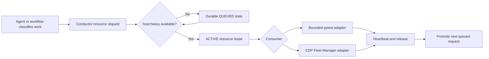

# TruthDeck Conductor - Cross-Repo Agent Work Queue

## Executive decision

Build **TruthDeck Conductor** as a local, durable coordinator for bounded engineering
work across the operator's repositories and agent hosts.

Conductor answers:

> What work is eligible now, who owns it, what evidence justified the assignment,
> and what must happen before it can advance?

TruthDeck continues to answer:

> What is true now, what is not proven, and what is the smallest permitted next
> action?

These are separate authorities. Conductor owns queue state. TruthDeck owns immutable
evidence snapshots. `/fwf` and `/fwp` continue to own the R1/R2/R3 engineering
lifecycle. Repositories remain the source of truth for plans and code.

**Plan-writing authorization:** granted by the operator on 2026-07-22.

**Original implementation authorization:** satisfied. Core implementation shipped
through PR #61 and containment fixes shipped through PR #62.

**Host Resource Lease amendment authorization:** the operator granted standing
`GO CONDUCTOR HOST RESOURCE LEASE R2` on 2026-07-28. The amendment appended to
this plan must still pass the routed R2 delta review before code changes.

## Consequence, downside, reversibility

- **Proposed action:** add a durable local queue, a single-writer coordinator,
  deterministic scheduler, work/lease/evidence model, CLI and bounded MCP surface,
  host adapters, recovery tooling, and TruthDeck checkpoint integration.
- **Plausible downside if wrong:** a central queue could become a competing workflow,
  launch duplicate agents, act on stale authority, monopolize repositories, or turn
  untrusted plan/handoff text into executable prompts.
- **Reversibility:** stop the coordinator, disable its owned host adapters, export the
  append-only event ledger, and revert its tracked installation. Application repos,
  TruthDeck snapshots, and host sessions remain intact. Database deletion is not part
  of rollback and requires a separate destructive action.
- **Risk grade:** R2 because Conductor introduces durable mutable state, leases,
  subprocess/host dispatch, replay, and cross-repository coordination. It has no
  broker, order-path, live-trading, deployment, or generic shell authority.

## Phase 0 - restatement and collision verdict

### Goal

Provide one visible, durable queue for engineering work across repositories and
Claude, Codex, Cursor, Gemini, Kimi, and Antigravity, with safe resumption after
session or process loss.

### Required behavior

1. Discover possible work without automatically authorizing it.
2. Admit only bounded work with explicit repository, risk, workflow, and terminal
   stage.
3. Order eligible work using dependencies, operator priority, risk gates, and aging.
4. Prevent concurrent ownership of the same Work Item and unsafe repository overlap.
5. Dispatch only through a capability-proven Host Adapter.
6. Require a fresh TruthDeck Evidence Checkpoint at declared lifecycle boundaries.
7. Preserve exact attempt history, handoffs, artifacts, and failure reasons.
8. Recover conservatively: an expired lease is not permission to repeat an ambiguous
   side effect.
9. Give the operator and every supported host the same queue/status semantics.

### Constraints

- Windows-first, with contract tests for POSIX paths and locking.
- Local-first; no mandatory cloud database or external control plane.
- No arbitrary shell service, arbitrary URL fetcher, or generic code-execution API.
- No inference of `GO` from chat, handoff prose, memory, a SHA, or a queue priority.
- No write into dirty operator checkouts.
- No duplicate lifecycle ownership with `/fwf`, `/fwp`, GitHub, Codex tasks, or CDP.
- No LLM access to broker APIs or the order path.

### Collision check

The plan-context loader cannot catalog this repository because it lives under
`D:/dotclaude` rather than `D:/APPS`. A bounded fallback found no repo-local
`PLANS.md`, `IDEA_BOX.md`, vision, `AGENTS.md`, `CLAUDE.md`, or
`Prompts/master_agent.md`.

Related artifacts were inspected:

- `2026-06-27_global_agent_workflow_os.md` was formally closed as shipped scope.
  Its artifact-bus concept was deliberately reduced to append-only files until a
  real multi-agent flow existed. Conductor is that new flow, but it does not reopen
  the old plan.
- `2026-07-21_global_fwf_fwp_contract_reset.md` owns workflow and risk routing.
  Conductor consumes that contract and cannot add a third public full workflow.
- `2026-07-22_truthdeck_agent_evidence_control_plane_r1.md` is shipped. It explicitly
  excludes a daemon, database, mutable task authority, and automatic workflow
  execution. Those exclusions remain true for TruthDeck Core.

**Verdict: CREATE NEW PLAN, LINK SHIPPED PREDECESSORS.** Do not amend or supersede
TruthDeck R1 or the closed Workflow OS.

`PONYTAIL: NOT USED` - this is R2 persistence/orchestration work, which is excluded
from the simplification checkpoint.

>> PHASE 0 COMPLETE

## Why now

The ecosystem has strong point tools but no durable owner of work between sessions:

- plans describe intended work but do not claim or schedule it;
- `/fwf` and `/fwp` execute one approved lifecycle but do not maintain a global queue;
- TruthDeck proves current evidence but intentionally does not own tasks;
- handoffs preserve context but do not reserve ownership;
- Codex tasks, Claude sessions, Kimi sessions, Cursor windows, and other hosts expose
  different continuation surfaces;
- a dead agent can leave an apparently active plan, worktree, or external action with
  no common recovery state;
- prioritization is reconstructed conversationally instead of recorded deterministically.

The missing component is not another source of truth. It is a coordinator that links
existing truths while preserving their authority.

## Current-state evidence and reuse map

Baseline at plan creation:

- repository `main == origin/main == a417a6fd2a6244d689bdce224ac11b8897d33828`;
- repository worktree was clean before the plan branch was created;
- code-review-graph reports `0` nodes, `0` files, never updated; the MCP minimal-context
  call did not complete, so targeted source reads were used as the declared fallback;
- TruthDeck is installed with `drift=[]`, CLI present, Claude/Codex skills present,
  and both Claude and Codex MCP registrations active;
- `D:/APPS/_shared/PORTS.md` was checked. The MVP intentionally opens no network
  listener and allocates no port.

Existing surfaces to reuse:

| Existing surface | Conductor use | Must not become |
|---|---|---|
| TruthDeck snapshots and gates | Evidence Checkpoints | queue database |
| `/fwf` and `/fwp` | lifecycle owner inside an admitted Work Item | scheduler internals |
| plan lifecycle hooks/catalogs | candidate discovery | automatic authorization |
| `git_hygiene.py` patterns | worktree and ownership observation | cleanup authority |
| `implementation_review_packet.py` | exact-head review identity | review executor |
| handoff hash verification | attempt continuation evidence | claim/lease |
| Codex task tools | Codex Host Adapter capability | universal host API |
| Claude CLI `-p`, resume/session flags | bounded Claude adapter candidate | generic command runner |
| Kimi CLI prompt/session/ACP surfaces | bounded Kimi adapter candidate | CDP provider identity |
| Cursor CLI | MCP install and operator navigation | proven autonomous agent |

## Frozen product contract

### Authority layers

| Layer | Owns | Does not own |
|---|---|---|
| Repository | plans, code, tests, tracked artifacts | session ownership |
| `/fwf` or `/fwp` | risk-routed plan review, implementation, exact-head review, landing | global prioritization |
| TruthDeck | observed facts, gates, immutable snapshots, one advisory next action | task state or execution |
| Conductor | admission, dependencies, priority, attempts, leases, dispatch state | technical truth or workflow gates |
| Host Adapter | a bounded host operation | cross-host policy |
| CDP Fleet Manager | browser job queue, role identity, browser health/lifecycle | application work queue |
| Operator | product priority, R2/R3 GO, external/destructive/live gates | routine mechanical reconciliation |

### Non-negotiable invariants

1. **A queue entry is not authority.** `QUEUED`, `READY`, or high priority never means
   implementation is approved.
2. **Evidence is referenced, not copied as truth.** Every gated transition records an
   immutable TruthDeck snapshot path, digest, observation time, and required gate.
3. **Claims and leases are not completion.** They express ownership only.
4. **Lease expiry is ambiguous.** It releases scheduling exclusivity but moves the
   Attempt to recovery review; it never blindly retries a side effect.
5. **One Attempt, one workspace identity.** Repo, base/head, branch, worktree, host,
   session/task ID, and Attempt ID are bound before execution.
6. **Dirty operator checkouts are observational.** Execution uses a dedicated worktree
   unless an explicit item authorizes the named clean checkout.
7. **No arbitrary execution surface.** Job kinds and adapter argv/templates are
   code-owned and allowlisted. Queue payloads cannot supply an executable or raw argv.
8. **Workflow ownership is preserved.** R1/R2/R3 implementation invokes the selected
   `/fwf` or `/fwp` contract; Conductor does not reproduce its internal stages.
9. **Risk gates fail closed.** Missing authorization, missing adapter capability,
   stale evidence, identity conflict, unknown dispatch result, or unsupported host is
   `HOLD`/`BLOCKED`, never a fallback launch.
10. **No host is supported by brand association.** Capability is proven per operation
    and installed version.
11. **Local-first and bounded.** Queue state, receipts, logs, and artifacts live under
    an owned user-home directory with quotas and redaction.
12. **No live/order coupling.** Conductor never submits orders, starts trading runtime,
    changes live configuration, or interprets model output as execution authority.

### Explicit non-goals

- No replacement for `/fwf`, `/fwp`, `/whatnext`, TruthDeck, GitHub, or repo plans.
- No generic autonomous-agent platform, prompt marketplace, or arbitrary tool broker.
- No automatic admission of every plan, idea, memory entry, or untrusted handoff.
- No semantic parsing of chat history to discover authorization.
- No credentials, browser cookies, API tokens, or complete raw model transcripts in
  queue records.
- No GUI in the MVP. CLI/MCP and machine-readable status come first.
- No cloud synchronization or multi-machine consensus in R2.
- No automatic branch deletion, worktree deletion, force push, merge, deploy, restart,
  or destructive cleanup.
- No CDP process, profile, port, role, login, or lifecycle management.
- No promise of autonomous dispatch for hosts without a proven non-interactive API.

## Domain model

The canonical glossary is in `CONTEXT.md`. The persistence model uses the following
entities.

### Work Item

Immutable identity plus versioned intent:

```json
{
  "schema_version": "conductor.work-item.v1",
  "work_item_id": "wi_<ulid>",
  "idempotency_key": "<scope-owned key>",
  "title": "<bounded display title>",
  "repo_id": "dotclaude-ecosystem",
  "repo_path": "D:/dotclaude/dotclaude-ecosystem",
  "plan_path": "design/plans/<plan>.md",
  "risk_class": "R2",
  "workflow": "fwf",
  "requested_terminal_stage": "merged",
  "job_kind": "engineering_plan_lifecycle",
  "priority": 50,
  "dependency_ids": [],
  "authority_requirement": "standing_r2_go",
  "execution_budget": {
    "max_attempts": 1,
    "max_wall_seconds": 7200,
    "max_cost_usd": null
  },
  "scope_digest_sha256": "<digest>",
  "created_at_utc": "<RFC3339>",
  "created_by": "<operator-or-adapter identity>"
}
```

Free-form task text is stored as an inert artifact reference with size and secret
limits. It is never evaluated as policy.

### Attempt

An Attempt binds:

- Work Item version and scope digest;
- Agent Host, Agent Instance, adapter version, and capability;
- repo base/head/branch/worktree identity;
- claim/lease identifiers;
- dispatch idempotency key and dispatch outcome;
- input artifact digests;
- timestamps and heartbeat sequence;
- output/handoff/evidence artifact references;
- terminal status and reason code.

Retries always create another Attempt. An earlier Attempt is immutable except for
append-only lifecycle events.

### Claim and Lease

A Claim is accepted atomically only when:

- the Work Item is eligible;
- dependencies are satisfied;
- no conflicting repo/worktree/resource claim exists;
- the Host Adapter proves the required capabilities;
- the authorization requirement is satisfied;
- the Evidence Checkpoint required for claim is fresh and eligible.

A Lease has a bounded TTL and monotonic heartbeat sequence. Extension requires the
same Agent Instance and Attempt. An expired lease transitions to
`RECOVERY_REQUIRED`; it does not enqueue a retry.

### Evidence Checkpoint

```json
{
  "checkpoint_id": "ev_<ulid>",
  "work_item_id": "wi_<ulid>",
  "attempt_id": "at_<ulid>",
  "boundary": "pre_claim|pre_dispatch|checkpoint|pre_review|pre_complete",
  "snapshot_path": "<absolute owned path>",
  "snapshot_sha256": "<digest>",
  "snapshot_id": "<truthdeck content id>",
  "required_gate": "<gate>",
  "observed_gate_state": "PASS|HOLD|BLOCKED|UNKNOWN|NOT_APPLICABLE",
  "observed_head": "<sha or null>",
  "recorded_at_utc": "<RFC3339>"
}
```

Conductor verifies the file and digest and consumes the declared TruthDeck result. It
does not recompute a TruthDeck gate.

### Host capability

Capabilities are granular:

- `discover`
- `claim`
- `heartbeat`
- `checkpoint`
- `execute_noninteractive`
- `resume`
- `cancel`
- `read_status`
- `return_artifact`

An adapter can be supported for some capabilities and `HOLD` for others.

## Work Item lifecycle

```text
DISCOVERED
    |
    | explicit admission
    v
QUEUED --dependency/authority/evidence missing--> HOLD
    |                                         |
    | eligible                                | condition changes + reconcile
    v                                         |
READY <----------------------------------------+
    |
    | atomic claim
    v
CLAIMED --> DISPATCHING --> RUNNING --> WAITING_EXTERNAL --> REVIEW
    |             |             |                  |             |
    |             |             |                  |             |
    |             +--> DISPATCH_UNKNOWN            +--> BLOCKED  |
    |                         |                                  |
    +--> lease expiry --> RECOVERY_REQUIRED <--------------------+
                                                              |
                            fresh evidence + terminal artifact  |
                                                              v
                                                          COMPLETED

Any non-terminal state may become CANCELLED by explicit operator action.
Invalid or conflicting persisted state becomes QUARANTINED.
```

`BLOCKED`, `HOLD`, `RECOVERY_REQUIRED`, `DISPATCH_UNKNOWN`, and `QUARANTINED` are
distinct and must remain visible.

## Admission and discovery

### Candidate discovery

Read-only discoverers may surface:

- active repo plans and plan catalogs;
- verified handoffs;
- open PRs and exact-head review/CI state;
- explicitly registered recurring operational checks;
- operator-submitted Work Items.

Memory and idea boxes may suggest candidates but cannot directly create `QUEUED` work.

### Admission

Admission requires one of:

1. explicit operator enqueue;
2. a code-owned rule for a named recurring monitor;
3. a workflow-owned continuation artifact whose contract explicitly permits
   continuation.

R2/R3 execution additionally requires a durable explicit authorization reference.
Conductor never searches chat logs for `GO`.

Duplicate admission is prevented by the idempotency key and scope digest. A material
scope change creates a new Work Item version and invalidates prior authorization and
evidence as required by policy.

## Scheduler contract

The scheduler is deterministic for the same eligible set and evaluation time.

Ordering inputs, in precedence order:

1. hard dependencies and resource conflicts;
2. required authority and Evidence Checkpoint eligibility;
3. explicit operator priority;
4. incident/containment class;
5. risk and workflow stage;
6. aging to prevent starvation;
7. stable Work Item ID tie-breaker.

Policies:

- per-repository concurrency defaults to one write-capable Attempt;
- read-only tasks may run concurrently when their declared paths/resources do not
  conflict;
- cross-repo tasks claim every repo in sorted canonical-path order to avoid deadlock;
- an active write Attempt blocks another overlapping write Attempt;
- high priority does not preempt an in-flight agent;
- aging cannot bypass dependencies, evidence, authority, or risk gates;
- operator pause and repo maintenance hold outrank priority.

The selected action and all rejected candidates are recorded with machine-readable
reason codes.

### Execution budgets and backpressure

- every autonomously dispatched Work Item has a finite attempt count and wall-clock
  budget;
- a monetary ceiling is optional only when the host cannot report/enforce cost, in
  which case the adapter must expose that limitation and use time/attempt limits;
- Conductor never changes the workflow-selected model basket or downgrades model
  capability solely to save cost;
- repo, host, and global concurrency limits are backend-owned operator settings with
  live readback;
- repeated adapter failures open a visible host-level hold after a configured bounded
  count; they do not create a retry storm;
- budget exhaustion transitions to `BLOCKED` with usage evidence and never silently
  launches another Attempt;
- priority cannot bypass host rate limits, cost ceilings, or global pause.

## Architecture

```text
repo plans / PRs / handoffs / operator
                  |
                  v
        read-only candidate discovery
                  |
                  v
 conductorctl / MCP / host skill
       | atomic command envelope
       v
 ~/.conductor/inbox/ --------------+
                                   |
                                   v
                         conductord single writer
                                   |
                    +--------------+--------------+
                    |                             |
                    v                             v
          SQLite WAL state + events      TruthDeck checkpoint runner
                    |                             |
                    v                             v
          deterministic scheduler       immutable snapshot reference
                    |
                    v
          capability/authority gate
                    |
          +---------+---------+------------------+
          |                   |                  |
          v                   v                  v
      Claude CLI          Kimi CLI       cooperative MCP/skill
      adapter             adapter        Codex/Cursor/Gemini/
                                            Antigravity
          |                   |                  |
          +--------- attempt artifacts/handoff -+
                                   |
                                   v
                    workflow-owned review/landing

 CDP Fleet Manager -- separate bounded provider adapter only --X-- browser ownership
```

### Process and storage model

Use a **port-free single-writer design**:

- `conductord` is the only SQLite writer;
- clients submit versioned command envelopes through unique temporary files followed
  by atomic rename into `~/.conductor/inbox/`;
- the coordinator validates a command before appending an event and mutating the
  materialized queue state;
- receipts are written atomically under `~/.conductor/receipts/`;
- CLI status opens SQLite read-only or consumes an exported status artifact;
- a leader lock plus owner PID/start identity prevents two coordinators;
- stale lock recovery requires both process-identity failure and database lease expiry;
- no loopback HTTP server, WebSocket, or new port exists in the MVP.

Directory contract:

```text
~/.conductor/
  conductor.db
  inbox/
  receipts/
  artifacts/
  logs/
  locks/
  backups/
  install-manifest.json
```

All paths are containment-checked after resolving symlinks/reparse points.

### Persistence

SQLite WAL is selected over a file-only queue because Conductor requires atomic
multi-entity claims, dependency queries, attempt history, and crash-safe leases.

Requirements:

- single writer;
- foreign keys and schema version table enabled;
- append-only event table plus rebuildable materialized tables;
- transactionally unique idempotency keys;
- UTC timestamps and monotonic durations kept distinct;
- migrations are forward-only in normal operation and backed up before apply;
- bounded startup integrity check;
- corruption or unsupported schema is fail-closed `QUARANTINED`;
- explicit JSONL export provides a durable diagnostic/rollback artifact;
- no automatic deletion in R2.

## TruthDeck integration

Conductor invokes the installed `truthctl` core at declared boundaries:

1. before a Work Item becomes `READY`;
2. before dispatch;
3. after a material Git/PR/review/runtime change;
4. before resuming an Attempt;
5. before review/landing;
6. before completion.

Each invocation creates a new immutable snapshot. Conductor stores only its reference
and digest. A changed HEAD, plan scope digest, authorization requirement, PR head,
review head, CI head, or runtime identity invalidates the corresponding checkpoint.

TruthDeck R1 receives no queue database or daemon responsibility. Conductor consumes
lifecycle evidence checkpoints via a read-only seam with the shipped session lifecycle
engine (`session_lifecycle.py` and `cross_runtime_session_lifecycle_adapters_r1.md`),
reading `session_state.py` and `truthctl` snapshots without writing `session_registry.json`
or owning session lifecycle state.

In the MVP, Conductor renders its own queue status and includes snapshot links. A later
code-owned TruthDeck collector may observe an exported `conductor.status.v1` artifact,
but only with explicit schema compatibility tests; no dynamic plugin is introduced.

## Host Adapter contract and current support

### Required adapter behavior

Every adapter must:

- declare granular capabilities and version;
- support a `doctor` probe with no mutation;
- accept a versioned assignment artifact, never arbitrary argv;
- bind host session/task identity to Attempt ID;
- emit structured progress, heartbeat, artifact, and terminal records;
- enforce repo/worktree and tool-permission boundaries;
- redact secrets and bound output;
- classify ambiguous launch/return as `DISPATCH_UNKNOWN`;
- implement idempotent resume where the host supports it;
- refuse cancellation if it cannot prove the target identity.

### Evidence at plan creation & delta discovery

| Host | Current local evidence | Initial plan status |
|---|---|---|
| Claude | `claude.exe` present; non-interactive `-p`; JSON/stream output; session ID/resume; bounded allowed/disallowed tools | Candidate for autonomous adapter (PROVEN) |
| Codex | Native app tools expose list/create/read/send/wait/handoff/archive; lifecycle adapter shipped in PRs #55–#57 | Cooperative/native-task adapter PROVEN; Standalone dispatch HOLD until stable API proven |
| Kimi | `kimi.exe` present; non-interactive prompt; stream JSON; session resume; ACP stdio and local server surfaces | Candidate for autonomous adapter |
| Cursor | Installed Cursor IDE 3.13.21 & Cursor Agent CLI 2026.07.23-e383d2b; CLI session lifecycle adapter landed (PR #58); no non-interactive execution API | Lifecycle adapter PROVEN; Cooperative client PROVEN; Autonomous dispatch HOLD / UNSUPPORTED |
| Gemini | Config home present; no standalone `gemini` executable found | MCP/skill contract only; Autonomous dispatch HOLD |
| Antigravity IDE | Antigravity IDE 1.107.0 installed at `C:\Users\dszub\AppData\Local\Programs\Antigravity IDE\bin\antigravity-ide.cmd`; CLI launcher provides `antigravity-ide chat [options] [prompt]`; user-level `mcp_config.json` present | Cooperative-only PROVEN (`cooperative-only`); Native session hooks and headless non-interactive autonomous dispatch UNSUPPORTED / HOLD (`HOLD_NO_PROVEN_SESSION_EVENT_CONTRACT`) |
| agy CLI | Standalone `agy` CLI binary is not installed on this machine | Status: `HOLD_NOT_INSTALLED` |

This matrix is a starting observation, not permanent product capability. Each adapter
must pass its own installed-version smoke before promotion.

### Common participation floor

All MCP-aware hosts can eventually share the same queue semantics through a bounded
MCP server:

- inspect queue;
- inspect one Work Item;
- claim eligible work;
- heartbeat/checkpoint;
- attach a bounded artifact;
- report terminal status.

MCP tools do not accept executable names, shell commands, unrestricted environment
variables, or arbitrary mutation paths.

## CDP Fleet Manager boundary

CDP Fleet Manager is a separate R2 project owned by WatchF. It controls:

- browser-provider job scheduling;
- physical CDP role/profile identity;
- browser health and lifecycle requests;
- per-role leases and provider evidence.

Conductor controls:

- application Work Items;
- repo/agent ownership;
- workflow and evidence boundaries.

If a Work Item needs a CDP provider, a future adapter submits one bounded provider job
and receives a result artifact. Conductor never:

- starts, stops, kills, or repairs Chrome;
- owns a CDP role lease;
- chooses a browser profile;
- bypasses the CDP Manager queue;
- treats a provider result as implementation or order authority.

The Conductor MVP does not depend on CDP Fleet Manager being implemented.

## CLI and MCP contract

### CLI

```text
conductorctl doctor
conductorctl discover [--repo <path>]
conductorctl enqueue --request <json>
conductorctl authorize --work-item <id> --authority-ref <path>
conductorctl claim --work-item <id> --agent <identity>
conductorctl heartbeat --attempt <id> --sequence <n>
conductorctl checkpoint --attempt <id> --artifact <path>
conductorctl complete --attempt <id> --artifact <path>
conductorctl block --attempt <id> --reason <code>
conductorctl cancel --work-item <id>
conductorctl status [--repo <path>] [--json]
conductorctl next [--repo <path>] [--json]
conductorctl reconcile [--dry-run]
conductorctl export --output <path>
conductorctl version
```

Mutating commands write an inbox envelope and wait a bounded time for a receipt. They
never write SQLite directly. When the coordinator is down, the response is
`PENDING_DELIVERY` with the envelope path, not false success.

### MCP

Expose a small static surface over the same core:

- `conductor_status`
- `conductor_get_work_item`
- `conductor_claim`
- `conductor_heartbeat`
- `conductor_checkpoint`
- `conductor_report`

Administrative admission, authorization, cancellation, migration, install, and
recovery remain CLI/operator operations.

## Authorization and security

### Authorization records

An authorization reference is a structured, operator-created artifact containing:

- schema version;
- Work Item ID and scope digest;
- risk class;
- authorized workflow;
- permitted terminal stage;
- issued time and optional expiry;
- operator identity/provenance;
- artifact digest.

Conductor validates the artifact but does not infer intent from prose. Scope digest
changes invalidate the authorization.

`authorize` is an operator-only control and is deliberately absent from MCP and Host
Adapter capabilities. The initial implementation must require an interactive console
confirmation and reject authorization supplied through argv, redirected stdin,
environment variables, inbox automation, or an agent assignment. This is a
provenance boundary, not a claim of cryptographic human identity: if a host cannot
distinguish an operator interaction from an agent action, autonomous R2/R3 dispatch
remains `HOLD`.

### Prompt and artifact safety

- plan text, issue text, PR bodies, handoffs, logs, and model output are untrusted;
- assignment templates quote and delimit untrusted content as data;
- adapters receive only allowlisted paths and declared environment variables;
- output and artifacts are byte-bounded;
- secret patterns and unexpected binary content are rejected before persistence;
- queue/status rendering escapes terminal and Markdown control characters;
- raw host transcripts are not persisted by default.

### Filesystem and process safety

- resolve canonical paths before policy checks;
- reject workspaces outside configured roots;
- use dedicated worktrees for write-capable Attempts;
- never clean/reset/switch a dirty operator checkout;
- record PID plus process start identity; PID alone is insufficient;
- cancellation targets only the exact Attempt-owned process/session;
- adapter process trees receive bounded graceful stop, never a broad name-based kill;
- no inherited secret-rich environment beyond an explicit allowlist.

## Failure modes and recovery

| Failure | State | Automatic behavior | Required evidence |
|---|---|---|---|
| coordinator stopped before consuming envelope | `PENDING_DELIVERY` | consume after restart | valid envelope and digest |
| duplicate envelope | existing receipt | return same outcome | idempotency key |
| crash after external launch, before receipt | `DISPATCH_UNKNOWN` | no relaunch | host/session identity reconciliation |
| heartbeat expires during pure read task | `RECOVERY_REQUIRED` | inspect, then operator/policy may retry | process and artifact readback |
| heartbeat expires after possible write | `RECOVERY_REQUIRED` | never auto-retry | Git/worktree/session evidence |
| host adapter missing | `HOLD` | none | successful doctor/smoke |
| stale TruthDeck snapshot | `HOLD`/`UNKNOWN` | request fresh snapshot | new immutable checkpoint |
| scope/head changed | `HOLD` | invalidate checkpoint/authority as applicable | new scope digest and evidence |
| dependency failed | `BLOCKED` | no dependent dispatch | dependency resolution |
| DB integrity/schema failure | `QUARANTINED` | stop mutation | backup/export/recovery proof |
| receipt write failure after DB commit | degraded receipt | regenerate from event ID | DB event identity |
| host reports completion without artifact | `BLOCKED` | no completion | bounded artifact plus digest |
| cancellation identity mismatch | unchanged | refuse | exact Attempt/session/process identity |

Recovery commands must default to dry-run and produce an evidence packet. No recovery
operation may delete worktrees, branches, snapshots, or the queue database.

## Observability

Every event records:

- event ID and schema version;
- Work Item and Attempt IDs;
- previous and next state;
- actor/adapter identity;
- reason code;
- evaluation time;
- scope, input, and artifact digests;
- Evidence Checkpoint ID when applicable;
- process/session/worktree identity where applicable.

`conductorctl status --json` exposes:

- coordinator owner and heartbeat;
- schema/database health;
- inbox depth and oldest age;
- counts by lifecycle state and reason;
- active claims/leases with bounded identity;
- eligible next Work Item and rejected-candidate reasons;
- adapter health/capability matrix;
- stale evidence and recovery-required Attempts;
- artifact paths/digests without sensitive body content.

Logs are bounded and rotated. Retention/deletion remains report-only in R2.

## Implementation slices

### S0 - hostile fixtures, domain contract, and threat model

**Files:** `CONTEXT.md`, plan fixtures, schema fixtures, threat-model test data.

- freeze Work Item, Attempt, Claim, Lease, Evidence Checkpoint, command, receipt,
  event, authorization, capability, and status schemas;
- define state transitions and reason-code registry;
- create hostile fixtures for duplicate commands, stale authority, prompt injection,
  dirty worktrees, identity mismatch, ambiguous dispatch, and corrupt state;
- freeze the CDP separation and workflow authority matrix.

**Gate:** schema and threat-model review complete before persistence code.

### S1 - deterministic model and single-writer persistence

**Files, proposed:**

- `scripts/conductor_model.py`
- `scripts/conductor_store.py`
- `scripts/conductor_commands.py`
- `scripts/tests/test_conductor_model.py`
- `scripts/tests/test_conductor_store.py`

Implement strict schemas, transition validation, SQLite WAL/event ledger, migrations,
atomic inbox/receipts, idempotency, leader identity, export, and corruption quarantine.

**Gate:** crash/replay/property matrix passes without launching any agent.

### S2 - discovery, admission, scheduler, and repo ownership

**Files, proposed:**

- `scripts/conductor_discovery.py`
- `scripts/conductor_scheduler.py`
- `scripts/conductor_repo.py`
- corresponding focused tests.

Implement read-only candidate discovery, explicit admission, dependencies, priority,
aging, resource conflicts, worktree identity, and deterministic `next`.

**Gate:** the same fixture/evaluation time produces byte-stable ordering and reasons;
dirty operator checkout tests prove zero mutation.

### S3 - TruthDeck checkpoints and workflow bridge

**Files, proposed:**

- `scripts/conductor_truthdeck.py`
- `scripts/conductor_workflow.py`
- corresponding focused tests.

Invoke installed TruthDeck with explicit scope, consume shipped `session_state.py` and
`truthctl` snapshots via a read-only seam without duplicating session lifecycle logic,
validate snapshot path/digest/schema, invalidate stale checkpoints, and map Work Items
to the existing `/fwf` or `/fwp` entry contract without duplicating workflow stages.

**Gate:** stale/mismatched evidence and missing R2 authorization cannot reach dispatch.

### S4 - CLI, coordinator, and static MCP adapter

**Files, proposed:**

- `scripts/conductorctl.py`
- `scripts/conductord.py`
- `scripts/conductor_mcp.py`
- `requirements-conductor-mcp.txt`
- CLI/MCP/coordinator tests.

Implement the port-free coordinator, command/receipt protocol, status/readback,
reconcile/export, and six fixed MCP tools over the same core.

**Gate:** CLI/MCP parity, concurrent inbox writers, coordinator restart, leader
collision, and no-network-listener tests pass.

### S5 - host adapters, capability registry, and recovery

**Files, proposed:**

- `scripts/conductor_adapters.py`
- `scripts/conductor_adapter_claude.py`
- `scripts/conductor_adapter_kimi.py`
- cooperative adapter definitions for Codex/Cursor/Gemini/Antigravity;
- host smoke and recovery tests.

Start with fixture adapters. Promote Claude and Kimi only after bounded
non-interactive smoke. Promote other hosts per capability, leaving unsupported
operations visibly `HOLD`.

No adapter may use `--dangerously-skip-permissions`, `--yolo`, broad filesystem
access, or an unbounded environment.

**Gate:** duplicate-launch and ambiguous-dispatch chaos tests pass; every advertised
capability has installed-host evidence.

### S6 - skill, installer, operator docs, and activation

**Files, proposed:**

- `skills/conductor/SKILL.md`
- `scripts/conductor_install.py`
- `templates/conductor.config.json.template`
- Windows/POSIX installer integration;
- operator runbook and installer tests.

Install owned files idempotently with backups, ownership hashes, config round-trip,
status, upgrade, and surgical uninstall. Install no startup task until the core and
recovery suite pass.

**Gate:** clean install/status/reinstall/upgrade/uninstall and foreign-ownership
refusal pass in fake homes and the bounded active-home smoke.

### S7 - exact-head review, landing, and bounded live acceptance

- run the owning `/fwf` or `/fwp` implementation review against the exact head;
- land through draft PR, one ready transition, CI, merge, and checkout sync;
- install from merged `main`;
- enqueue one docs-only fixture Work Item;
- prove claim, heartbeat, TruthDeck checkpoint, artifact return, completion, restart,
  and export;
- do not dispatch into TSU/Tsignal or any live/hardware/order-adjacent repo in the
  first acceptance.

**Gate:** post-install status proves merged versus installed identity and the fixture
completes without duplicate dispatch or repository mutation outside its worktree.

## Test plan

### Model and transition matrix

- every allowed state transition;
- every forbidden transition;
- duplicate Work Item/idempotency/scope digest;
- lease before/at/after expiry;
- monotonic heartbeat replay and out-of-order heartbeat;
- dependency cycle and missing dependency;
- cross-repo resource lock ordering;
- authority scope mismatch and expiry;
- checkpoint head/scope/workflow mismatch.

### Persistence and concurrency

- concurrent atomic inbox writers;
- duplicate envelope before and after receipt;
- crash before transaction, during transaction, after commit, and before receipt;
- two coordinator leaders;
- stale PID reuse with different process start identity;
- WAL recovery and backup-before-migration;
- unsupported/corrupt schema quarantine;
- event-ledger replay equals materialized state;
- read-only status during active writer;
- bounded disk/output and failed atomic replace.

### Scheduler

- dependency and authority precedence;
- operator priority;
- risk and stage ordering;
- aging without bypassing hard gates;
- attempt, wall-clock, cost, rate, and concurrency budgets;
- budget exhaustion without retry;
- no starvation across repos;
- write/read resource conflicts;
- stable ID tie-break;
- operator pause and maintenance hold;
- deterministic rejected-candidate reason list.

### TruthDeck and workflow

- fresh eligible checkpoint;
- exact TTL boundary;
- stale/missing/malformed/conflicting snapshot;
- changed HEAD, plan scope, PR head, review head, and CI head;
- valid handoff hash with stale base;
- `/fwf` versus `/fwp` preservation;
- R2/R3 missing GO;
- merged code without installed/runtime proof;
- TruthDeck unavailable or timed out.

### Host adapters

- doctor missing executable/config;
- version drift;
- safe argv and environment;
- prompt/artifact injection;
- launch success with structured identity;
- launch timeout before/after host session creation;
- resume exact session;
- cancellation exact identity and mismatch refusal;
- output overflow and malformed stream;
- agent completion without artifact;
- host process dies while lease remains;
- Cursor/Gemini/Antigravity unsupported capability stays `HOLD`.

### Security

- path traversal and symlink/reparse escape;
- secret-bearing environment and artifact;
- terminal/Markdown escape injection;
- arbitrary executable/argv/URL rejection;
- foreign installer ownership;
- queue database and authorization permission checks;
- no network listener;
- static scan proving no broker/order/CDP lifecycle imports;
- before/after Git status proving collectors and status are read-only.

### Proposed validation commands

```powershell
python -m pytest -q scripts/tests/test_conductor_*.py
python -m pytest -q scripts/tests/
python -m ruff check scripts/conductor*.py scripts/tests/test_conductor_*.py
python scripts/conductorctl.py doctor --json
python scripts/conductorctl.py status --json
python scripts/conductorctl.py reconcile --dry-run
python scripts/conductorctl.py export --output "$env:TEMP/conductor-export.jsonl"
git diff --check
```

Full existing `scripts/tests` suite runs before PR-ready. A test is reported passed only
when exit code is zero and the expected targets actually ran.

## Performance and limits

Initial acceptance budgets:

- read-only status: p95 <= 250 ms on 10,000 events;
- enqueue receipt with live coordinator: p95 <= 500 ms;
- deterministic scheduling over 1,000 Work Items: p95 <= 500 ms;
- coordinator idle CPU: <= 1% averaged over five minutes;
- MCP construction: p95 <= 100 ms and six tools exactly;
- bounded status JSON: <= 1 MiB;
- individual assignment artifact: <= 256 KiB;
- no unbounded transcript or command output persistence.

Benchmarks use fixed fixtures and publish raw JSON evidence. Budgets may be revised by
engineering review with measured justification.

## Activation

1. Implement on a dedicated branch/worktree.
2. Run focused tests, full repo tests, lint, and security scans.
3. Complete exact-head `/fwf` or `/fwp` review and land on `main`.
4. Run installer `status` against the active home.
5. Install CLI, skill, static MCP adapter, and owned state directories.
6. Start the coordinator manually for the first smoke.
7. Run a docs-only fixture through enqueue -> claim -> checkpoint -> completion.
8. Stop/restart mid-fixture and prove recovery.
9. Only then enable an owned Windows startup task; POSIX service activation remains a
   separately verified installer path.
10. Promote host capabilities one by one after installed-version smoke.

Ship-on applies only after all R2 gates pass. Unsupported host operations remain
`HOLD`; the core feature is not disabled merely because one optional adapter is absent.

## Rollback and emergency off

1. Stop only the exact owned coordinator process.
2. Disable/remove only the owned startup registration.
3. Disable Host Adapters while retaining read-only queue/export.
4. Restore owned host config from installer backups if registration changed.
5. Reinstall the previous tracked version or revert merged commits.
6. Preserve `~/.conductor`, receipts, exports, TruthDeck snapshots, worktrees, and host
   sessions for diagnosis.

Rollback never deletes application branches/worktrees, queue state, or snapshots.
Destructive cleanup requires a separate explicit operator action.

## Definition of Done

- [ ] Domain and state schemas are versioned and threat-modelled.
- [ ] One single-writer coordinator owns durable mutation.
- [ ] Command/receipt/event replay is crash-safe and idempotent.
- [ ] Scheduler is deterministic, dependency-aware, fair, and resource-safe.
- [ ] Dirty operator checkouts are never mutated.
- [ ] Every gated transition binds a verified immutable TruthDeck checkpoint.
- [ ] `/fwf` and `/fwp` remain the only public full engineering workflows.
- [ ] R2/R3 authorization is explicit and scope-bound.
- [ ] Operator authorization is unavailable to MCP/Host Adapters and fails closed
      when interactive provenance cannot be established.
- [ ] Attempt, time, cost, rate, and concurrency limits prevent runaway dispatch.
- [ ] Claims, leases, attempts, recovery, and ambiguous dispatch remain distinct.
- [ ] CLI and MCP expose the same bounded model and reason codes.
- [ ] Every advertised host capability has an installed-version smoke.
- [ ] Unsupported host capabilities visibly report `HOLD`.
- [ ] Claude and Kimi autonomous candidates pass bounded smoke before promotion.
- [ ] Codex, Cursor, Gemini, and Antigravity have a proven cooperative adapter floor or
      an explicit unsupported record.
- [ ] CDP Fleet Manager remains a separate owner with no lifecycle imports.
- [ ] No broker/order/live-trading path is reachable.
- [ ] Installer upgrade/uninstall is ownership-checked and reversible.
- [ ] Exact-head review, CI, merge, main sync, active-home install, restart recovery, and
      docs-only end-to-end acceptance are proven.

## Open risks for `/fwf` review

1. **Name collision:** existing tools use “Conductor” as a host/session label. Product
   docs must consistently say `TruthDeck Conductor`; internal schemas use
   `conductor.*` without assuming any vendor host.
2. **Codex dispatch seam:** native task tools are proven inside the Codex app but not as
   a standalone Python API. Autonomous dispatch stays `HOLD` unless a stable supported
   seam is demonstrated.
3. **Authorization artifact UX:** it must be explicit enough to prevent inferred GO
   without making routine R2 work unusably manual.
4. **Single writer availability:** a stopped coordinator must leave visible pending
   envelopes and never tempt clients to mutate SQLite directly.
5. **External launch ambiguity:** process creation and host session creation are not one
   atomic transaction; `DISPATCH_UNKNOWN` and reconciliation are ship-critical.
6. **Cross-platform locking:** Windows process identity, reparse behavior, and atomic
   replace semantics require real tests; POSIX behavior cannot be assumed from Windows.
7. **Host drift:** host CLIs and app task APIs may change independently. Capabilities
   need versioned doctor evidence and fail-closed promotion.

## CEO review decisions (fwf Stage 1, 2026-07-23, agent-resolved R2)

**Mode: HOLD SCOPE.** The plan is deliberately bounded infrastructure; the complexity
smell (many new modules) is answered by the alternatives analysis below, not by
expansion. Reviewer: Claude (Fable), agent-resolved per the R2 `/fwf` contract.

### Premise verdict

Real problem, not proxy. Evidence from operator history: duplicate-work incident
(WatchF/TSU custody F1 duplicated as TSU PR #230, backed out), phantom-deletion
incident (#465) from manual multi-actor reconciliation, a 30-worktree pile requiring
manual triage (2026-07-03), and — live during this very review — Codex exhausting its
token quota for 5 days, stranding its in-flight lanes with no common recovery state.
Doing nothing keeps paying that tax. Conductor is the most direct path that does not
create a second workflow authority.

### Alternatives considered (0C-bis)

- **A - as planned (selected):** port-free `conductord` single writer + atomic inbox
  + SQLite WAL + adapters. Ideal-architecture path; only variant that gives live lease
  TTL/heartbeat processing without depending on the next CLI call happening.
- **B - daemonless tick:** no coordinator; every `conductorctl` call writes SQLite
  directly under `BEGIN IMMEDIATE`, a scheduled `tick` command processes expiries.
  Genuinely simpler (SQLite WAL serializes concurrent writers itself; the single-writer
  constraint is a design choice for deterministic event order, not a SQLite necessity).
  Rejected: lease expiry and recovery would only be observed on the next invocation,
  which is exactly the dead-agent window Conductor exists to close. Decision: keep A,
  and require the S4 gate to include a liveness test proving lease expiry is processed
  with zero client activity (see D1).
- **C - GitHub Issues/Projects as queue:** rejected — cloud dependency, no lease/
  heartbeat semantics, no local-first guarantee, and trading-adjacent repos must not
  depend on an external control plane.

### Binding decisions

- **D1 (S4 gate addition):** add a liveness acceptance test — with no client
  invocations, an expired lease transitions to `RECOVERY_REQUIRED` within one TTL
  window. This is the concrete payoff justifying the daemon over alternative B.
- **D2 (dependency check, resolved):** `2026-07-21_global_fwf_fwp_contract_reset.md`
  is confirmed landed on `main`; four of five open `codex/*` branches are
  patch-equivalent to main (reap candidates for hygiene), one (`ci-model-b0`) has one
  unlanded commit out of Conductor scope. S3 binds to the landed contract version.
- **D3 (name-collision hardening):** risk #1 is confirmed by live evidence: the gstack
  skill family already detects `CONDUCTOR_WORKSPACE_PATH`/`CONDUCTOR_PORT` env vars and
  a `CONDUCTOR_SESSION` mode for an unrelated third-party host. Conductor MUST NOT
  read or set any `CONDUCTOR_*` environment variable; use `TDCONDUCTOR_*` prefixes and
  keep product wording `TruthDeck Conductor`.
- **D4 (truthctl exit-code contract):** the checkpoint runner must distinguish
  "snapshot valid, gates not all green" (observed live: exit 12 with complete JSON)
  from "collector failed". Exit 12 with parseable snapshot is a VALID checkpoint whose
  gate states are consumed; only malformed/missing output is a checkpoint failure.
  Add both cases to S3 tests.
- **D5 (storage exhaustion):** disk-full/quota failure while writing
  `~/.conductor` (db, WAL checkpoint, inbox, receipts) is a distinct failure mode from
  corruption; it must fail closed to a visible degraded/QUARANTINED state without
  losing the event ledger. Add to S1 tests.
- **D6 (provider-quota reason code):** "host quota/token budget exhausted" (the
  currently-live Codex condition) becomes a named reason code driving the host-level
  hold, distinct from adapter-missing and adapter-error.

### Expansion opportunities (recorded, NOT in scope - operator may cherry-pick at GO)

1. `/whatnext` steering-brief integration: render `conductorctl status` next to the
   coverage map (R1, small, after S4).
2. Windows toast on `BLOCKED`/`RECOVERY_REQUIRED` via the existing notification path
   (R1, small, after S4).
3. TruthDeck read-only collector for `conductor.status.v1` (already deferred by the
   plan itself; keep deferred).
4. Verified-handoff auto-admission rule (plan already defers; keep deferred - highest
   prompt-injection surface).

## Matrix review record (fwf Stage 2, free basket, 2026-07-23, judge: Claude)

**Panel honesty:** 12 lanes launched; **2 substantive returns** (Nemotron 3 Super
120B, Poolside Laguna M.1), 2 degenerate (too-short), **8 failed**: all four CDP
frontier lanes (Gemini timeout incl. one retry, ChatGPT `input_selector_not_found`,
Perplexity `connect_over_cdp` timeout incl. one retry, Kimi no-listener), and four
OpenRouter free lanes (3x HTTP 404 roster rot, 1x 429). The frontier cross-check
that normally prevents self-grading was therefore **absent**. Confidence:
**LOW-MEDIUM** — consensus is real but shallow. Run:
`~/.claude/fusion_runs/2026-07-23_081437_title-truthdeck-conductor-cross-repo-age`.
The CDP fleet degradation is flagged as a separate WatchF triage task, out of this
plan's scope.

**Consensus (both lanes + judge):** plan is implementation-ready for the R2 gate;
CEO decisions D1-D6 close the real gaps and must be carried verbatim; authority
split (Conductor = queue state only) holds; **no boundary violations found** (no
broker/order reach, no CDP lifecycle, no third workflow).

**Applied amendments (judged valid, in scope):**

- **M1 (from panel, folded into S0/S4):** the operator-authorization
  interactive-provenance check becomes an explicit tested contract, not prose:
  S0 freezes the rule (authorize accepted only from an interactive console;
  rejected when supplied via argv, redirected stdin, environment variables, inbox
  envelopes, or an agent assignment) and S4 carries a test row for each rejected
  channel plus the accepted interactive path.
- **M2 (from panel, folded into S1/S2 gates):** the performance budgets in
  "Performance and limits" are validated by fixture benchmarks at the S1 and S2
  gates (raw JSON evidence published), not asserted.

**Judge blind-spot addition (carried to eng review):** MCP `conductor_claim` is
agent-reachable; claim-spam from a misbehaving MCP client must be bounded by the
existing rate/concurrency limits — add an explicit abuse-test row (repeated claim
attempts from one host identity open a visible host-level hold, never a retry
storm).

**Discarded:** degenerate bare-"GO" outputs (Cohere North Mini, Nemotron Nano)
carry no evidentiary weight and were not counted as approvals.

## Engineering review (fwf Stage 3, 2026-07-23, agent-resolved R2)

Reviewer: Claude (Fable). Scope was settled in Stage 1 (HOLD SCOPE) and is not
re-litigated. Sections: architecture, quality, tests, performance. Confidence
scores per finding; findings are folded directly into the slices below.

### Architecture

- **E1 [P2, confidence 8/10] Installer reuse.** S6's `conductor_install.py` must
  reuse the shipped TruthDeck installer pattern from `scripts/truthdeck_install.py`
  (ownership hashes, drift detection, backup-before-overwrite, `status` JSON,
  foreign-file refusal) — verified working live today (`drift=[]`, `state:
  installed`). This also answers runtime-environment ownership: Conductor's CLI/MCP
  pin the same interpreter/venv mechanism `truthctl` uses. Do not invent a second
  installer idiom in the same repo (DRY at the infrastructure level).
- **No further architecture findings.** Layering, leader-lock identity
  (PID + process start time), inbox atomicity, and the CDP/workflow boundaries were
  already pressure-tested by Stage 1 (alternatives A/B/C) and Stage 2; the failure-
  mode table covers every integration point with a visible state and no silent path.

### Code quality

No findings beyond what Stage 1 bound: the reason-code registry and all entity
schemas are single-sourced in `conductor_model.py` (S0/S1) and consumed by CLI,
MCP, and status alike; `TDCONDUCTOR_*` env prefix per D3.

### Tests (additions folded into the test plan)

The existing matrix is close to complete. Added rows:

- **T-live (S4, from D1):** with zero client invocations, an expired lease reaches
  `RECOVERY_REQUIRED` within one TTL window.
- **T-auth (S4, from M1):** authorization accepted only interactively; one test row
  per rejected channel (argv, redirected stdin, env var, inbox envelope, agent
  assignment) plus the accepted interactive path.
- **T-claimspam (S4, judge blind spot):** repeated `conductor_claim` attempts from
  one MCP host identity trip the bounded-failure host-level hold — visible hold,
  no retry storm, other hosts unaffected.
- **T-clock (S1):** system wall-clock moved backwards between events — ledger order
  is unaffected (event IDs monotonic), lease TTL/heartbeat use monotonic durations,
  and no state transition regresses.
- **T-upginstall (S6):** installer upgrade attempted while the coordinator is
  running — refused or safely serialized; never leaves a half-upgraded install.
- **T-disk (S1, from D5):** simulated disk-full/quota on db/WAL/inbox/receipt
  writes fails closed to visible degraded/`QUARANTINED` without event-ledger loss.

### Performance

Budgets stand as written; per M2 they are validated by fixture benchmarks with
published raw JSON at the S1 (store) and S2 (scheduler) gates, and revised only
with measured justification. No further findings.

### Worktree parallelization

| Lane | Slices | Notes |
|---|---|---|
| A (sequential spine) | S0 → S1 → S2 → S3 → S4 | shared `scripts/conductor_*` core, hard dependency chain |
| B (post-S4, parallel) | S5 adapters | depends on S4 CLI/coordinator surface |
| C (post-S4, parallel) | S6 installer/skill/docs | depends on S4 artifacts only |
| join | S7 | after B and C |

Lanes B and C may run in parallel worktrees after S4; flag: both touch
`scripts/`, so keep file sets disjoint (`conductor_adapter_*` vs
`conductor_install.py`/`skills/`).

### Failure modes

Zero critical gaps: every failure row in the plan's table has a visible state,
required evidence, and (with the T-rows above) a test. No silent path found.

### Outside voice

Owned by the `/fwf` workflow itself: Stage 2 matrix was the cross-model pass
(degraded panel, recorded honestly above). Codex CLI is quota-exhausted at review
time; no duplicate subagent pass was run — the workflow's own Stage 2 record is
the outside voice of record. gstack review-log/dashboard plumbing skipped
(cross-project slug attribution would be wrong from this session's cwd).

## Current-head delta review (fwf Stage 4, 2026-07-28, exact head: 0805465)

Reviewer: Antigravity Host / Claude Pair.
Reconciliation of Stages 1–3 review record with current HEAD (`0805465`):

1. **Binding Decisions D1–D6:** Preserved unchanged. D1–D6 remain valid and active.
2. **Host Capability Classification Corrections:**
   - **Antigravity IDE:** Classified strictly as `cooperative-only` (cooperative MCP/skill client `PROVEN`; native session event contract & headless non-interactive autonomous dispatch UNSUPPORTED / HOLD).
   - **`agy` CLI:** Classified as `HOLD_NOT_INSTALLED` (standalone `agy` CLI binary is not present on this machine; status is `HOLD_NOT_INSTALLED`, not a global host unsupported statement).
   - **Antigravity Lifecycle Adapter:** Classified as `HOLD_NO_PROVEN_SESSION_EVENT_CONTRACT` (no native `hooks.json` event contract proven for Antigravity runtime).
   - **Cursor Host Adapter:** CLI session lifecycle adapter landed in PR #58 (`PROVEN` for session start/end event logging), but non-interactive autonomous dispatch remains `HOLD / UNSUPPORTED`.
3. **Session Lifecycle Engine Seam:** Conductor S3 reads `session_state.py` and `truthctl` snapshots via a read-only seam with the shipped session lifecycle engine (`session_lifecycle.py` and `cross_runtime_session_lifecycle_adapters_r1.md`), without writing `session_registry.json` or owning session state.
4. **Historical Test References:** Removed historical test count assertions from the plan doc; validation mandates executing the complete live `scripts/tests` suite.

## Historical core approval record

The original-core approval gate and review report are superseded by the HRL-R2
amendment below. They remain represented by the preceding Stage 1-4 evidence;
the terminal HRL-R2 review report is appended at the end of this plan.

Original-core Stage 1-4 evidence was CLEAR and is retained in the preceding
sections; it is not the active HRL-R2 review gate.
| Design Review | `/plan-design-review` | UI/UX gaps | 0 | — | no UI scope (CLI/MCP MVP) |
| DX Review | `/plan-devex-review` | Developer experience gaps | 0 | — | not requested |

**CROSS-MODEL:** matrix consensus (Nemotron 3 Super, Laguna M.1) endorsed the
architecture and D1-D6 with no boundary violations; frontier CDP lanes failed
(fleet degradation, separately triaged) so cross-model coverage is thinner than
the free-basket norm — recorded, not hidden.

**VERDICT:** CEO + MATRIX + ENG + CURRENT-HEAD CLEARED — plan is review-complete for the R2
standing implementation gate. Implementation requires one explicit operator GO
(`>> APPROVAL NEEDED` above); no reviewer output constitutes that GO.

Original-core report superseded; see the terminal HRL-R2 report at the end.

## 2026-07-28 Amendment HRL-R2 - Host Resource Admission

### Amendment decision and implementation truth

This section amends the authoritative Conductor plan. It does not create a
second queue plan and does not reopen already reviewed work.

| Layer | Exact evidence | Status |
|---|---|---|
| Core implementation | PR #61; reviewed head `2ffcb8d6d6e922680b89b28d27381b37ed235832`; merge `38a58a331ce11f3fe12e70e34eaab236d5a76087` | SHIPPED |
| Containment fixes | PR #62; `NO FINDINGS`; reviewed head `0ffd735eea1a6d570901e03725405ebd98cf4171`; merge `7ea759c366d486fd589ea2345ec9c215c43c3e4c` | SHIPPED |
| Containment validation | PR #62 evidence: 389/389 tests and 11 subtests passed, Ruff clean, `git diff --check` clean | EXACT-HEAD REVIEWED |
| Local checkout | `main == origin/main == 7ea759c366d486fd589ea2345ec9c215c43c3e4c`, clean | VERIFIED |
| Host-resource admission | operator token `GO CONDUCTOR HOST RESOURCE LEASE R2` | APPROVED FOR DELTA REVIEW AND IMPLEMENTATION |

The test count above is PR #62 evidence. It was not rerun while writing this
amendment because another full Tsignal pytest was active and the host was
already CPU-saturated. Avoiding another concurrent full suite is part of this
amendment's acceptance discipline.

### Phase 0 - restatement and collision verdict

#### Goal

Prevent independent Codex, Claude, Kimi, Cursor, and Antigravity sessions from
starting overlapping host-heavy work. The first consumers are:

1. full or otherwise heavy pytest runs;
2. Playwright/browser test runs classified as heavy;
3. bounded CDP provider jobs submitted through the separate CDP Fleet Manager.

The machine-wide invariant is:

> At most one active `host:heavy` lease exists at a time.

#### Why

On 2026-07-28 the host reached 99-100% CPU with processor queue length up to
139 while independent cleanup, pytest, Chrome, Thorium, and Tsignal work
overlapped. Live readback also showed Chrome above 20 GB private memory and
Thorium approaching 7 GB. No single active pytest explained the entire incident,
but uncoordinated heavy jobs were a confirmed amplifier on an eight-logical-
processor host.

#### Collision verdict

The plan-context loader still cannot catalog `D:/dotclaude`. A bounded fallback
checked this plan, repo status, recent history, `IDEA_BOX.md`, and plan/vision
indexes. No competing host-resource plan or idea-box owner exists.

**Verdict: AMEND EXISTING PLAN.** Conductor already owns durable application
work admission, deterministic ordering, leases, heartbeat, and recovery.
Creating another pytest/CDP scheduler would duplicate those authorities.

#### Preserved boundaries

- Conductor owns host-resource admission and durable evidence.
- CDP Fleet Manager continues to own browser job queues, physical role/profile
  identity, browser health, and per-role leases.
- The pytest adapter may launch only a Python interpreter with `-m pytest`; it
  is not a generic shell runner.
- A resource lease never authorizes a Work Item, changes its risk class, grants
  operator GO, or proves completion.
- No broker, order path, Tsignal runtime, Chrome lifecycle, or arbitrary process
  termination enters scope.
- No active job is preempted. Queue pressure delays later work.

>> PHASE 0 COMPLETE

### Confirmed implementation gap at `7ea759c`

The shipped core provides WorkItem `Claim` and `Lease` entities, but no
host-resource requirement or resource lease. `ConductorScheduler` currently
checks dependencies, R2/R3 authorization, priority, risk, and age only.
`ConductorStore` has no resource pool/request/lease tables, and
`conductorctl.py` exposes no resource admission or pytest gate.

This is narrower than the original scheduler contract, which already states:

- hard dependencies and resource conflicts precede priority;
- host/global concurrency limits are backend-owned with live readback;
- concurrency limits prevent runaway dispatch.

HRL-R2 implements those existing promises for one deliberately small resource
class instead of inventing a second scheduling system.

### Architecture

#### Deep module and seam

Add a Host Resource Admission module behind one interface:

```text
request(resource_key, owner, purpose, idempotency_key) -> queued|active
heartbeat(lease_id, sequence) -> renewed|rejected
release(lease_id, outcome) -> released|already_terminal
reconcile(now, process_readback) -> recovered|recovery_required
status(resource_key?) -> read-only snapshot
```

Callers and tests cross this same seam. SQLite transactions, deterministic
queue selection, PID/start-time checks, heartbeat TTL, redaction, and retry
rules stay inside the implementation.

#### Durable entities

`HostResourceRequest`:

- `request_id`, `idempotency_key`;
- `resource_key` (`host:heavy` in this slice);
- `purpose` (`pytest_full`, `pytest_heavy`, `playwright`, `cdp_provider`);
- `repo_id` and canonical repo path digest;
- `owner_host`, `owner_instance`;
- priority and creation sequence;
- state: `QUEUED`, `ACTIVE`, `RELEASED`, `CANCELLED`,
  `RECOVERY_REQUIRED`, or `QUARANTINED`;
- sanitized display label and command SHA-256, never raw environment,
  credentials, or full command text.

`HostResourceLease`:

- `resource_lease_id`, `request_id`, `resource_key`;
- units (fixed to 1 in HRL-R2);
- owner PID and process-start identity when available;
- monotonic heartbeat sequence;
- acquired, last-heartbeat, and expiry timestamps;
- terminal outcome and reason code.

`HostResourcePool`:

- key `host:heavy`;
- capacity fixed to 1 for the first shipped slice;
- enabled by default;
- current active units and queued count in readback.

Capacity is not environment-configurable in HRL-R2. A silent environment
override would recreate per-session drift. Changing capacity is a later,
operator-owned persistent setting backed by measured host evidence.

#### Admission transaction

Resource acquisition uses one SQLite `BEGIN IMMEDIATE` transaction:

1. reject duplicate/conflicting idempotency keys;
2. append the request;
3. count valid active leases for the pool;
4. if capacity is available, activate the oldest eligible request using
   priority, creation order, and stable request ID;
5. otherwise leave it `QUEUED` with reason `HOST_RESOURCE_BUSY`;
6. append an immutable event before committing.

No client-side check-then-claim path is permitted.

#### Queue flow



### Pytest adapter contract

Provide a bounded local command:

```text
conductorctl pytest --repo <canonical-path> --python <interpreter> -- <pytest-args>
```

It may execute only:

```text
<validated-python> -m pytest <pytest-args>
```

The adapter:

1. classifies the invocation before creating a subprocess;
2. obtains `host:heavy` when classification is heavy;
3. starts pytest only after lease activation;
4. records child PID/process-start identity;
5. heartbeats while the child runs;
6. streams stdout/stderr without rewriting pytest's exit code;
7. releases in `finally` with success, failure, timeout, or launch-error
   evidence.

It cannot accept shell syntax, chained commands, arbitrary executables, or
environment secrets. `shell=True` is prohibited.

#### Classification

| Invocation | Classification | Lease |
|---|---|---|
| no explicit test target | `pytest_full` | required |
| repo test directory or multiple test files | `pytest_full` | required |
| xdist/parallel workers, integration marker, stress/benchmark marker | `pytest_heavy` | required |
| one explicit test file or node, no parallel/integration/stress marker | `pytest_focused` | not required; classification still logged |
| ambiguous/unparseable target | `pytest_heavy_unknown` | required, fail closed |

Callers may promote focused work to heavy. They may not downgrade a derived
heavy classification.

### CDP consumer contract

HRL-R2 does not modify WatchF or the Fleet Manager. It freezes the adapter
contract the CDP owner must consume:

1. before a physical provider job begins, request `host:heavy` with purpose
   `cdp_provider`;
2. retain the existing Fleet Manager queue and per-role lease;
3. do not claim the physical CDP role until the host lease is active;
4. heartbeat both leases independently;
5. release the host lease after the provider artifact reaches a terminal state;
6. report `HOST_RESOURCE_BUSY` distinctly from browser-down/auth/selector
   failures.

One lease does not imply the other. Conductor never starts, stops, repairs, or
selects Chrome.

### Cross-runtime adoption

The canonical generated agent rules must require:

- all full/heavy pytest invocations to use the bounded Conductor pytest adapter;
- focused pytest to use the adapter as well when practical so classification is
  visible;
- no agent to bypass a busy queue by changing `--basetemp`, interpreter, repo,
  or working directory;
- `/fwf`, `/fwp`, audit, and CDP integrations to use their declared adapters,
  not direct physical profile ownership;
- fail closed when Conductor is unavailable for heavy work.

Canonical source is changed once, then generated targets are updated through
`sync_agent_rules.py --write`. Generated managed blocks are never hand-edited.
Deployment must refuse dirty/conflicting target files and report each skipped
target.

### Failure and recovery contract

| Failure | Required behavior |
|---|---|
| Conductor unavailable | heavy job does not start; `RESOURCE_COORDINATOR_UNAVAILABLE` |
| queue wait timeout | request remains or is cancelled per explicit caller choice; pytest does not start |
| wrapper dies before child launch | lease expires and reconciles after proven process death |
| wrapper dies while child may run | `RECOVERY_REQUIRED`; pool remains blocked until process-tree readback proves safe |
| pytest exits nonzero | exact exit code returned; lease released with `FAILED` outcome |
| heartbeat replay/out of order | reject without extending TTL |
| duplicate request | return original request/lease state; never launch twice |
| database restart | queued order and active/recovery state survive round-trip |
| capacity invariant violation | quarantine affected pool; no further admission |
| CDP adapter unavailable | pytest admission remains functional; CDP request reports adapter hold |

### Exact implementation surface

Core:

- `scripts/conductor_model.py` - resource entities, states, schemas, reasons;
- `scripts/conductor_store.py` - additive migration and atomic admission;
- `scripts/conductor_scheduler.py` - deterministic resource promotion;
- `scripts/conductor_commands.py` - request/heartbeat/release/reconcile/status;
- `scripts/conductor_resources.py` - deep module and bounded pytest process
  lifecycle;
- `scripts/conductorctl.py` - resource readback and pytest interface.

Tests:

- `scripts/tests/test_conductor_resources.py` - persistence, races, recovery,
  classification, process lifecycle;
- `scripts/tests/test_conductor_cli.py` - CLI exit/output compatibility and
  read-only status.

Adoption/docs:

- `skills/conductor/SKILL.md`;
- canonical `agent-rules/core.md`;
- generated managed targets produced only by `scripts/sync_agent_rules.py`.

Plan:

- this file only.

No `conductor_mcp.py`, Host Adapter autonomous-dispatch capability, WatchF
source, application repo, or broker/runtime file is in the initial diff.

The implementation exceeds eight physical files because the persistent core,
bounded adapter, tests, and cross-runtime policy are independently necessary.
The external interface stays small; distribution is not omitted to create an
artificially small diff.

### Implementation slices

| Slice | Scope | Gate |
|---|---|---|
| HRL-0 | amend this plan; refresh CEO/matrix/engineering delta review | no code before review clears |
| HRL-1 | model, additive SQLite migration, atomic capacity-one admission | concurrent transaction and restart tests |
| HRL-2 | resource command handlers, scheduler promotion, status/reconcile | deterministic queue and fail-closed recovery tests |
| HRL-3 | bounded pytest adapter and CLI | real subprocess success/failure/timeout tests; no shell execution |
| HRL-4 | canonical agent rule and Conductor skill adoption | sync check; dirty-target refusal; no unmanaged-block edits |
| HRL-5 | focused tests, one gated full suite, exact-head R2 review, landing | draft PR, one ready/CI transition, reviewed exact head |

HRL-1 through HRL-4 are one sequential spine because they share schema,
interface, and generated policy. Do not parallel-edit them.

### Validation matrix

#### Domain and persistence

- additive migration from the PR #62 database opens without data loss;
- write -> coordinator restart -> read preserves queue order and lease state;
- unknown future schema/version fails closed;
- export includes resource requests/leases without raw command/environment data.

#### Atomicity and scheduling

- 50 concurrent requests against capacity 1 yield exactly one active lease;
- active units never exceed capacity under retries and coordinator restart;
- duplicate idempotency keys return one durable request;
- priority plus stable aging/order is deterministic;
- one active CDP-shaped request blocks a pytest-shaped request and vice versa;
- focused pytest classification does not consume the heavy slot.

#### Process and recovery

- real short pytest child passes and returns exit 0;
- real failing pytest child returns its original nonzero exit;
- wrapper termination before/after child launch follows the failure table;
- stale PID with reused numeric identity does not release a lease;
- heartbeat replay cannot keep a dead owner alive;
- no subprocess path uses `shell=True`.

#### Compatibility

- all existing `test_conductor_*.py` pass;
- one full live `scripts/tests` suite runs through the new gate only after the
  host preflight is green;
- Ruff and `git diff --check` pass;
- `conductorctl status` and installer status remain read-only;
- original WorkItem Claim/Lease behavior and authorization containment tests
  remain green.

#### Host preflight for heavy validation

Do not start matrix/CDP review or the full suite while another heavy job is
active. Before HRL-0 matrix review and HRL-5 full validation, require a
60-second readback with:

- no active pytest/Playwright/full audit process;
- CPU below 70%;
- processor queue below 8;
- no current TCP exhaustion event or socket storm;
- the system-pressure monitor recording successfully.

If preflight fails, record `HOLD_HOST_PRESSURE`; do not bypass the gate.

Preflight evidence on 2026-07-28:

- the already-running Tsignal PR #760 full non-integration suite was allowed to
  finish without interference: `15531 passed, 2 skipped, 54 deselected,
  2 xpassed` in 942.26 seconds;
- no second pytest or audit was started by this lane;
- the first post-test window fell from 91.7% to 65.6% CPU but did not sustain
  the threshold;
- an independent `System.Diagnostics.PerformanceCounter` window then measured
  `75.93, 71.95, 66.01, 55.91, 80.03, 99.94` percent CPU and ended with
  processor queue 127;
- the standing monitor independently observed queue peaks of 181 and the
  unmanaged Kimi `rg` incident described below;
- therefore the current gate remains `HOLD_HOST_PRESSURE`; Stage 2 matrix and
  all new heavy validation are intentionally not running.

Preflight evidence on 2026-07-29 after WPR attribution:

- a 60-sample, one-second counter window ran from
  `2026-07-29T12:30:55.2385635-06:00` through
  `2026-07-29T12:32:01.6569863-06:00` (`66.418 s` wall time including
  sampling overhead);
- all 60/60 CPU samples failed the strict `<70%` gate: average `99.99%`,
  median `100%`, maximum `100%`;
- all 60/60 processor-queue samples failed the strict `<8` gate: average
  `96.6`, maximum `186`;
- no `pytest`, `auditf.py`, or `fuse.py` process was present at entry or exit;
  continuous absence was not claimed because the CPU and queue gates had
  already failed decisively;
- TCP totals stayed between 833 and 899 during monitor samples and were 891 at
  exit, below the monitor's 2,000-detail threshold; no socket storm was
  observed;
- bounded monitor PID `13360` produced eight samples from `12:30:25` through
  `12:31:47` but did not cover the final 14 s of the counter window, so monitor
  coverage independently failed the gate;
- monitor samples were `99.97-100%` CPU with queue up to 165; DPC stayed at or
  below `1.59%` and interrupt time at or below `2.68%`;
- runtime readback showed a new Tsignal headless launcher/child pair
  `33276/57932` (child created `12:10:05`) and hot Thorium renderer PID
  `49216`; this lane did not restart or mutate either runtime;
- raw counter CSV SHA-256:
  `6FEB887826D61DED8B7139A9A979DCE0BD6681A32D995FA865FD73A95024693B`;
- machine-readable verdict SHA-256:
  `86A5D00334390AC23ADBF9DB98160878514308B77E9B160BC996CE494919D136`.

Verdict: **`HOLD_HOST_PRESSURE`**. The matrix, full tests, and CDP fan-out did
not start.

Preflight evidence on 2026-07-30 after operator-authorized host cleanup:

- Spotify was closed; the WatchF CDP fleet supervisor was stopped so that
  intentionally closed profiles would not respawn;
- Chrome profiles TV/9225, SOCIAL/9227, and GPT/9233 were closed; the
  matrix-relevant TE/9222, Gemini/9223, PPL/9224, and KIMI/9228 profiles were
  preserved;
- no Tsignal headless or TWS process was present, and this lane made no broker,
  account, order, arming, or runtime-state mutation;
- the final preflight ran for 74.092 seconds with 60 samples: CPU averaged
  13.98%, median 10%, maximum 64%, with 0 samples at or above 70%;
- processor queue averaged 0.08, maximum 2, with 0 samples at or above 8;
- the refined process readback proved continuous absence of real pytest,
  `auditf.py`, `fuse.py`, and Playwright test workloads across all 60 samples;
- the bounded system-pressure monitor recorded 24 samples from
  `2026-07-30T15:45:27.2983983-06:00` through
  `2026-07-30T15:47:25.1628579-06:00`, fully covering the preflight window;
  it reported no sample errors, CPU maximum 64.07%, queue maximum 4, DPC
  maximum 0.67%, and interrupt maximum 1.27%;
- TCP totals remained 178-224 during the monitor and were 177 at exit, below
  the detail threshold of 2000; no socket storm was detected;
- result artifact:
  `D:\APPS\Tsignal 5.0\scratch\system-pressure-monitor\hrl-r2-preflight-20260730-run5\hrl-r2-preflight-result.json`,
  SHA-256
  `008085626E3350A2B31901BA5FEDF0C3D638098830B106B4A3978FBEE13D0D5E`;
- raw preflight CSV SHA-256:
  `473C6368C946B208752F99743A65DA69EE45932F7E46C0FA079A5301C21319A4`;
- system-pressure CSV SHA-256:
  `1B3865E04575936C786ED6CB8EF97F6D88DE5853B3D56DCB9FED323E07CC570A`;
- system-pressure metadata SHA-256:
  `2799A77A51E64175A5768E636049277358CB13D6302DE5D57FD42B8DF7AC0430`.

Verdict: **`PASS_HOST_PREFLIGHT`**. `HOLD_HOST_PRESSURE` is cleared for the
next bounded HRL-R2 matrix run. The matrix itself has not started.

Stage 2 matrix evidence on 2026-07-30:

- exact command: `fuse.py --mode free --synthesizer gpt` against this plan;
- run directory:
  `C:\Users\dszub\.claude\fusion_runs\2026-07-30_155856_title-truthdeck-conductor-cross-repo-age`;
- 10/12 lanes returned; four were correctly marked `DEGN`, and two were real
  failures: Kimi CLI `WinError 206` (path too long) and Nemotron Nano VL
  upstream idle timeout;
- Gemini, Perplexity roster, Nemotron Super, Ling, Gemma, and Cohere returned
  substantive artifacts; the panel is recorded honestly as degraded with
  **LOW-MEDIUM** confidence;
- the generated L3 synthesis finds no boundary violation and clears the R2
  delta condition **only after D13 is folded into HRL-0 before HRL-1 code**;
- D13 is the sole ship-blocking finding: without attempt-scoped re-entrant
  lease inheritance, HRL-3/HRL-5 real pytest children deadlock behind their
  ancestor's capacity-one lease;
- valid non-blocking findings H2-H9 are recorded above as HRL-0 freeze and
  acceptance requirements; truncation-based and degenerate lane claims are
  discarded;
- `_run_meta.json` SHA-256:
  `CDBDD6033D23F69BA953BE273380B5D9C462F562D74442F6A1BAB0ACF75B894F`;
- `synthesis_prompt.md` SHA-256:
  `185A4C485AE5A116DEF41061EE54467DA9796DDFC0AFC93AEF41B1F1079305CF`;
- `_matrix/L3_synthesis.md` SHA-256:
  `D64C0193719478B5B61E2FBF949C62D092A6A161D9D99AC504EF0B789C1F32BF`.

Verdict: **`MATRIX_CLEAR_CONDITIONAL_D13`**. D13/H2-H9 are now reflected in
the schema, acceptance rows, generated policy, and status gate.

### HRL-1 through HRL-4 implementation checkpoint

Implementation began only after the conditional matrix finding was folded into
the freeze. The sequential spine now contains:

- additive SQLite migrations v2 (resource tables), v3 (`context_digest_sha256`),
  and v4 (resource priority), each preserving pre-migration state and backup
  evidence;
- atomic capacity-one admission with idempotency, queue visibility, priority
  plus stable aging/tie-break promotion, heartbeat, restart round-trip,
  re-entrant D13 inheritance, forged/stale-token demotion, and fail-closed
  recovery;
- retained-`Popen` bounded pytest execution using only
  `<python> -m pytest <args>` and `shell=False`, with exact success/failure/
  timeout outcomes and ambiguous termination held in `RECOVERY_REQUIRED`;
- resource command handlers/CLI, `doctor` truthctl minimum-version check,
  report-only storage ceilings (artifacts 1 GiB, receipts 256 MiB, inbox
  64 MiB), CONTEXT digest binding, and canonical/generated rule adoption.

Focused evidence on the implementation head: `test_conductor_*.py` **51
passed**, including 50 concurrent admission attempts (1 ACTIVE/49 QUEUED),
real subprocess pass/fail/timeout, focused/heavy classification, scheduler
resource conflict, environment allowlisting, priority persistence, v2
migration replay, H2 handshake refusal, read-only status seams, duplicate
idempotency, inherited-child parent-process identity, H6 quota readback, and
the post-#63 command-envelope GO refusal.
`compileall`,
Ruff, `git diff --check`, and the managed rule sync check are green. The
exact-head R2 review remains open; no PR is ready or merged.

The gated full `scripts/tests` run completed on 2026-07-30 after installing the
declared optional `requirements-truthdeck-mcp.txt` dependency (`mcp 1.29.0`):
**421 passed, 11 subtests passed in 33.86 s**. The first attempt was preserved
as a collection blocker (`ModuleNotFoundError: mcp`); it was not counted as a
pass. No broker, runtime, account, order, arming, or WatchF state was touched.

Current gate: **HRL-5 FULL SUITE COMPLETE; EXACT-HEAD R2 REVIEW PENDING.**

### Acceptance criteria

- `host:heavy` capacity is exactly 1 and enabled by default.
- Two independent cooperative sessions cannot start two heavy pytest/CDP jobs
  concurrently.
- Busy work is visible with owner, purpose, queue age, and sanitized identity.
- Full pytest preserves native output and exit code.
- Resource leases survive restart and fail closed under ambiguous process loss.
- CDP ownership remains in Fleet Manager; no Chrome lifecycle code enters
  Conductor.
- Heavy work fails closed when Conductor is unavailable.
- An attempt-scoped inherited lease lets its bounded child run without a second
  unit; two concurrent inherited children are refused; forged/stale tokens are
  treated as fresh requests and cannot bypass capacity one.
- Authorization transport is interactive tty-verified, child supervision uses
  retained process handles, and `truthctl` minimum-version drift fails closed.
- Migration-boundary replay, disk-full quarantine, `TDCONDUCTOR_*` prefix
  isolation, and status growth/quota readback have explicit test rows. The
  report-only ceilings are artifacts **1 GiB**, receipts **256 MiB**, and
  inbox **64 MiB**.
- Work Items persist an optional `context_digest_sha256` beside
  `scope_digest_sha256`; authorization refuses a supplied CONTEXT digest that
  does not match the durable Work Item binding.
- Cross-runtime generated rules require the gate and hash-match their canonical
  source.
- Exact-head external R2 review reports no ship-blocking findings before merge.

### Rollback

1. stop accepting new resource requests;
2. allow or explicitly reconcile the one active lease;
3. revert the pytest/rules adoption and core code commit through the PR;
4. leave additive resource tables and ledger events intact but inert;
5. never delete `~/.conductor/conductor.db` as part of rollback.

Rollback does not authorize direct concurrent heavy work. Until a replacement
gate exists, operators run heavy jobs serially.

### Deferred

- capacity above 1 or weighted/multi-resource pools;
- bulk file deletion, broad recursive source scans, model training, build, and
  GPU-specific resource classes;
- automatic termination of unrelated/foreign processes (the bounded pytest
  adapter may terminate only its retained child on its own timeout);
- generic shell execution;
- MCP resource mutation;
- WatchF/Fleet Manager implementation changes;
- UI/dashboard beyond existing status output.

#### Adjacent host-pressure evidence (not added to HRL-R2 scope)

During the required host preflight on 2026-07-28, a Kimi-owned `rg.exe`
(`PID 43980`) recursively searched `D:\APPS`, `C:\Users\dszub\.claude`, and
`C:\Users\dszub\.codex`. The monitor observed a peak of 100% CPU and processor
queue 226 before the process exited. This confirms that pytest and CDP are not
the only possible heavy consumers, but interception of arbitrary agent commands
has no bounded, proven adoption seam in this slice. It remains an explicit
follow-up resource class; HRL-R2 must not claim to contain it.

##### 2026-07-29 WPR attribution follow-up

An operator-authorized elevated WPR `CPU` trace established exact attribution
for one subsequent host-pressure window:

- ETL span `91.8598542 s`, eight processors, zero lost buffers and zero lost
  events; ETL SHA-256
  `17FC2F7FC0EE0CED39FD1C7E9BAE273C42C6798F72A548EF9660A92FDCDA27C5`;
- mean non-idle CPU was approximately `86.6%`;
- no `pytest`, `auditf.py`, or `fuse.py` process ran; the Playwright match was
  an idle MCP driver, not a test run;
- Tsignal headless `python.exe` PID `31456` was the largest individual active
  process at `11.69%` total-machine CPU (`85.92 s` CPU time);
- the live system-pressure monitor PID `28976` used only `0.20%`, disproving it
  as the primary pressure source for this interval;
- Codex/ChatGPT desktop PID `31836` spawned `951` direct children
  (`10.35/s`): 425 Git probes, 424 forced `taskkill /t /f` processes,
  90 PowerShell probes, seven ChatGPT children, four GitHub CLI children, and
  one Codex CLI child;
- those PowerShell children included 51 process-tree polls and 39
  performance/process polls; the associated `WmiPrvSE.exe` plus `Winmgmt`
  service cost was `9.57%` total-machine CPU;
- Antigravity `language_server.exe` spawned another 320 Git commands and VS
  Code spawned 196, confirming multi-owner IDE/agent Git churn.

The diagnosis is `ROOT_CAUSE_CONFIRMED_FOR_CAPTURE_WINDOW`: real concurrent
user-space load, led by Codex/IDE process churn and amplified by the
single-core-scale Tsignal backend load. It does not prove that every earlier
spike had identical composition.

Durable summary hashes:

- analysis report SHA-256
  `9E8D6747069A9FA3EB1478425351DB85EDD4AA1C84737BC4E345D4D01245D15C`;
- machine-readable summary SHA-256
  `D95BBF7032C82C0C34426DF889C99C3320C9B17AEAB8F2CE5A9B7A65934B0E50`.

This evidence does not widen HRL-R2. The initial slice still coordinates only
cooperative heavy pytest/Playwright and bounded CDP provider jobs. Generic
Codex/IDE command interception, polling throttles, recursive-scan admission,
and arbitrary process termination remain deferred. At the time of this incident
attachment the gate was `HOLD_HOST_PRESSURE`; later HRL-R2 preflight and matrix
evidence supersede that temporary state. No broker/runtime or unrelated process
action was taken.

### Amendment review and authorization state

Risk remains **R2**: additive durable schemas, cross-session leases, subprocess
lifecycle, and generated global policy.

The operator supplied standing authorization:

```text
GO CONDUCTOR HOST RESOURCE LEASE R2
```

That token authorizes the bounded HRL-0 through HRL-5 lifecycle after the
required R2 delta review clears. It does not authorize scope expansion, direct
WatchF/CDP lifecycle changes, destructive cleanup, or bypassing
`HOLD_HOST_PRESSURE`.

Current gate: **HRL-5 FULL SUITE COMPLETE; EXACT-HEAD R2 REVIEW PENDING.**

### HRL-0 `/fwf` Stage 1 - CEO delta review

Review date: 2026-07-28. Exact base:
`7ea759c366d486fd589ea2345ec9c215c43c3e4c`.

**Mode: HOLD SCOPE.** The operator selected the product outcome: the Conductor
being introduced for CDP queue coordination must also prevent overlapping
heavy pytest work. The narrow complete solution is shared host admission, not a
second test scheduler.

#### Premise and leverage review

- A separate pytest lockfile or Windows mutex would split queue truth from the
  existing SQLite ledger, leases, heartbeat, status, and recovery.
- Extending the existing persistent model gives one operator readback and one
  fail-closed recovery path across every cooperative host.
- A generic `run <command>` interface would be more convenient but would violate
  the existing no-arbitrary-shell authority decision.
- A dedicated pytest adapter is a real seam: pytest and CDP are two different
  consumers of the same resource-admission interface.

#### Alternatives

| Alternative | Completeness | Decision |
|---|---:|---|
| Conductor resource lease plus bounded pytest and CDP adapters | 10/10 | ACCEPT |
| separate pytest file lock beside Conductor | 5/10 | REJECT - split-brain ownership and weak recovery |
| Windows global mutex only | 4/10 | REJECT - no durable queue, owner evidence, aging, or restart state |
| generic Conductor shell runner | 8/10 operationally, 2/10 authority safety | REJECT - expands execution authority |
| observe concurrent tests but do not block | 3/10 | REJECT - detects after overload begins |

#### Binding amendment decisions

- **D7 - one admission authority:** Conductor owns `host:heavy`; Fleet Manager
  retains CDP role/profile and lifecycle ownership.
- **D8 - capacity one:** the first pool has fixed capacity 1, enabled by
  default. No environment override or auto-tuning.
- **D9 - bounded pytest execution:** only validated
  `<python> -m pytest <args>` is launchable; no shell and no arbitrary command.
- **D10 - fail closed:** an unavailable/busy coordinator does not launch heavy
  work.
- **D11 - distribution is product scope:** canonical shared agent rules and
  generated clients must adopt the gate; an unused core lease is not complete.
- **D12 - no preemption:** active work is never killed or reprioritized. Later
  work waits and remains visible.
- **D13 - re-entrant lease inheritance (P1, binding before HRL-1):** an
  attempt-scoped `TDCONDUCTOR_LEASE_ID` is passed through the bounded child
  environment. A child whose ancestor holds an active lease on the same pool
  inherits that lease without consuming another unit; a second concurrent
  inherited child is refused, and forged or stale tokens are rejected as fresh
  requests. This preserves capacity-one and prevents HRL-3/HRL-5 self-test
  deadlock behind the ancestor's own `host:heavy` lease.

#### Stage 2 delta findings folded into the HRL-0 freeze

- **H2 (P2):** name the `authorize` transport as an operator-only,
  tty-verified coordinator handshake; keep it out of inbox, argv, redirected
  stdin, environment, MCP, and agent assignment paths.
- **H3 (P2):** supervise bounded children through retained `Popen` handles
  (`poll()`/`wait()` and Windows job containment where available), not WMI/CIM
  or process-list polling; ambiguous identity remains `RECOVERY_REQUIRED`.
- **H4 (P2):** `conductorctl doctor` must pin and fail closed on an unknown or
  below-minimum `truthctl` version.
- **H5 (P3):** retain the current strict preflight for this cleared run; record
  a measured follow-up to calibrate p95 plus bounded max-excursion thresholds
  without dropping monitor-coverage or continuous-absence proof.
- **H6 (P3):** define numeric ceilings for `artifacts/`, `receipts/`, and
  `inbox/`, and expose growth readback in `status --json`; retention remains
  report-only and no automatic deletion enters HRL-R2.
- **H7 (P3):** discovery cadence is event-triggered or manually invoked in the
  MVP; no background polling or implicit external rate-limit budget.
- **H8 (P3):** bind `CONTEXT.md` by digest alongside `scope_digest_sha256`.
- **H9 (P3):** add a migration-boundary replay test that reproduces state or
  fails closed to `QUARANTINED`.

#### Accepted and deferred scope

Accepted: one persistent pool, atomic admission, recovery, bounded pytest
adapter, readback, shared-rule adoption, and a consumer contract for the
separate CDP manager.

Deferred: multi-capacity/weights, bulk-I/O/GPU/build classes, UI, MCP mutation,
generic command execution, automatic termination, and direct WatchF
implementation.

**CEO verdict: CLEAR.** No product decision remains open. Continue to the R2
matrix only after `HOLD_HOST_PRESSURE` clears.

## GSTACK REVIEW REPORT

Review date: 2026-07-30. Exact reviewed implementation head:
`a1d5fd5b8397f538d4bd99d5d5fcb4ed09786147` (merged with `origin/main`
`b531374b2a617e5c3f1830ae3396cc6891f912fb`).

Scope Check: **CLEAN**

Intent: implement the approved HRL-R2 Conductor `host:heavy` capacity-one
lease and bounded pytest seam without touching WatchF, broker, or runtime
execution paths.

Delivered: additive durable resource request/pool/lease/event state, atomic
admission and deterministic promotion, D13 inheritance and fail-closed
recovery, bounded `<python> -m pytest` execution, read-only status/doctor
seams, context-digest binding, and canonical rule/skill adoption.

Evidence:

- host preflight remained green; matrix verdict is
  `MATRIX_CLEAR_CONDITIONAL_D13` with degraded LOW-MEDIUM lane confidence;
- focused Conductor tests: **51 passed**;
- full `scripts/tests`: **421 passed, 11 subtests passed in 33.86 s**;
- `compileall`, Ruff, `git diff --check`, and managed-rule sync check passed;
- graph-assisted exact-head impact pass completed; no affected runtime or
  broker surface was found;
- superseded review entries were recorded for the pre-#63 heads; the current
  exact-head pass was rerun after conflict resolution; no Greptile review was
  available.

Critical pass: **CLEAN** — no SQL/data-safety, race/concurrency,
trust-boundary, shell-injection, enum-completeness, async/sync, field-name,
time-window, or CI/distribution findings remain. The retained `Popen` handle,
`shell=False`, `BEGIN IMMEDIATE`, allowlisted child environment, single-use
TTY handshake, and fail-closed recovery paths were checked against the diff
and tests. Design review was not applicable to this non-UI slice.

Review outcome: **CLEAN**, 0 unresolved findings, quality score **8.8/10**.
PR #64 was squash-merged; GitHub merge commit is
`a8044ba1c28743a5dce6d45373eef2aaea50dcb3`, and the operator checkout is
fast-forwarded to that exact `main` head.

Current gate: **HRL-5 COMPLETE; PR #64 MERGED; OPERATOR CHECKOUT SYNCED.**

NO UNRESOLVED DECISIONS
