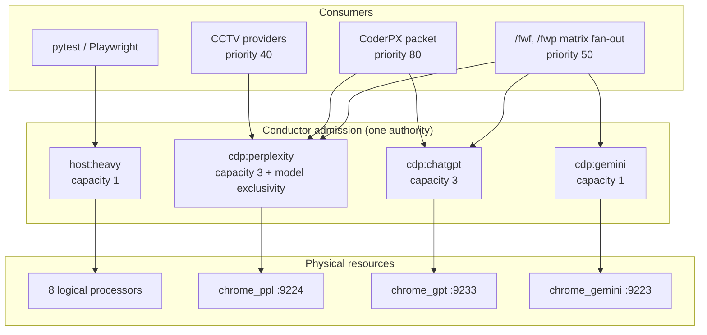

# CDP admission pools - stop serialising prompts behind pytest

## Executive decision

**One pool exists. Everything queues in it.** `host:heavy`, capacity 1, is the only row in
`host_resource_pools`, and four unrelated classes of work compete for that single slot:

| Purpose | Requests ever |
|---|---:|
| `cdp_provider` | 118 |
| `pytest_full` | 107 |
| `pytest_focused` | 43 |
| `pytest_heavy` | 25 |

Submitting a prompt to an **already-running** Chrome therefore waits behind a full pytest
suite, and a pytest suite waits behind a prompt. Neither constrains the other in reality.

**Split the pool by the resource actually being contended:**

| Pool | Capacity | Governs |
|---|---:|---|
| `host:heavy` | 1 | pytest, Playwright: real CPU/RAM serialisation on 8 logical processors |
| `cdp:perplexity` | 3 | prompt submissions to `chrome_ppl`, at most one per model |
| `cdp:chatgpt` | 3 | prompt submissions to `chrome_gpt` |
| `cdp:gemini` | 1 | prompt submissions to `chrome_gemini` |

This is not a new authority. Conductor already keys admission by `resource_key`; the table
simply has one row today.

**Implementation authorization:** NOT granted. Named token required:
`GO CDP POOL SPLIT R2`.

## Why now: the incident this caused

On 2026-08-27 the CCTV lease `rr_55a2d45ff178` expired at `14:17:17Z` and became
`RECOVERY_REQUIRED`. Admission blocks on `{ACTIVE, RECOVERY_REQUIRED}`
(`conductor_resources.py:311`, `:897`), so a **dead lease fences the gate exactly like a
running job**, with `active_units = 0` throughout.

For the next five hours everything queued behind that corpse:

| Waiting | Purpose |
|---|---|
| `rr_1d256a6f0a42` `tsignal-cctv:35968` | `cdp_provider` |
| `rr_233acfa15e3a` `t4-ops-unblock` | `cdp_provider` |
| `rr_a6b580201f52`, `rr_6772821c81c5`, `rr_9aa91b671651`, `rr_f4aae8962cd9` | `cdp_provider` |
| plus CoderPX `--probe-models`, which reported `CONDUCTOR_UNAVAILABLE` | `cdp_provider` |

A second Opus session tried to run `/fwf` and concluded that "two lanes are occupied by X and
gpt". **Nothing was occupied.** One dead CCTV lease fenced the single shared gate, and every
CDP request in the ecosystem queued behind it. The misdiagnosis is itself evidence: with one
pool, an operator cannot tell "the browser is busy" from "an unrelated job died".

Under the split, that same fence would have blocked only `cdp:perplexity`'s CCTV consumer.
GPT prompts, Gemini prompts and pytest would have proceeded untouched.

## Why the original design put CDP in `host:heavy`

The parent plan is explicit (HRL-R2, "Why"):

> On 2026-07-28 the host reached 99-100% CPU with processor queue length up to 139 while
> independent cleanup, pytest, Chrome, Thorium, and Tsignal work overlapped. Live readback
> also showed Chrome above 20 GB private memory.

That reasoning is sound for **launching or driving a heavy browser session**. It does not
hold for **posting a prompt into a browser that is already running and idle**. HRL-R2
collapsed both into one class and fixed capacity at 1, deliberately non-configurable to avoid
per-session drift. This plan keeps that discipline and changes the axis: capacity stays a
property of the pool, and the pools now match the physical resources.

## Should `/fwf` and CoderPX share a pool?

**Yes. Same pool, differentiated by priority, not by caller.**

The reason is that the pool must be keyed on the **contended resource**, never on the
consumer. `/fwf` and CoderPX both post prompts into the *same* Chrome profile through the
*same* CDP role. Giving each its own capacity-3 pool would permit six concurrent submissions
into one browser, which is precisely the overload admission exists to prevent. Two consumers,
one browser, one pool.

Fairness is a **priority** problem and Conductor already carries `priority` on every request
(values 50 and 80 are both in the current ledger):

| Consumer | Priority | Rationale |
|---|---:|---|
| CoderPX | 80 | operator-initiated, interactive, one bounded packet at a time |
| `/fwf` and `/fwp` fan-out | 50 | batch; wide, and can afford to wait |
| CCTV / background providers | 40 | fully autonomous, lowest urgency |

`_promote_locked` already orders by `priority DESC, created_at_utc, request_id`, so this
needs no scheduler change. A CoderPX packet naturally overtakes a queued `/fwf` leaf without
starving it, because the fan-out holds slots only for the duration of each submission.

## Per-model exclusivity on Perplexity

Capacity alone is not sufficient for `cdp:perplexity`. Three concurrent submissions are fine
**only if they target three different picker models**. Two concurrent requests for Kimi 3
would contend for the same picker state in one UI.

So admission for `cdp:perplexity` takes a second dimension:

```text
request(resource_key="cdp:perplexity", slot_key="kimi-3", ...)

admitted when:
    active_count(cdp:perplexity) < capacity          # 3
  AND no ACTIVE holder has slot_key == "kimi-3"      # model exclusivity
```

If Kimi 3 is running, Sonnet 5 / Grok 4.6 / GLM 5.2 / Terra / Gemini 3.7 Flash remain
admissible up to the capacity of 3. A second Kimi 3 request queues until the first releases,
even when a slot is free.

`slot_key` is optional and defaults to empty. Pools that do not use it (`host:heavy`,
`cdp:chatgpt`) behave exactly as today. This keeps the change additive.

**Expected effect.** Tonight's Perplexity roster ran 8 models sequentially through one picker
in **288.5 s**. At capacity 3 with model exclusivity, the same roster is bounded by roughly
`ceil(8/3)` waves rather than 8 serial submissions.

## Response completion detection

Reported by the operator and accepted as a requirement: a model often emits a short sentence
stating what it intends to do, then thinks, then produces the real answer. CDP capture
sometimes returns that preamble as the final response, and the caller treats the result as an
error.

The rule this plan adopts: **a lane must not treat "response present" as "response complete".**
Completion is a positive signal (the UI's generation-finished state, a stable DOM for a
settle window, or a streaming end marker), never merely "text exists". On an incomplete
answer the lane waits and re-reads within its lease TTL rather than failing.

Two honest boundaries on this item:

1. **It is not reproduced in the 2026-08-27 evidence.** All three Perplexity rejections that
   night (Kimi K3, Claude Sonnet 5, Nemotron 3 Ultra) returned complete, coherent 3.7-4.2 KB
   answers and were rejected for `priority_grades_missing` for a different reason (below).
   The requirement rests on the operator's observation, and slice CP-4 must therefore start by
   capturing a reproduction before changing capture logic.
2. **It lives in WatchF's CDP lane code, not in Conductor.** Conductor admits and leases; it
   never reads a browser. Fixing capture inside the admission plan would cross that boundary.

## Adjacent finding, not in scope: `fuse.py` compaction destroys the payload

While gathering evidence, all three "failed" Perplexity models were found to have answered
correctly and refused for the same stated reason:

- Kimi K3: *"the plan you've asked me to audit appears to be heavily truncated"*
- Claude Sonnet 5: *"heavily compacted/truncated - many sections show only partial headings"*
- Nemotron 3 Ultra: *"most sections show only partial headings... cut off mid-sentence"*

Each quoted the same mutilated fragments, e.g. `"Make the three distinct host:heavy conditi"`.
A 73 KB plan was compacted to fit a browser input budget and arrived as headings with the
content removed. **Three of four roster models were wasted on an unreadable payload**, and the
matrix stage reported them as lane failures rather than as a payload defect.

This is a real and expensive bug, but it belongs to `fuse.py`'s payload preparation, not to
admission. Recorded here as a linked follow-up so it is not lost:
raising the input budget, chunking, or attaching the plan by reference (the GitHub connector
is already present and enabled in those lanes) instead of pasting a compacted body.

## Architecture



The essential correction: **a pool represents one physical resource.** `host:heavy` represents
the CPU. Each `cdp:*` pool represents one browser. Today's single pool conflates them, so a
browser prompt consumes the machine's only CPU slot.

## Slices

| Slice | Scope | Gate |
|---|---|---|
| CP-0 | This plan; `/fwf` CEO, matrix, eng review | No code before `GO CDP POOL SPLIT R2` |
| CP-1 | Multi-pool support: seed `cdp:*` rows, per-pool capacity, `slot_key` column and exclusivity in the admission transaction | Concurrency tests per pool; `host:heavy` behaviour byte-identical |
| CP-2 | Route `cdp_provider` to the correct `cdp:*` pool by role; add `purpose` values per lane; keep `host:heavy` for pytest/Playwright only | A CDP request never touches `host:heavy`; a pytest request never touches a `cdp:*` pool |
| CP-3 | Consumer adoption: WatchF CDP lanes, `coderpx.py`, `fuse.py`, CCTV; priorities 80 / 50 / 40 | Each consumer requests the right pool at the right priority; no consumer bypasses admission |
| CP-4 | Response completion detection in the WatchF CDP lane, starting from a captured reproduction | A preamble is never returned as a final answer; incomplete answers wait within TTL |
| CP-5 | Readback, `resource-live` projection, and Gate Panel rendering of N pools | The panel shows every pool; a fence in one is not reported as a fence in another |
| CP-6 | Focused tests, exact-head review, PR, CI, merge, checkout sync | One ready transition |

CP-1 and CP-2 are the spine. CP-4 is separable and may land independently; it is the only
slice that touches browser capture.

## Interaction with the Gate Panel plan

`design/plans/2026-08-27_conductor_operator_gui_r1.md` is approved and assumes **one** pool.
Its rendering rule 6 already states the hazard: *"a panel that silently showed only the first
would report CLEAR while another gate was fenced"*, and its test asserts the displayed scope
matches the queried key.

Consequence, stated so the two plans do not drift:

- The Gate Panel may ship first against `host:heavy` alone. Its scope claim remains truthful.
- CP-5 extends the panel to N pools. It is listed here, not there, so the panel's approved
  scope is unchanged.
- `read_resource_live_snapshot(resource_key=...)` is already parameterised, so multi-pool is
  a caller change, not a redesign.

## Test plan

- **Isolation**: a `RECOVERY_REQUIRED` fence in `cdp:perplexity` does not block `cdp:chatgpt`,
  `cdp:gemini`, or `host:heavy`. Built from the captured `rr_55a2d45ff178` fixture, this is
  the regression for the incident that motivated the plan.
- **Capacity**: 3 concurrent admits on `cdp:perplexity`; the 4th queues; a release promotes it.
- **Model exclusivity**: with Kimi 3 active, a second Kimi 3 request queues even when a slot is
  free; Sonnet 5 and Grok 4.6 admit concurrently.
- **Priority**: a CoderPX request at 80 is promoted ahead of an `/fwf` leaf at 50 queued
  earlier, and the `/fwf` leaf still eventually admits (no starvation across a bounded run).
- **No cross-contamination**: a pytest request never admits into a `cdp:*` pool, asserted
  against the real admission transaction.
- **`host:heavy` unchanged**: existing capacity-one tests pass without modification, including
  the inherited-child and recovery paths.
- **Read-only contract preserved**: `resource-live` and `doctor` still create no home and leave
  a byte-identical tree with N pools present.
- CP-4 only: a captured preamble-then-answer transcript yields the final answer, never the
  preamble; a genuinely truncated response is reported as incomplete, not as success.

## Rollback

1. Set the `cdp:*` pools to `enabled = 0`. Admission then refuses CDP with
   `HOST_RESOURCE_DISABLED` rather than misrouting it.
2. Revert CP-2's routing so `cdp_provider` resolves to `host:heavy` again. Behaviour returns
   to today's single-lane serialisation.
3. The additive `slot_key` column and the extra pool rows may remain, inert.
4. No ledger rewrite. Existing `host:heavy` history keeps its meaning.

## Non-goals

- Raising `host:heavy` above capacity 1. The 2026-07-28 CPU evidence still stands for pytest.
- Any change to `release`, `recover`, or the `RECOVERY_REQUIRED` semantics. A dead lease must
  keep fencing its own pool; this plan reduces the blast radius, it does not weaken the fence.
- Chrome lifecycle ownership. Conductor still never starts, stops, or repairs a browser.
- The `fuse.py` compaction defect. Recorded above; separate change.
- Auto-recovery of expired CDP leases.

## Definition of Done

- [ ] More than one pool exists and each maps to one physical resource.
- [ ] A fence in one CDP pool provably does not block another pool or pytest.
- [ ] Perplexity admits 3 concurrent submissions with at most one per model.
- [ ] `/fwf` and CoderPX share each CDP pool and are separated by priority, not by pool.
- [ ] No consumer reaches a browser without admission; no CDP request consumes a CPU slot.
- [ ] `host:heavy` semantics and tests are unchanged.
- [ ] The Gate Panel renders every pool, and CP-5 is reflected in the GUI plan when it lands.

## Open questions for review

1. **`cdp:gemini` capacity.** Set to 1 pending evidence. Gemini's UI drives a single
   conversation, so concurrency there is unproven, unlike Perplexity's per-model picker.
2. **Should `slot_key` also apply to ChatGPT?** Capacity 3 is the operator's estimate. If
   ChatGPT concurrency turns out to be per-conversation rather than per-tab, this becomes the
   same exclusivity problem and `slot_key` is already available.
3. **Is capacity 3 right, or should it derive from measured browser memory?** Fixed integers
   are chosen for the same reason HRL-R2 fixed capacity at 1: a measured, environment-derived
   capacity drifts per session and cannot be reasoned about from a readback.

>> APPROVAL NEEDED - reply `GO CDP POOL SPLIT R2` to authorize implementation
