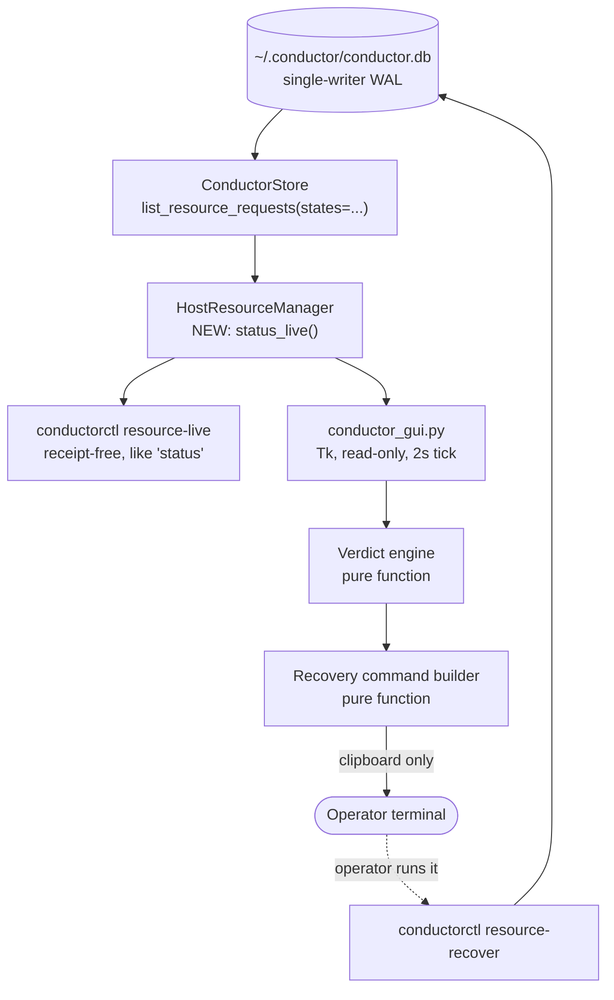

# Conductor Gate Panel - read-only operator GUI for host:heavy

## Executive decision

Build a **local, port-free, read-only Tk window** that answers one question about the
`host:heavy` gate:

> Can a heavy job start right now, and if not: who holds the gate, since when, what is
> waiting behind them, and what exactly must the operator type to clear it?

The panel is a **projection** of state Conductor already owns. It adds no admission
authority, no lease store, no release path, and no port. It ships with one narrow,
receipt-free live read added to the existing host-resource seam, which the CLI gets too.

**Plan-writing authorization:** granted by the operator on 2026-08-27 via
`design/handoffs/2026-08-27_conductor_operator_gui_plan_handoff.md`.

**Implementation authorization:** NOT granted. Named token required:
`GO CONDUCTOR GATE PANEL R2`. It is deliberately distinct from
`GO CONDUCTOR HOST RESOURCE LEASE R2`, which authorized HRL-R2 and does not extend here.

**Mockups:** three gate aspects rendered from the live readback, published as an artifact:
<https://claude.ai/code/artifact/fcd0b521-c3a8-416b-8feb-c28827a6a1c7>. ASCII equivalents are
inlined in this file so the plan stands alone in the repo.

## Consequence, downside, reversibility

**Consequence.** The recovery fence stops being an invisible failure. Today a fenced gate is
indistinguishable from a free gate in the two numbers an operator naturally reads, and the
only diagnosis path is a 244 KB JSON dump that itself damages the store.

**Downside.** One more surface to keep truthful. If the panel's verdict logic drifts from the
admission transaction's actual behaviour, it becomes a confident liar, which is worse than no
panel. Mitigation: the verdict is derived from the same states the admission transaction
writes, and slice GP-1 puts the projection behind the existing seam rather than in the GUI.

**Reversibility.** High. The panel is a standalone script with no persistent state and no
writes. Deleting `scripts/conductor_gui.py` removes it completely. The projection added in
GP-1 is additive and inert if unused.

## Phase 0 - restatement and collision verdict

### Goal

Make the three distinct `host:heavy` conditions legible at a glance, and make the exit from a
recovery fence discoverable without reading source or asking an agent.

### Required behaviour

1. Distinguish **CLEAR**, **OCCUPIED**, and **FENCED** as a single stated verdict, never as
   raw counters the operator must combine.
2. Name the blocker: request, agent instance, purpose, attempt, elapsed hold, lease, heartbeat,
   expiry, and what the lease recorded about its process.
3. Show the resource queue in the scheduler's own deterministic promotion order.
4. Explain the refusal path when the blocker is `RECOVERY_REQUIRED`, and emit the exact,
   pre-filled command that does work.
5. Separate live state from history. The default view contains zero terminal rows.
6. Report the liveness of the coordinator itself: leader, store state, WorkItem count, storage
   headroom.
7. Never request `host:heavy`, never mutate Conductor state, never open a port.

### Constraints

- Conductor is port-free by contract: single-writer SQLite WAL plus atomic inbox envelopes.
  No loopback HTTP server, WebSocket, or new port exists in the MVP.
- `dotclaude-ecosystem` is a pure Python scripts and skills repo. There is no `package.json`,
  no frontend, no build toolchain, and no `pyproject.toml` dependency surface to extend.
- Available on this host today: `tkinter` (stdlib), `pillow` 12.2.0, `psutil` 7.2.2.
  `pystray` is **not** installed.
- Operator GO for R2/R3 WorkItems is a tty-verified handshake and cannot move to a GUI.
- `resource-release` refuses `RECOVERY_REQUIRED` on purpose. That refusal is load-bearing and
  the panel must not soften it.

### Collision check

`plan_context_loader.py` still cannot catalog `D:/dotclaude` (reproduced 2026-08-27 with an
explicit `--cwd`, output `_could not detect repo_`). **Fallback used:** direct inspection of
`design/plans/`, `IDEA_BOX.md`, repo status, and `D:/APPS/_shared/ECOSYSTEM_CONTROL_PANEL.md`.

| Neighbour | Verdict |
|---|---|
| `2026-07-22_truthdeck_conductor_cross_repo_work_queue_r2.md` (status: shipped) | Parent. Its **Deferred** list contains the literal entry *"UI/dashboard beyond existing status output"*. This plan is that deferred item. |
| Ecosystem Control Panel CP-B / CP-C (`D:/APPS/EcosystemControl/`, decided 2026-06-10) | Adjacent, must not merge. CP owns application start, stop, health, and the panic path. This panel owns lease, queue, and recovery. Different authority, different repo. |
| `IDEA_BOX.md` "Conductor operator GUI" (P2, 2026-08-27) | Owner of this work. Points at the handoff today; must point at this plan once it lands. |
| CDP Fleet Manager / WatchF `chrome_ppl` | Context only. The panel shows that admission never reached the lane; it does not manage Chrome. |

### Verdict

**CREATE NEW CHILD PLAN, linked to the parent.** Not an amendment: the parent is `shipped`,
already 2,064 lines, and already carries one amendment. Not a new scheduler: Conductor remains
the sole admission authority for `host:heavy`, and this plan adds no second gate, no second
lease store, and no alternate release path. This plan closes the parent's deferred UI item and
must be cross-referenced from it when it lands.

>> PHASE 0 COMPLETE

## Live evidence, 2026-08-27

Readback taken while writing this plan. **The incident described in the handoff is still open
and has grown.**

```text
conductorctl resource-status --json
  resource_key      host:heavy
  capacity          1
  enabled           true
  active_units      0          <- reads as "free"
  queued            6          <- was 5 at handoff time
  recovery_required 1
  state_counts      {RELEASED: 229, RECOVERY_REQUIRED: 1, QUEUED: 6}
```

Blocker, unchanged since the handoff, held for over four and a half hours:

| Field | Value |
|---|---|
| `request_id` | `rr_55a2d45ff178` |
| `state` / `reason_code` | `RECOVERY_REQUIRED` / `LEASE_EXPIRED` |
| `agent_instance` | `tsignal-cctv:79584` |
| `purpose` | `cdp_provider` |
| `attempt_id` | `cctv-provider-79584-938a899a374f-15` |
| `created_at_utc` | `2026-08-27T14:12:17Z` |
| `lease_id` | `hrl_806dfd65ef7a` |
| `expires_at_utc` | `2026-08-27T14:17:17Z` |
| `heartbeat` | sequence 1, last `14:12:17Z` |
| `process_pid` / `process_start_time` | **`null` / `null`** |

Queue behind it, in admission order (all priority 50, so ordered by creation):

| # | request | agent | purpose | created |
|---|---|---|---|---|
| 1 | `rr_1d256a6f0a42` | `tsignal-cctv:35968` | `cdp_provider` | 16:59:17Z |
| 2 | `rr_233acfa15e3a` | `t4-ops-unblock` | `cdp_provider` | 17:22:34Z |
| 3 | `rr_a6b580201f52` | `tsignal-cctv:90488` | `cdp_provider` | 17:36:32Z |
| 4 | `rr_6772821c81c5` | `tsignal-cctv:94488` | `cdp_provider` | 17:39:12Z |
| 5 | `rr_9aa91b671651` | `tsignal-cctv:128584` | `cdp_provider` | 17:46:54Z |
| 6 | `rr_f4aae8962cd9` | `tsignal-cctv:9076` | `cdp_provider` | 18:39:51Z |

### Delta against the handoff, and two new findings

1. **The queue grew from 5 to 6** while the fence stood. Queue pressure under a fence is
   unbounded: nothing expires a `RECOVERY_REQUIRED` request.
2. **`conductorctl doctor` reports `doctor_status: PASS`** with the gate fenced four hours and
   six requests starved. Doctor covers store, leader lock, directories, and `truthctl`; it does
   not look at the resource pool at all. The operator's existing "is it healthy" command is
   blind to the exact condition that is blocking every heavy lane.
3. **The fence cannot be cleared by `resource-recover` alone.** The lease recorded
   `process_pid: null`, so `_owner_liveness` returns `OWNER_UNRECORDED` and the command refuses
   with `OWNER_LIVENESS_UNPROVEN`. The only exit is
   `--attest-owner-gone --reason "<why>"`. This is precisely the knowledge the operator lacked.

Coordinator state at the same moment: `store_state: AVAILABLE`, `leader_id
leader_5ae29296c484`, `leader_pid 44708`, **`leader_active: false`**, `total_work_items: 0`.

## Measured read-path evidence

Measured on this host, 2026-08-27, against the live 15.9 MB `conductor.db`.

| Read path | Latency | Payload | Rows | Durable write per read |
|---|---:|---:|---|---:|
| `conductorctl resource-status --json` | 1,560 ms | 243,737 B | 236 requests + 171 leases | **262,173 B receipt** |
| Filtered live-only store read | **15.8 ms** | **3,414 B** | 7 live requests | **0 B** |

Breakdown of the 1,560 ms: `storage_status` alone costs **623 ms** because it walks 2,867 files
in `~/.conductor/receipts/`.

Receipt-store composition today, by command:

| Command | Receipts | Bytes | Mean size |
|---|---:|---:|---:|
| `resource_status` | 140 | **15.45 MB** | 110,325 B |
| `pytest` | 170 | 2.49 MB | 14,642 B |
| `resource_request` | 2,236 | 1.26 MB | 564 B |
| everything else | 319 | 0.13 MB | ~430 B |
| **total** | **2,865** | **19.3 MB** | ceiling 268,435,456 B |

**140 occasional manual reads already own 80 percent of the entire receipt store**, and each
new one is larger than the last because the payload embeds full history. Retention is
`REPORT_ONLY`; nothing deletes them. The loop is self-amplifying: reading status writes a
receipt, and the receipt makes the next read slower through `storage_status`.

**Therefore:** a repeating viewer must not call `resource-status`. At a 2 s cadence it would
reach the 256 MB ceiling in roughly 33 minutes and would be the dominant storage consumer on
the machine. This is not a preference; it is the binding constraint on the read path.

## Grilled decisions

Operator answered 2026-08-27, during plan authoring.

| # | Decision | Chosen | Rejected, and why |
|---|---|---|---|
| D1 | Transport and shell | **Local Tk window** | HTTP on a new 17100 band: breaks the port-free contract, needs a `PORTS.md` entry, a server, and HTML assets in a repo with no frontend. Static HTML plus refresher: adds a background process and is always one refresh stale. `pystray` tray in `EcosystemControl`: new dependency, lands Conductor's GUI in another repo, and risks fusing lease authority with start/stop authority. |
| D2 | Mutations in v1 | **Read-only, plus a copyable pre-filled command** | Pure read-only without command help leaves the original complaint ("what does releasing host:heavy even mean") unanswered. Real mutate buttons would require moving operator attestation into a GUI and defending it against the tty-only GO rule; that is a separate plan. |
| D3 | Read path | **New live projection on the existing deep module, plus a `resource-live` CLI** | GUI opening `conductor.db` itself: creates a second reader that knows the SQLite schema and drifts silently. Calling `resource-status`: measured above, disqualifying. |

Decisions taken by the architect, recorded for review rather than asked:

| # | Decision | Value | Rationale |
|---|---|---|---|
| D4 | Risk class | **R2** | The diff edits `conductor_resources.py` and `conductorctl.py`, the shipped modules that gate every heavy lane. The GUI alone would be R1; the seam it consumes is not. Higher class chosen deliberately, routing this through `/fwf` CEO, matrix, and eng review. |
| D5 | Refresh cadence | 2 s, paused when the window is withdrawn or iconified | At 15.8 ms per read this is 0.8 percent of one core, and it is receipt-free. Pausing while hidden keeps an unattended open window free. |
| D6 | Process liveness display | Adjudicate **only** the pid the lease recorded, exactly one lookup per displayed lease, zero enumeration | Reuses the existing `_owner_liveness` logic so the panel's claim matches what `resource-recover` will decide. A WMI, CIM, or process-list scan of the Chrome fleet remains out of scope per the handoff and the pytest adapter contract. |
| D7 | History depth | Drawer, closed by default, newest 50 terminal requests, paged | The default view must contain zero of the 229 `RELEASED` rows. |
| D8 | Panel identity in the ledger | The panel makes no request and therefore has no `agent_instance` | Anything that appears in the resource ledger competes for the gate. The panel must be invisible to admission. |

## Frozen product contract

### Authority layers

| Layer | Owns | This panel |
|---|---|---|
| Conductor admission (`conductor_resources.py`) | Whether a heavy job may start | **Reads only.** Never decides, never queues, never promotes. |
| Conductor recovery (`resource-recover`) | Leaving `RECOVERY_REQUIRED` on evidence | **Explains and pre-fills.** Never executes. |
| Operator tty handshake (`authorize`) | R2/R3 WorkItem GO | **Untouched.** Not surfaced, not proxied. |
| CDP Fleet Manager (WatchF) | Browser roles, profiles, health | **Context hint only.** Never manages Chrome. |
| Ecosystem Control Panel | Application start, stop, panic | **Out of scope entirely.** |

### Non-negotiable invariants

1. The panel opens **no listening socket** and binds **no port**. `PORTS.md` is unchanged.
2. The panel **never** calls `resource-request`, and never appears in the resource ledger.
3. The panel performs **no writes** to `conductor.db`, `receipts/`, `inbox/`, or `artifacts/`.
4. The panel **never** presents an action that would bypass
   `RECOVERY_REQUIRED_RELEASE_REFUSED`, `OWNER_PROCESS_ALIVE`, `INHERITED_CHILD_ACTIVE`, or
   `OWNER_LIVENESS_UNPROVEN`.
5. Copying a command to the clipboard is a local UI action and is **not** a Conductor mutation.
   The operator still runs it, in their own terminal, and supplies the reason string.
6. The panel enumerates **no** processes. One recorded pid, one lookup, or "unknown".
7. If the store is unreadable or the schema is unrecognised, the panel shows an explicit
   degraded banner. It never renders a stale or guessed verdict.

### Explicit non-goals

- Any mutation of Conductor state from the GUI.
- Auto-release, auto-retry, or auto-recovery of expired leases.
- A second admission authority, or any path around Conductor for CoderPX, CCTV, or pytest.
- Application start and stop, or the panic path.
- Ownership of Chrome, `chrome_ppl`, or Perplexity.
- Granting R2/R3 GO through GUI, MCP, environment, or inbox.
- Broker, order path, or Tsignal runtime.
- Remote or phone access. This is a local window on the operator's workstation.

## Surfaces

v1 covers the handoff table in full.

| Surface | Source of truth | Rendered as |
|---|---|---|
| `host:heavy` gate | pool `capacity`, `enabled`, plus live state counts | The verdict banner: CLEAR, OCCUPIED, or FENCED. Never a bare `active_units`. |
| Holder | request joined to lease: `request_id`, `lease_id`, `agent_instance`, `purpose`, `attempt_id`, `reason_code`, heartbeat, expiry | Blocker card: who, why, since when, TTL remaining or overdue. |
| Resource queue | requests in `QUEUED` | Ordered table with position, wait time, and `HOST_RESOURCE_BUSY`. Position 1 is next to be promoted. |
| Recovery | requests in `RECOVERY_REQUIRED` | Same slot as the holder, red aspect, plus the refusal explainer and pre-filled command. |
| WorkItems | `read_store_status()` | Strip cell, `total_work_items` and `state_summary`. Kept visibly separate from the resource queue. |
| Leader | `leader_id`, `leader_pid`, `leader_active`, `store_state` | Strip cell with a lamp. `leader_active: false` is shown as a warning, not hidden. |
| Storage | `storage_status()` | Strip cell, used against ceiling. Refreshed on a slow timer, not every tick. |
| CDP / CoderPX context | read-only hint derived from `purpose` | A line noting that admission never reached the lane. No Chrome control. |

Request states the UI must render distinctly: `ACTIVE`, `INHERITED`, `QUEUED`,
`RECOVERY_REQUIRED`, `RELEASED`, `QUARANTINED`.

`QUARANTINED` is treated as a fourth, most severe aspect: the pool itself is compromised and
no admission will occur. It renders as FENCED with a distinct headline.

## Architecture

### Component and data flow



The dotted edge is the only path back to the database, and a human is standing on it.

### The live projection

`HostResourceManager.status()` today returns every request and every lease. It already has the
tool to do better: `ConductorStore.list_resource_requests` accepts a `states` filter that
`status()` simply does not pass.

Add a sibling that does:

```text
status_live() -> {
  resource_key, capacity, enabled,
  live_counts:   {ACTIVE, INHERITED, QUEUED, RECOVERY_REQUIRED, QUARANTINED},
  terminal_count: int,               # summary only, never the rows
  holder:  request+lease join or None,
  queue:   [request, ...] in promotion order,
  fenced:  [request+lease join, ...],
  pool_state: OK | QUARANTINED,
}
```

Rules:

- `status()` is left untouched, so `resource-status` output stays byte-compatible for any
  existing consumer.
- `status_live()` returns **no** terminal rows and **does not** call `storage_status()`.
  Storage is a separate, slower call the GUI makes on its own timer.
- Queue order is produced by the same key the admission transaction promotes on: priority,
  then `created_at_utc`, then `request_id`. It is asserted against the scheduler in tests.

### The `resource-live` command

Follows the **existing receipt-free precedent** in `conductorctl.py`: `status` calls
`read_store_status()` directly and bypasses `CommandEnvelope`, which is why it writes no
receipt. `resource-live` is built the same way. It is a read, not a command, and the receipt
ledger is for commands.

This also gives the command line a fix it needed independently: an operator or agent asking
"is the gate free" gets a 16 ms, 3.4 KB answer instead of a 1.6 s, 244 KB answer that damages
the store.

### The verdict engine

A pure function over `status_live()`, unit-testable without a GUI:

| Condition | Verdict | Headline |
|---|---|---|
| `pool_state == QUARANTINED` | QUARANTINED | Pool quarantined. No admission will occur. |
| any `RECOVERY_REQUIRED` | FENCED | Gate fenced. Nothing is running. |
| any `ACTIVE` or `INHERITED` | OCCUPIED | Gate held. A job is running. |
| `enabled == false` | DISABLED | Gate disabled. |
| otherwise, queue empty | CLEAR | Gate clear. |
| otherwise, queue non-empty | ANOMALY | Queue is waiting with nothing holding the gate. |

ANOMALY is deliberate: if it ever renders, either the promotion path is stuck or the panel's
model is wrong. Both are worth seeing rather than smoothing over.

### The recovery command builder

Also a pure function. Given a fenced request and its lease, it selects the correct command and
states which ordinary exits are closed:

| Lease evidence | What the panel says will refuse | Command offered |
|---|---|---|
| `process_pid` is null | `release` -> `RECOVERY_REQUIRED_RELEASE_REFUSED`; `recover` -> `OWNER_LIVENESS_UNPROVEN` | `resource-recover --request-id <id> --attest-owner-gone --reason "<why>"` |
| pid recorded, process gone or pid reused | `release` -> `RECOVERY_REQUIRED_RELEASE_REFUSED` | `resource-recover --request-id <id>` |
| pid recorded, process alive | both -> `OWNER_PROCESS_ALIVE` | none; the panel says the owner is still running and names the pid |
| surviving `INHERITED` child | both -> `INHERITED_CHILD_ACTIVE` | none; the panel names the inherited request |

The `<why>` placeholder is never auto-filled. Attestation is the operator's claim, not the
panel's.

### Process and file model

- One `python scripts/conductor_gui.py`, launched on demand. No service, no autostart, no
  daemon in v1.
- Opens a short-lived read connection per refresh through `ConductorStore`. Holds no write
  lock, and never holds a transaction across a tick.
- If the database is locked by the single writer, the tick is skipped and the previous frame is
  retained with a visible "stale, retrying" marker. The panel never blocks the writer.
- Zero new dependencies. `tkinter` and `psutil` are already present; `psutil` is used only for
  the single recorded-pid lookup of D6.

## Mockups

Rendered mockups with real identifiers: <https://claude.ai/code/artifact/fcd0b521-c3a8-416b-8feb-c28827a6a1c7>

Every widget below is plain `tkinter` / `ttk`: flat frames, `Label`, `Treeview`, `Text`, and a
coloured `Frame` as the aspect bar. No custom drawing, no rounded corners, no images.

### FENCED, from the live 2026-08-27 readback

```text
+-- Conductor Gate ---------------------------------------------------------+
|#| GATE FENCED. NOTHING IS RUNNING.                                        |
|#| Blocked 4h 42m by tsignal-cctv:79584. 6 requests waiting.               |
|#| A normal release will be refused.                                       |
+---------------------------------------------------------------------------+
| BLOCKER                                                                   |
| rr_55a2d45ff178   [RECOVERY_REQUIRED]  [LEASE_EXPIRED]                    |
|   agent      tsignal-cctv:79584        priority   50                      |
|   purpose    cdp_provider              units      1 of 1                  |
|   attempt    cctv-provider-79584-938a899a374f-15                          |
|   held since 2026-08-27 14:12:17Z  (4h 42m)                               |
|   lease      hrl_806dfd65ef7a          heartbeat  seq 1, last 14:12:17Z   |
|   expired    14:17:17Z (4h 37m ago)                                       |
|   process    not recorded, liveness cannot be adjudicated                 |
|                                                                           |
|   Both ordinary exits are closed:                                         |
|     - resource-release refuses RECOVERY_REQUIRED_RELEASE_REFUSED, by design|
|     - resource-recover refuses OWNER_LIVENESS_UNPROVEN, no pid recorded    |
|   The gate opens only on operator attestation. Paste into a terminal:      |
|   +---------------------------------------------------------+  +-------+  |
|   | python scripts/conductorctl.py resource-recover \        |  | COPY  |  |
|   |   --request-id rr_55a2d45ff178 \                         |  +-------+  |
|   |   --attest-owner-gone --reason "<why you know it's gone>"|             |
|   +---------------------------------------------------------+             |
+---------------------------------------------------------------------------+
| RESOURCE QUEUE            6 waiting, admission order                      |
|  #  request           agent                purpose       reason    waiting|
|  1  rr_1d256a6f0a42   tsignal-cctv:35968   cdp_provider  BUSY      1h 55m |
|  2  rr_233acfa15e3a   t4-ops-unblock       cdp_provider  BUSY      1h 32m |
|  3  rr_a6b580201f52   tsignal-cctv:90488   cdp_provider  BUSY      1h 18m |
|  4  rr_6772821c81c5   tsignal-cctv:94488   cdp_provider  BUSY      1h 15m |
|  5  rr_9aa91b671651   tsignal-cctv:128584  cdp_provider  BUSY      1h 08m |
|  6  rr_f4aae8962cd9   tsignal-cctv:9076    cdp_provider  BUSY      0h 15m |
+---------------------------------------------------------------------------+
| * leader inactive leader_5ae29296c484 pid 44708 | store AVAILABLE |        |
| work items 0 | receipts 19.3 / 256 MB | read 16 ms, no receipt written     |
+---------------------------------------------------------------------------+
```

### OCCUPIED, illustrative

```text
+-- Conductor Gate ---------------------------------------------------------+
|#| GATE HELD. A JOB IS RUNNING.                                            |
|#| Held 8m 12s by codex-root-4075 running pytest_full.                     |
|#| Heartbeat healthy. 2 requests waiting.                                  |
+---------------------------------------------------------------------------+
| HOLDER                                                                    |
| rr_c19f4a7b32de   [ACTIVE]  [1 of 1 units]                                |
|   agent      codex-root-4075           purpose    pytest_full             |
|   acquired   18:46:48Z (8m 12s)        lease      hrl_4b2c90ad1e77        |
|   heartbeat  seq 98, last 18:54:51Z (9s ago)                              |
|   expires    18:59:51Z (in 4m 51s)                                        |
|   process    pid 51204, started 18:46:48Z, alive                          |
|   inherited  none                                                         |
|                                                                           |
|   No action is available or needed. The gate clears when the job releases  |
|   it, or when the lease expires and reconcile proves the process is gone.  |
+---------------------------------------------------------------------------+
| RESOURCE QUEUE            2 waiting, admission order                      |
|  1  rr_7ea3f0c5518b   coderpx:22318   cdp_provider   BUSY          0h 06m |
|  2  rr_2d80b1f6ac94   luna-a          pytest_heavy   BUSY          0h 02m |
+---------------------------------------------------------------------------+
```

### CLEAR, illustrative

```text
+-- Conductor Gate ---------------------------------------------------------+
|#| GATE CLEAR.                                                             |
|#| Nothing holds host:heavy and nothing is waiting.                        |
|#| A heavy request now is admitted immediately.                            |
+---------------------------------------------------------------------------+
| LAST RELEASE              history, for orientation only                   |
|   rr_c19f4a7b32de  codex-root-4075  pytest_full  PYTEST_COMPLETED         |
|   released 19:11:03Z (3m 27s ago), held 24m 15s                           |
+---------------------------------------------------------------------------+
```

Empty sections are removed rather than shown as zeros, so window height itself signals that
there is nothing to read.

### Rendering rules

1. **No animation on live values.** No fades, no sliding, no progress easing. Values are
   replaced in place on the tick.
2. **Layout stability.** Fixed column widths and a fixed-width font for every identifier,
   timestamp, and duration. A number must never move while it is being read.
3. **State is encoded in form as well as text.** The aspect bar colour and the state pill both
   carry the verdict, so it survives a monochrome screenshot.
4. **Semantic colour only.** Green, amber, red mean clear, held, blocked. They are not a theme.

## Implementation slices

| Slice | Scope | Gate |
|---|---|---|
| GP-0 | This plan, `/fwf` CEO, matrix, and eng review | No code before review clears and `GO CONDUCTOR GATE PANEL R2` is given |
| GP-1 | `status_live()` on `HostResourceManager`; `resource-live` receipt-free CLI; tests | Receipt-count-unchanged test; `status()` byte-compatibility test; promotion-order test |
| GP-2 | Verdict engine and recovery command builder, as pure functions with no Tk import | Full state-matrix unit tests, including QUARANTINED and ANOMALY |
| GP-3 | Tk panel: verdict banner, holder/blocker card, queue table, strip | Headless render test over recorded fixtures; no-request-in-ledger test |
| GP-4 | History drawer, degraded and locked-store states, clipboard, launcher | Store-locked and schema-unknown paths render degraded, never stale |
| GP-5 | `skills/conductor/SKILL.md` adoption, `IDEA_BOX.md` repoint, parent-plan cross-reference | `sync_agent_rules.py` clean; no unmanaged-block edits |
| GP-6 | Focused tests, exact-head R2 review, draft PR, ready, CI, merge, checkout sync | One ready transition, reviewed exact head |

GP-1 and GP-2 are independent of GP-3 and can be built and reviewed first; the panel is a
consumer of both. GP-2 has no Tk import by design, so the logic that matters is testable
without a display.

## Test plan

### Projection and read path

- `status_live()` returns zero terminal rows against a fixture with 229 `RELEASED` requests.
- `status_live()` never calls `storage_status()`.
- Queue order from `status_live()` equals the scheduler's promotion order across randomised
  priority and creation-time fixtures, including ties broken by `request_id`.
- `status()` output is unchanged, field for field, against a golden fixture.
- **Receipt invariant:** counting files in `receipts/` before and after N `resource-live` calls
  yields a delta of exactly zero. The same assertion against `resource-status` is expected to
  be non-zero, and is asserted, so the test documents why the new path exists.

### Verdict engine

- Full matrix: every combination of `{0,1} ACTIVE` x `{0,1} INHERITED` x `{0,n} QUEUED` x
  `{0,1} RECOVERY_REQUIRED` x `{OK, QUARANTINED}` x `{enabled, disabled}` maps to exactly one
  verdict, and the mapping is asserted row by row.
- **Regression for the incident:** `active_units == 0` with one `RECOVERY_REQUIRED` and six
  `QUEUED` yields FENCED, and the headline names `tsignal-cctv:79584`. This fixture is built
  from the captured 2026-08-27 readback.
- ANOMALY renders when the queue is non-empty with nothing holding the gate.

### Recovery command builder

- Null pid yields the `--attest-owner-gone --reason` form, with the placeholder unfilled.
- Recorded pid, process gone, yields the plain `resource-recover --request-id` form.
- Recorded pid, process alive, yields **no command** and an explicit `OWNER_PROCESS_ALIVE`
  explanation naming the pid.
- Surviving `INHERITED` child yields no command and names `INHERITED_CHILD_ACTIVE`.
- The builder never emits `resource-release` for a `RECOVERY_REQUIRED` request, asserted
  against every fixture.
- Emitted command strings are shell-quoted and contain no environment, credential, or raw
  command text from the request record.

### Panel behaviour

- Over a full refresh cycle against a live store, `receipts/` file count is unchanged and no
  row appears in `host_resource_requests` for the panel. This is the "panel never competes for
  the gate" test and it drives the real code path, not a mock.
- A locked store causes a skipped tick with a visible stale marker; the previous frame is
  retained and no exception escapes.
- An unrecognised schema version renders the degraded banner rather than a verdict.
- Exactly one `psutil.Process` lookup occurs per displayed lease that recorded a pid, and zero
  process enumeration calls occur. Asserted by patching at the `psutil` boundary and counting.
- Clipboard copy performs no store access.

### Proposed validation commands

```bash
python -m pytest scripts/tests/test_conductor_resources.py scripts/tests/test_conductor_cli.py scripts/tests/test_conductor_gui.py -q
```

Heavy or full-suite runs request `host:heavy` through Conductor like any other consumer. This
plan does not exempt its own tests from the gate.

## Acceptance story

The 2026-08-27 incident, replayed against the shipped panel.

1. `coderpx.py --probe-models` returns `CONDUCTOR_UNAVAILABLE`, `host:heavy not admitted:
   state=QUEUED reason=HOST_RESOURCE_BUSY`.
2. The operator opens the panel. Within one tick the banner reads
   **GATE FENCED. NOTHING IS RUNNING. Blocked 4h 42m by tsignal-cctv:79584. 6 requests
   waiting.**
3. The blocker card names `rr_55a2d45ff178`, the expired lease `hrl_806dfd65ef7a`, and states
   `process not recorded, liveness cannot be adjudicated`.
4. The refusal panel states that `resource-release` will refuse with
   `RECOVERY_REQUIRED_RELEASE_REFUSED` and `resource-recover` will refuse with
   `OWNER_LIVENESS_UNPROVEN`.
5. The operator presses COPY, pastes into a terminal, replaces `<why>` with their reason, and
   runs it. Conductor adjudicates and records the attestation in the event ledger.
6. The panel's next tick shows **GATE CLEAR** or **GATE HELD** as the queue drains, and the
   queue count falls from 6.

**The story is satisfied only if the operator never opens `resource-status --json` and never
asks an agent what releasing `host:heavy` means.** Steps 2 through 4 are the entire product.

## Rollback

1. Stop launching the panel. It is on demand and holds no state.
2. Delete `scripts/conductor_gui.py` and its tests. Nothing else references them.
3. `status_live()` and `resource-live` may remain: they are additive, receipt-free, and inert
   when unused. Removing them is a separate, optional revert of the GP-1 commit.
4. No database migration, no schema change, no data to reconcile. `conductor.db` is never
   written by this work and is never deleted as part of rollback.

Rollback does not authorize bypassing Conductor. Without the panel, the diagnosis path returns
to `resource-status --json` and its receipt cost.

## Follow-ups, explicitly out of scope

Recorded so they are not smuggled in, and not implemented here.

1. **`doctor` is blind to the resource pool.** Confirmed 2026-08-27: `doctor_status: PASS`
   with the gate fenced four hours and six requests starved. Teaching `doctor` about the pool
   is a small, separate change with its own review, and it would help every non-GUI caller.
2. **Receipt retention is `REPORT_ONLY` and `resource_status` receipts dominate the store.**
   GP-1 stops the panel from making it worse but does not shrink the existing 15.45 MB. Bounded
   retention is an operator-owned decision, not a side effect of a GUI plan.
3. **`leader_active: false` with the leader lock present.** Observed, not diagnosed. The panel
   will surface it; explaining it is separate work.
4. Mutating controls in the panel, a tray or always-on shell, remote access, capacity above 1,
   and any resource class other than `host:heavy`.

## Definition of Done

- [ ] Collision verdict recorded: projection of Conductor, new child plan, no second scheduler.
- [ ] Transport decided and its consequence stated: local Tk, port-free, **`PORTS.md` unchanged**.
- [ ] v1 surfaces cover the handoff table in full; mutations consciously out, with the
      copy-command affordance defended in D2.
- [ ] The 2026-08-27 incident is the acceptance story, with real identifiers.
- [ ] Named implementation GO token defined and distinct from the plan-writing authorization.
- [ ] Mockups exist for all three aspects and are buildable in plain `tkinter`.
- [ ] Read-path cost measured, not asserted, and the disqualifying path documented with numbers.
- [ ] `IDEA_BOX.md` points at this plan instead of the handoff once this file lands.
- [ ] Parent plan cross-references this file against its deferred UI item.

## Open risks for `/fwf` review

1. **Verdict drift.** The panel's verdict is a second implementation of "is the gate free". If
   admission changes and the verdict engine does not, the panel lies confidently. Mitigation is
   the promotion-order test and keeping the projection inside the existing seam, but the risk
   is real and worth a reviewer's attention.
2. **Tk ceiling.** A Tk window is dependency-free but plain, and it cannot be reached from a
   phone. If the operator later wants remote visibility, this plan is not the foundation for
   it, and the transport decision would reopen with a `PORTS.md` consequence.
3. **The copy-command affordance is a persuasion surface.** It tells the operator what to
   attest. It must never state that the owner is gone; it must only state what the ledger
   recorded and leave the claim to the human. Reviewers should check the exact copy for this.
4. **R2 classification may be argued down to R1** since the diff is read-only. The higher class
   was chosen because the files touched gate every heavy lane on the machine. A reviewer may
   reasonably disagree; the routing consequence is CEO plus matrix plus eng versus CEO plus
   audit plus eng.

>> APPROVAL NEEDED - reply `GO CONDUCTOR GATE PANEL R2` to authorize implementation
