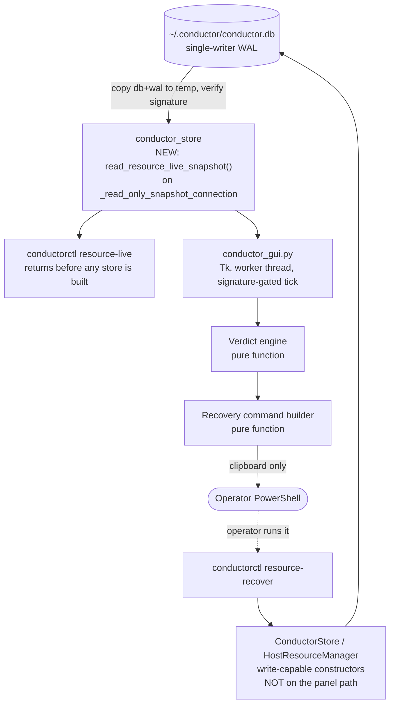

# Conductor Gate Panel - read-only operator GUI for host:heavy

## Executive decision

Build a **local, port-free, read-only Tk window** that answers one question about the
`host:heavy` gate:

> Can a heavy job start right now, and if not: who holds the gate, since when, what is
> waiting behind them, and what exactly must the operator type to clear it?

The panel is a **projection** of state Conductor already owns. It adds no admission
authority, no lease store, no release path, and no port. It ships with one narrow,
receipt-free live read added to the existing host-resource seam, which the CLI gets too.

**Plan-writing authorization:** granted by the operator on 2026-08-27 via
`design/handoffs/2026-08-27_conductor_operator_gui_plan_handoff.md`.

**Implementation authorization:** NOT granted. Named token required:
`GO CONDUCTOR GATE PANEL R2`. It is deliberately distinct from
`GO CONDUCTOR HOST RESOURCE LEASE R2`, which authorized HRL-R2 and does not extend here.

**Mockups:** three gate aspects rendered from the live readback, published as an artifact:
<https://claude.ai/code/artifact/fcd0b521-c3a8-416b-8feb-c28827a6a1c7>. ASCII equivalents are
inlined in this file so the plan stands alone in the repo.

## Consequence, downside, reversibility

**Consequence.** The recovery fence stops being an invisible failure. Today a fenced gate is
indistinguishable from a free gate in the two numbers an operator naturally reads, and the
only diagnosis path is a 244 KB JSON dump that itself damages the store.

**Downside.** One more surface to keep truthful. If the panel's verdict logic drifts from the
admission transaction's actual behaviour, it becomes a confident liar, which is worse than no
panel. Mitigation: the verdict is derived from the same states the admission transaction
writes, and slice GP-1 puts the projection behind the existing seam rather than in the GUI.

**Reversibility.** High. The panel is a standalone script with no persistent state and no
writes. Deleting `scripts/conductor_gui.py` removes it completely. The projection added in
GP-1 is additive and inert if unused.

## Phase 0 - restatement and collision verdict

### Goal

Make the three distinct `host:heavy` conditions legible at a glance, and make the exit from a
recovery fence discoverable without reading source or asking an agent.

### Required behaviour

1. Distinguish **CLEAR**, **OCCUPIED**, and **FENCED** as a single stated verdict, never as
   raw counters the operator must combine.
2. Name the blocker: request, agent instance, purpose, attempt, elapsed hold, lease, heartbeat,
   expiry, and what the lease recorded about its process.
3. Show the resource queue in the scheduler's own deterministic promotion order.
4. Explain the refusal path when the blocker is `RECOVERY_REQUIRED`, and emit the exact,
   pre-filled command that does work.
5. Separate live state from history. The default view contains zero `RELEASED` rows.
6. Report the liveness of the coordinator itself: leader, store state, WorkItem count, storage
   headroom.
7. Never request `host:heavy`, never mutate Conductor state, never open a port.

### Constraints

- Conductor is port-free by contract: single-writer SQLite WAL plus atomic inbox envelopes.
  No loopback HTTP server, WebSocket, or new port exists in the MVP.
- `dotclaude-ecosystem` is a pure Python scripts and skills repo. There is no `package.json`,
  no frontend, no build toolchain, and no `pyproject.toml` dependency surface to extend.
- Available on this host today: `tkinter` (stdlib), `pillow` 12.2.0, `psutil` 7.2.2.
  `pystray` is **not** installed.
- Operator GO for R2/R3 WorkItems is a tty-verified handshake and cannot move to a GUI.
- `resource-release` refuses `RECOVERY_REQUIRED` on purpose. That refusal is load-bearing and
  the panel must not soften it.

### Collision check

`plan_context_loader.py` still cannot catalog `D:/dotclaude` (reproduced 2026-08-27 with an
explicit `--cwd`, output `_could not detect repo_`). **Fallback used:** direct inspection of
`design/plans/`, `IDEA_BOX.md`, repo status, and `D:/APPS/_shared/ECOSYSTEM_CONTROL_PANEL.md`.

| Neighbour | Verdict |
|---|---|
| `2026-07-22_truthdeck_conductor_cross_repo_work_queue_r2.md` (status: shipped) | Parent. Its **Deferred** list contains the literal entry *"UI/dashboard beyond existing status output"*. This plan is that deferred item. |
| Ecosystem Control Panel CP-B / CP-C (`D:/APPS/EcosystemControl/`, decided 2026-06-10) | Adjacent, must not merge. CP owns application start, stop, health, and the panic path. This panel owns lease, queue, and recovery. Different authority, different repo. |
| `IDEA_BOX.md` "Conductor operator GUI" (P2, 2026-08-27) | Owner of this work. Points at the handoff today; must point at this plan once it lands. |
| CDP Fleet Manager / WatchF `chrome_ppl` | Context only. The panel shows that admission never reached the lane; it does not manage Chrome. |

### Verdict

**CREATE NEW CHILD PLAN, linked to the parent.** Not an amendment: the parent is `shipped`,
already 2,064 lines, and already carries one amendment. Not a new scheduler: Conductor remains
the sole admission authority for `host:heavy`, and this plan adds no second gate, no second
lease store, and no alternate release path. This plan closes the parent's deferred UI item and
must be cross-referenced from it when it lands.

>> PHASE 0 COMPLETE

## Live evidence, 2026-08-27

Readback taken while writing this plan. **The incident described in the handoff is still open
and has grown.**

```text
conductorctl resource-status --json
  resource_key      host:heavy
  capacity          1
  enabled           true
  active_units      0          <- reads as "free"
  queued            6          <- was 5 at handoff time
  recovery_required 1
  state_counts      {RELEASED: 229, RECOVERY_REQUIRED: 1, QUEUED: 6}
```

Blocker, unchanged since the handoff, held for over four and a half hours:

| Field | Value |
|---|---|
| `request_id` | `rr_55a2d45ff178` |
| `state` / `reason_code` | `RECOVERY_REQUIRED` / `LEASE_EXPIRED` |
| `agent_instance` | `tsignal-cctv:79584` |
| `purpose` | `cdp_provider` |
| `attempt_id` | `cctv-provider-79584-938a899a374f-15` |
| `created_at_utc` | `2026-08-27T14:12:17Z` |
| `lease_id` | `hrl_806dfd65ef7a` |
| `expires_at_utc` | `2026-08-27T14:17:17Z` |
| `heartbeat` | sequence 1, last `14:12:17Z` |
| `process_pid` / `process_start_time` | **`null` / `null`** |

Queue behind it, in admission order (all priority 50, so ordered by creation):

| # | request | agent | purpose | created |
|---|---|---|---|---|
| 1 | `rr_1d256a6f0a42` | `tsignal-cctv:35968` | `cdp_provider` | 16:59:17Z |
| 2 | `rr_233acfa15e3a` | `t4-ops-unblock` | `cdp_provider` | 17:22:34Z |
| 3 | `rr_a6b580201f52` | `tsignal-cctv:90488` | `cdp_provider` | 17:36:32Z |
| 4 | `rr_6772821c81c5` | `tsignal-cctv:94488` | `cdp_provider` | 17:39:12Z |
| 5 | `rr_9aa91b671651` | `tsignal-cctv:128584` | `cdp_provider` | 17:46:54Z |
| 6 | `rr_f4aae8962cd9` | `tsignal-cctv:9076` | `cdp_provider` | 18:39:51Z |

### Delta against the handoff, and two new findings

1. **The queue grew from 5 to 6** while the fence stood. Queue pressure under a fence is
   unbounded: nothing expires a `RECOVERY_REQUIRED` request.
2. **`conductorctl doctor` reports `doctor_status: PASS`** with the gate fenced four hours and
   six requests starved. Doctor covers store, leader lock, directories, and `truthctl`; it does
   not look at the resource pool at all. The operator's existing "is it healthy" command is
   blind to the exact condition that is blocking every heavy lane.
3. **The fence cannot be cleared by `resource-recover` alone.** The lease recorded
   `process_pid: null`, so `_owner_liveness` returns `OWNER_UNRECORDED` and the command refuses
   with `OWNER_LIVENESS_UNPROVEN`. The only exit is
   `--attest-owner-gone --reason "<why>"`. This is precisely the knowledge the operator lacked.

Coordinator state at the same moment: `store_state: AVAILABLE`, `leader_id
leader_5ae29296c484`, `leader_pid 44708`, **`leader_active: false`**, `total_work_items: 0`.

## Measured read-path evidence

Measured on this host, 2026-08-27, against the live 15.9 MB `conductor.db`.

| Read path | Latency | Payload | Rows | Durable write per read | Usable? |
|---|---:|---:|---|---:|---|
| `conductorctl resource-status --json` | 1,560 ms | 243,737 B | 236 requests + 171 leases | **262,173 B receipt** | no, cost |
| Direct `ConductorStore` read, filtered | 15.8 ms | 3,414 B | 7 live requests | 0 B | **no, constructor writes** |
| **`_read_only_snapshot_connection`, filtered** | **~10 ms** | **3,414 B** | live requests only | **0 B** | **yes** |

The middle row is kept deliberately. It is what this plan proposed in its first draft, and it
is not usable: constructing `ConductorStore` creates directories and migrates, and constructing
`HostResourceManager` writes a pool row. The measurement was real, the path was not available.
The third row is the production path, measured five times against the live 17.1 MB store
(15, 9, 9, 9, 8 ms). It is *faster* than the direct read because the query runs against a local
temp copy with no lock contention, but its cost scales with database size, which is why the
panel gates it behind a file-signature check rather than paying it every tick.

Breakdown of the 1,560 ms: `storage_status` alone costs **623 ms** because it walks 2,867 files
in `~/.conductor/receipts/`.

Receipt-store composition today, by command:

| Command | Receipts | Bytes | Mean size |
|---|---:|---:|---:|
| `resource_status` | 140 | **15.45 MB** | 110,325 B |
| `pytest` | 170 | 2.49 MB | 14,642 B |
| `resource_request` | 2,236 | 1.26 MB | 564 B |
| everything else | 319 | 0.13 MB | ~430 B |
| **total** | **2,865** | **19.3 MB** | ceiling 268,435,456 B |

**140 occasional manual reads already own 80 percent of the entire receipt store**, and each
new one is larger than the last because the payload embeds full history. Retention is
`REPORT_ONLY`; nothing deletes them. The loop is self-amplifying: reading status writes a
receipt, and the receipt makes the next read slower through `storage_status`.

**Therefore:** a repeating viewer must not call `resource-status`. At a 2 s cadence it would
reach the 256 MB ceiling in roughly 33 minutes and would be the dominant storage consumer on
the machine. This is not a preference; it is the binding constraint on the read path.

## Grilled decisions

Operator answered 2026-08-27, during plan authoring.

| # | Decision | Chosen | Rejected, and why |
|---|---|---|---|
| D1 | Transport and shell | **Local Tk window** | HTTP on a new 17100 band: breaks the port-free contract, needs a `PORTS.md` entry, a server, and HTML assets in a repo with no frontend. Static HTML plus refresher: adds a background process and is always one refresh stale. `pystray` tray in `EcosystemControl`: new dependency, lands Conductor's GUI in another repo, and risks fusing lease authority with start/stop authority. |
| D2 | Mutations in v1 | **Read-only, plus a copyable pre-filled command** | Pure read-only without command help leaves the original complaint ("what does releasing host:heavy even mean") unanswered. Real mutate buttons would require moving operator attestation into a GUI and defending it against the tty-only GO rule; that is a separate plan. |
| D3 | Read path | **New live projection on the existing deep module, plus a `resource-live` CLI** | GUI opening `conductor.db` itself: creates a second reader that knows the SQLite schema and drifts silently. Calling `resource-status`: measured above, disqualifying. |

Decisions taken by the architect, recorded for review rather than asked:

| # | Decision | Value | Rationale |
|---|---|---|---|
| D4 | Risk class | **R2** | The diff edits `conductor_resources.py` and `conductorctl.py`, the shipped modules that gate every heavy lane. The GUI alone would be R1; the seam it consumes is not. Higher class chosen deliberately, routing this through `/fwf` CEO, matrix, and eng review. |
| D5 | Refresh cadence | 2 s, paused when the window is withdrawn or iconified | At 15.8 ms per read this is 0.8 percent of one core, and it is receipt-free. Pausing while hidden keeps an unattended open window free. |
| D6 | Process liveness display | Adjudicate **only** the pid the lease recorded, exactly one lookup per displayed lease, zero enumeration. The panel reports the **observation**, never the **conclusion**. | Reuses the existing `_owner_liveness` logic so the panel's reading matches what `resource-recover` will decide. A WMI, CIM, or process-list scan of the Chrome fleet remains out of scope per the handoff and the pytest adapter contract. |

D6 needs one distinction spelled out, because an earlier draft of this plan asserted both
"adjudicate the recorded pid and display liveness" and "the panel never states the owner is
gone", which cannot both be true as written. They are reconciled as observation versus claim:

- The panel **may** render `recorded pid 51204 is not running` or `pid not recorded, liveness
  cannot be adjudicated`. Those are readings of the ledger and the OS.
- The panel **may not** render `the owner is gone` or `safe to attest`. Attestation is the
  operator's claim about the world, and the `--reason` string is where they make it.

The difference is not pedantry. `--attest-owner-gone` is the one place where a human vouches
for something the system could not prove, and a panel that pre-vouches turns an attestation
into a rubber stamp.
| D7 | History depth | Drawer, closed by default, newest 50 terminal requests, paged | The default view must contain zero of the 229 `RELEASED` rows. |
| D8 | Panel identity in the ledger | The panel makes no request and therefore has no `agent_instance` | Anything that appears in the resource ledger competes for the gate. The panel must be invisible to admission. |

## Frozen product contract

### Authority layers

| Layer | Owns | This panel |
|---|---|---|
| Conductor admission (`conductor_resources.py`) | Whether a heavy job may start | **Reads only.** Never decides, never queues, never promotes. |
| Conductor recovery (`resource-recover`) | Leaving `RECOVERY_REQUIRED` on evidence | **Explains and pre-fills.** Never executes. |
| Operator tty handshake (`authorize`) | R2/R3 WorkItem GO | **Untouched.** Not surfaced, not proxied. |
| CDP Fleet Manager (WatchF) | Browser roles, profiles, health | **Context hint only.** Never manages Chrome. |
| Ecosystem Control Panel | Application start, stop, panic | **Out of scope entirely.** |

### Non-negotiable invariants

1. The panel opens **no listening socket** and binds **no port**. `PORTS.md` is unchanged.
2. The panel **never** calls `resource-request`, and never appears in the resource ledger.
3. The panel performs **no writes** to `conductor.db`, `receipts/`, `inbox/`, or `artifacts/`.
4. The panel **never** presents an action that would bypass
   `RECOVERY_REQUIRED_RELEASE_REFUSED`, `OWNER_PROCESS_ALIVE`, `INHERITED_CHILD_ACTIVE`, or
   `OWNER_LIVENESS_UNPROVEN`.
5. Copying a command to the clipboard is a local UI action and is **not** a Conductor mutation.
   The operator still runs it, in their own terminal, and supplies the reason string.
6. The panel enumerates **no** processes. One recorded pid, one lookup, or "unknown".
7. If the store is unreadable or the schema is unrecognised, the panel shows an explicit
   degraded banner. It never renders a stale or guessed verdict.

### Explicit non-goals

- Any mutation of Conductor state from the GUI.
- Auto-release, auto-retry, or auto-recovery of expired leases.
- A second admission authority, or any path around Conductor for CoderPX, CCTV, or pytest.
- Application start and stop, or the panic path.
- Ownership of Chrome, `chrome_ppl`, or Perplexity.
- Granting R2/R3 GO through GUI, MCP, environment, or inbox.
- Broker, order path, or Tsignal runtime.
- Remote or phone access. This is a local window on the operator's workstation.

## Surfaces

v1 covers the handoff table in full.

| Surface | Source of truth | Rendered as |
|---|---|---|
| `host:heavy` gate | pool `capacity`, `enabled`, plus live state counts | The verdict banner: CLEAR, OCCUPIED, or FENCED. Never a bare `active_units`. |
| Holder | request joined to lease: `request_id`, `lease_id`, `agent_instance`, `purpose`, `attempt_id`, `reason_code`, heartbeat, expiry | Blocker card: who, why, since when, TTL remaining or overdue. |
| Resource queue | requests in `QUEUED` | Ordered table with position, wait time, and `HOST_RESOURCE_BUSY`. Position 1 is next to be promoted. |
| Recovery | requests in `RECOVERY_REQUIRED` | Same slot as the holder, red aspect, plus the refusal explainer and pre-filled command. |
| WorkItems | `read_store_status()` | Strip cell, `total_work_items` and `state_summary`. Kept visibly separate from the resource queue. |
| Leader | `leader_id`, `leader_pid`, `leader_active`, `store_state` | Strip cell with a lamp. `leader_active: false` is shown as a warning, not hidden. |
| Storage | `storage_status()` | Strip cell, used against ceiling. Refreshed on a slow timer, not every tick. |
| CDP / CoderPX context | read-only hint derived from `purpose` | A line noting that admission never reached the lane. No Chrome control. |

Request states the UI must render distinctly: `ACTIVE`, `INHERITED`, `QUEUED`,
`RECOVERY_REQUIRED`, `RELEASED`, `QUARANTINED`.

`QUARANTINED` is **not** a gate aspect. It does not appear in the admission blocker set, so
admission proceeds normally while quarantined requests exist. It is rendered as an attention row
below the queue, never as a verdict. (An earlier draft called it "a fourth, most severe aspect"
that blocks admission and renders FENCED. That was wrong on all three counts and is corrected
here as well as in the verdict table, so the two sections cannot drift apart again.)

## Architecture

### Component and data flow



The dotted edge is the only path back to the database, and a human is standing on it. The
write-capable objects sit on that path and only that path: the panel never constructs them,
because constructing them is itself a write.

### The live projection

**The read must not go through `HostResourceManager` or `ConductorStore` at all.** Both
constructors write:

- `HostResourceManager.__init__` (`conductor_resources.py:191`) calls `save_resource_pool()`
  when the pool row is missing. Constructing it *creates state*.
- `ConductorStore.__init__` (`conductor_store.py:239`) resolves the root, then creates
  directories and initialises or migrates the database.

A `read_resource_live_snapshot()` method hung on `HostResourceManager` would therefore fail
`test_cli_read_only_commands_do_not_create_home` on its first run against an absent home, and
could not honour the tree-byte-identity assertion either. This plan asserted the opposite in
its first draft. The `status` command avoids the trap not by luck but by construction: it calls
`read_store_status()` and **returns before `ConductorStore()` is ever built**
(`conductorctl.py:114`, with the store constructed only at `:161`).

The correct seam already exists. `_read_only_snapshot_connection`
(`conductor_store.py:67`) copies the database and its WAL into a temporary directory, verifies
the source file signatures did not change across the copy (retrying up to three times, raising
`sqlite3.OperationalError("store changed during read-only snapshot")` if it cannot get a stable
copy), and opens the copy. Nothing is written beside the live database.

So GP-1 adds a **module-level function in `conductor_store.py`**, directly beside
`read_store_status` (`:102`), which is the existing worked example: it takes the snapshot at
`:120` and returns an `ABSENT` result at `:116` when the database file does not exist, without
creating anything. The new function copies that shape exactly, including the absent case.
It must not live in `conductor_resources.py`, which would import a module-private helper across
a boundary.

**One snapshot per refresh, not two.** The panel's footer needs `read_store_status()` (leader,
store state, work items) and its body needs the resource rows. Specified as two calls, each
would open its own snapshot, and a snapshot is a `shutil.copy2` of the whole database: at 17.1
MB that is two full copies per refresh, doubling exactly the cost the signature gate exists to
control. So the reader is one function over one connection:

```text
read_gate_frame(resource_key="host:heavy") -> {
  store:  {store_state, leader_id, leader_pid, leader_active, total_work_items, state_summary},
  gate:   {resource_key, capacity, enabled, pool_present, live_counts, terminal_count,
           holder, inherited, queue, fenced, quarantined},
}
```

`read_resource_live_snapshot()` is the gate half and stays separately callable, because that is
what `resource-live` exposes to the CLI and to agents. `read_gate_frame()` is the panel's entry
point and pays for one snapshot. Both return before any store object is constructed, mirroring
how `status` is placed at `conductorctl.py:114` rather than at `:161`.

The gate half's shape:

Its shape:

```text
read_resource_live_snapshot(resource_key="host:heavy") -> {
  resource_key, capacity, enabled,
  pool_present:  bool,               # a missing pool row is not the same as enabled=false
  live_counts:   {ACTIVE, INHERITED, QUEUED, RECOVERY_REQUIRED, QUARANTINED},
  terminal_count: int,               # summary only, never the rows
  holder:   request+lease join or None,      # the ACTIVE request, if any
  inherited: [request, ...],                 # children under the holder's lease
  queue:    [request, ...] in promotion order,
  fenced:   [request+lease join, ...],       # zero or more, see below
  quarantined: [request, ...],               # non-blocking, needs attention
}
```

There is deliberately **no `pool_state` field**. `HostResourcePool`
(`scripts/conductor_model.py:285`) carries only `resource_key`, `capacity`, `enabled`, and
`schema_version`. `QUARANTINED` is a *request* state (`conductor_model.py:240`), set on an
inherited-child conflict (`conductor_resources.py:280`, reason `INHERITED_CHILD_BUSY`). The
parent plan's failure table speaks of quarantining a *pool*; that is an aspiration in prose,
not implemented state, and the panel must not render it as if it were.

Rules:

- `status()` is left untouched, so `resource-status` output stays compatible for any
  existing consumer.
- The snapshot returns **no `RELEASED` rows** and **does not** call `storage_status()`.
  `storage_status()` measured **623 ms**, because it walks all 2,867 files under `receipts/`,
  and that number grows with the directory. It runs on the worker thread on its own **60 s**
  timer, never inside a gate refresh, and a slow or failed storage read leaves the strip cell
  showing its last value rather than delaying the verdict.
- `QUARANTINED` is terminal to `release()`, which returns `ALREADY_RELEASED` for it, yet it is
  returned here on purpose. "Live" means *needs an operator's eyes*, not *non-terminal*. The
  earlier draft said "no terminal rows" while returning `quarantined`, which was a
  contradiction; the rule is now stated as `RELEASED` only.
- Queue order is produced by the exact key the promotion transaction uses
  (`_promote_locked`, `conductor_resources.py:897`):
  `ORDER BY priority DESC, created_at_utc, request_id`. Asserted against the scheduler in
  tests, not restated by hand.
- `fenced` is a **list**. Capacity one bounds `ACTIVE`; it does not bound
  `RECOVERY_REQUIRED`. `_mark_recovery` (`conductor_resources.py:808`) acts per request, so
  repeated ambiguous terminations accumulate independent fences.

### The `resource-live` command

Follows the **existing receipt-free precedent** in `conductorctl.py`: `status` calls
`read_store_status()` directly and bypasses `CommandEnvelope`, which is why it writes no
receipt. `resource-live` is built the same way. It is a read, not a command, and the receipt
ledger is for commands.

This also gives the command line a fix it needed independently: an operator or agent asking
"is the gate free" gets a 16 ms, 3.4 KB answer instead of a 1.6 s, 244 KB answer that damages
the store.

### The verdict engine

A pure function over `read_resource_live_snapshot()`, unit-testable without a GUI. The order below is the
evaluation order and it mirrors admission, which is the only thing that makes the verdict
true rather than plausible.

The blocking set is exactly `{ACTIVE, RECOVERY_REQUIRED}`. That is verified in both places
that enforce it: the admission blocker query (`conductor_resources.py:311`) and
`_promote_locked` (`conductor_resources.py:897`). `INHERITED` and `QUARANTINED` are **not**
in it.

| # | Condition | Verdict | Headline |
|---|---|---|---|
| 1 | pool row absent, or `enabled == false` | DISABLED | Gate disabled. Admission is refused with `HOST_RESOURCE_DISABLED`. |
| 2 | any `RECOVERY_REQUIRED` | FENCED | Gate fenced. Nothing is running. |
| 3 | any `ACTIVE` | OCCUPIED | Gate held. A job is running. |
| 4 | queue non-empty, none of the above | ANOMALY | Queue is waiting with nothing holding the gate. |
| 5 | otherwise | CLEAR | Gate clear. |

Three corrections this table encodes, each one a defect caught in CEO review:

- **DISABLED is first, not fourth.** `conductor_resources.py:238` raises
  `HOST_RESOURCE_DISABLED` *before* the blocker query, and it takes the same branch when the
  pool row is missing entirely. A disabled gate with an active lease is still disabled.
- **`INHERITED` does not hold the gate.** An inherited request is a child running under the
  holder's lease. Admission ignores it. Rendering it as a holder would report OCCUPIED after
  the parent released. It is displayed as an attribute of the holder instead.
- **`QUARANTINED` does not block.** Admission proceeds normally with quarantined requests
  present. It is surfaced as an attention row, never as a gate verdict.

ANOMALY is deliberate: if it ever renders, either the promotion path is stuck or the panel's
model has drifted from admission. Both are worth seeing rather than smoothing over.

**Multiple fences.** `fenced` may hold more than one request. When it does, the verdict names
the oldest fence and states the count, and the panel renders one blocker card and one command
per fence. The headline must say that clearing one fence may not open the gate, because
admission checks for *any* `RECOVERY_REQUIRED`.

**Duration arithmetic.** Every elapsed time is `now - created_at_utc`, where the timestamp was
written by another process. Durations are clamped at zero and rendered `<1m` below one minute.
The panel never renders a negative or absurd duration, and never treats clock skew as a fence.

### The recovery command builder

Also a pure function. Given a fenced request and its lease, it selects the correct command and
states which ordinary exits are closed:

For a request already in `RECOVERY_REQUIRED`, **`release()` always refuses the same way**. It
raises `RECOVERY_REQUIRED_RELEASE_REFUSED` at `conductor_resources.py:395`, before it inspects
inherited children or process liveness. `INHERITED_CHILD_ACTIVE` at `:417` is reachable only
when the request is `ACTIVE`. Only `recover()` (`:504`) can answer `OWNER_PROCESS_ALIVE` or
`INHERITED_CHILD_ACTIVE` for a fenced request. The first draft of this table said "both" on two
rows and was wrong.

| Lease evidence | `release` says | `recover` says | Command offered |
|---|---|---|---|
| `process_pid` is null | `RECOVERY_REQUIRED_RELEASE_REFUSED` | `OWNER_LIVENESS_UNPROVEN` | `resource-recover --request-id <id> --attest-owner-gone --reason "<why>"` |
| pid recorded, process gone or pid reused | `RECOVERY_REQUIRED_RELEASE_REFUSED` | recovers | `resource-recover --request-id <id>` |
| pid recorded, process alive | `RECOVERY_REQUIRED_RELEASE_REFUSED` | `OWNER_PROCESS_ALIVE` | none; the panel says the owner is still running and names the pid |
| surviving `INHERITED` child | `RECOVERY_REQUIRED_RELEASE_REFUSED` | `INHERITED_CHILD_ACTIVE` | none; the panel names the inherited request |

The panel must not tell the operator that `release` will report a liveness reason. It will not.
That is the whole point of the fence, and getting it wrong would send them down the exact dead
end the panel exists to prevent.

The `<why>` placeholder is never auto-filled. Attestation is the operator's claim, not the
panel's. The panel states what the ledger recorded; it never states that the owner is gone.

**The command must run in the shell the operator actually has.** The operator's primary shell
on this host is PowerShell. Backslash line-continuations are bash syntax and are a parse error
there, and a bare `python scripts/conductorctl.py` depends on the terminal's working directory.
The mockups in the first draft of this plan showed exactly that, which means the panel's single
most important feature would have failed on first use.

The builder emits **one line**, with the call operator and quoted absolute paths, both resolved
at runtime rather than assumed:

```text
& '<sys.executable>' '<repo>\scripts\conductorctl.py' resource-recover --request-id rr_… --attest-owner-gone --reason '<why>'
```

Acceptance is end-to-end, not by string inspection: a test builds a temporary fenced store,
takes the generated string, runs it through PowerShell, and asserts the fence actually cleared.
A command that is merely well-formed is not the deliverable; a command that works is.

**The clipboard is a trust boundary.** The generated string is destined for a shell the
operator will paste it into. Before emitting, the builder validates `request_id` against
`^rr_[0-9a-f]{12}$` and refuses to emit at all if it does not match. Every interpolated value
is shell-quoted. No environment, credential, `command_sha256`, or raw command text from the
request record ever reaches the clipboard. Machine-generated ids make this low-likelihood
today; it is pinned because the path from database row to operator shell is exactly the path
that must not be assumed safe.

### Process and file model

- One `python scripts/conductor_gui.py`, launched on demand. No service, no autostart, no
  daemon in v1.
- **Reads happen on a worker thread, never on the Tk event loop.** Tk is single-threaded, and
  the snapshot read copies the database and can retry up to three times before raising
  `sqlite3.OperationalError`. Doing that inline would freeze the panel exactly when the gate is
  busiest, which is the only time anyone is looking at it. The worker delivers frames to the UI
  through a `queue.Queue` drained by an `after()` callback; only the drain touches widgets.
- `sqlite3.OperationalError` from the snapshot (the store moved under the copy) is not an
  error state. It is the existing "stale, retrying" marker: the previous frame is retained and
  the next tick tries again. The panel never blocks the writer and never shows a torn frame.
- **The 2 s tick is a change-check, not a snapshot.** Copy cost is O(database size) and the
  database only grows: it moved from 15.9 MB to 17.1 MB during the single session that wrote
  this plan. A snapshot every 2 s would be roughly 31 GB/hour of copy traffic today and more
  later, to observe a value that changes a few times an hour. So each tick first stats the
  database and its WAL (`_file_signature`, already used inside the snapshot helper) and takes a
  full snapshot only when the signature moved. Measured: the snapshot path is ~10 ms warm, so
  the cost is acceptable when it is paid rarely and wasteful when it is paid 1,800 times an hour
  for nothing.
- Zero new dependencies. `tkinter` and `psutil` are already present; `psutil` is used only for
  the single recorded-pid lookup of D6.

## Mockups

Rendered mockups with real identifiers: <https://claude.ai/code/artifact/fcd0b521-c3a8-416b-8feb-c28827a6a1c7>

Every widget below is plain `tkinter` / `ttk`: flat frames, `Label`, `Treeview`, `Text`, and a
coloured `Frame` as the aspect bar. No custom drawing, no rounded corners, no images.

### FENCED, from the live 2026-08-27 readback

```text
+-- Conductor Gate ---------------------------------------------------------+
|#| GATE FENCED. NOTHING IS RUNNING.                                        |
|#| Blocked 4h 42m by tsignal-cctv:79584. 6 requests waiting.               |
|#| A normal release will be refused.                                       |
+---------------------------------------------------------------------------+
| BLOCKER                                                                   |
| rr_55a2d45ff178   [RECOVERY_REQUIRED]  [LEASE_EXPIRED]                    |
|   agent      tsignal-cctv:79584        priority   50                      |
|   purpose    cdp_provider              units      1 of 1                  |
|   attempt    cctv-provider-79584-938a899a374f-15                          |
|   held since 2026-08-27 14:12:17Z  (4h 42m)                               |
|   lease      hrl_806dfd65ef7a          heartbeat  seq 1, last 14:12:17Z   |
|   expired    14:17:17Z (4h 37m ago)                                       |
|   process    not recorded, liveness cannot be adjudicated                 |
|                                                                           |
|   Both ordinary exits are closed:                                         |
|     - resource-release refuses RECOVERY_REQUIRED_RELEASE_REFUSED, by design|
|     - resource-recover refuses OWNER_LIVENESS_UNPROVEN, no pid recorded    |
|   The gate opens only on operator attestation. Paste into PowerShell:      |
|   +---------------------------------------------------------+  +-------+  |
|   | & 'C:\...\python.exe' 'D:\...\scripts\conductorctl.py' … |  | COPY  |  |
|   +---------------------------------------------------------+  +-------+  |
|   (one line, quoted absolute paths, resolved at runtime; the text box      |
|    wraps for display but copies as a single pasteable line)                |
+---------------------------------------------------------------------------+
| RESOURCE QUEUE            6 waiting, admission order                      |
|  #  request           agent                purpose       reason    waiting|
|  1  rr_1d256a6f0a42   tsignal-cctv:35968   cdp_provider  BUSY      1h 55m |
|  2  rr_233acfa15e3a   t4-ops-unblock       cdp_provider  BUSY      1h 32m |
|  3  rr_a6b580201f52   tsignal-cctv:90488   cdp_provider  BUSY      1h 18m |
|  4  rr_6772821c81c5   tsignal-cctv:94488   cdp_provider  BUSY      1h 15m |
|  5  rr_9aa91b671651   tsignal-cctv:128584  cdp_provider  BUSY      1h 08m |
|  6  rr_f4aae8962cd9   tsignal-cctv:9076    cdp_provider  BUSY      0h 15m |
+---------------------------------------------------------------------------+
| * leader inactive leader_5ae29296c484 pid 44708 | store AVAILABLE |        |
| work items 0 | receipts 19.3 / 256 MB | read 16 ms, no receipt written     |
+---------------------------------------------------------------------------+
```

### OCCUPIED, illustrative

```text
+-- Conductor Gate ---------------------------------------------------------+
|#| GATE HELD. A JOB IS RUNNING.                                            |
|#| Held 8m 12s by codex-root-4075 running pytest_full.                     |
|#| Heartbeat healthy. 2 requests waiting.                                  |
+---------------------------------------------------------------------------+
| HOLDER                                                                    |
| rr_c19f4a7b32de   [ACTIVE]  [1 of 1 units]                                |
|   agent      codex-root-4075           purpose    pytest_full             |
|   acquired   18:46:48Z (8m 12s)        lease      hrl_4b2c90ad1e77        |
|   heartbeat  seq 98, last 18:54:51Z (9s ago)                              |
|   expires    18:59:51Z (in 4m 51s)                                        |
|   process    pid 51204, started 18:46:48Z, alive                          |
|   inherited  none                                                         |
|                                                                           |
|   No action is available or needed. The gate clears when the job releases  |
|   it, or when the lease expires and reconcile proves the process is gone.  |
+---------------------------------------------------------------------------+
| RESOURCE QUEUE            2 waiting, admission order                      |
|  1  rr_7ea3f0c5518b   coderpx:22318   cdp_provider   BUSY          0h 06m |
|  2  rr_2d80b1f6ac94   luna-a          pytest_heavy   BUSY          0h 02m |
+---------------------------------------------------------------------------+
```

### CLEAR, illustrative

```text
+-- Conductor Gate ---------------------------------------------------------+
|#| GATE CLEAR.                                                             |
|#| Nothing holds host:heavy and nothing is waiting.                        |
|#| A heavy request now is admitted immediately.                            |
+---------------------------------------------------------------------------+
| LAST RELEASE              history, for orientation only                   |
|   rr_c19f4a7b32de  codex-root-4075  pytest_full  PYTEST_COMPLETED         |
|   released 19:11:03Z (3m 27s ago), held 24m 15s                           |
+---------------------------------------------------------------------------+
```

Empty sections are removed rather than shown as zeros, so window height itself signals that
there is nothing to read.

### Rendering rules

1. **No animation on live values.** No fades, no sliding, no progress easing. Values are
   replaced in place on the tick.
2. **Layout stability.** Fixed column widths and a fixed-width font for every identifier,
   timestamp, and duration. A number must never move while it is being read.
3. **State is encoded in form as well as text.** The aspect bar colour and the state pill both
   carry the verdict, so it survives a monochrome screenshot.
4. **Semantic colour only.** Green, amber, red mean clear, held, blocked. They are not a theme.
5. **The verdict never scrolls away.** The queue table is capped at 20 visible rows with a
   `+N more` row; the true count stays in the verdict line and the section label. A fence with
   a retrying consumer grows the queue without bound (the live incident added a request roughly
   every 20 minutes for five hours), and an uncapped table would push the headline, the blocker
   card, and the command off screen precisely when they matter most.
6. **The panel says what it is scoped to.** `host:heavy` is named in the verdict subtext, and
   the verdict is worded as a claim about that pool, never about the host in general. A panel
   explicitly scoped to one pool stays truthful when another pool exists, so the test asserts
   the **displayed scope matches the queried key** rather than asserting no other pool exists.
   (An earlier draft required the unread pool set to be empty, which would have made a correct
   panel fail the moment a second pool was added.)

## Implementation slices

| Slice | Scope | Gate |
|---|---|---|
| GP-0 | This plan, `/fwf` CEO, matrix, and eng review | No code before review clears and `GO CONDUCTOR GATE PANEL R2` is given |
| GP-1 | Module-level `read_resource_live_snapshot()` on `_read_only_snapshot_connection`; `resource-live` CLI returning before any store construction; tests | Joins the existing read-only CLI contract (no home created, tree byte-identical, WAL visible); `status()` structural-compatibility test; promotion-order test |
| GP-2 | Verdict engine and recovery command builder, as pure functions with no Tk import | Full state-matrix unit tests, including QUARANTINED and ANOMALY |
| GP-3 | Tk panel: verdict banner, holder/blocker card, queue table, strip | Headless render test over recorded fixtures; no-request-in-ledger test |
| GP-4 | History drawer on its own snapshot seam `read_resource_history_page(limit, cursor)`; degraded and store-moved states; clipboard; launcher | History must not reach for `ConductorStore.list_resource_requests()`, which would reintroduce the write-capable construction path; store-moved and schema-unknown paths render degraded, never stale |
| GP-5 | `skills/conductor/SKILL.md` adoption, `IDEA_BOX.md` repoint, parent-plan cross-reference | `sync_agent_rules.py` clean; no unmanaged-block edits |
| GP-6 | Focused tests, exact-head R2 review, draft PR, ready, CI, merge, checkout sync | One ready transition, reviewed exact head |

GP-1 and GP-2 are independent of GP-3 and can be built and reviewed first; the panel is a
consumer of both. GP-2 has no Tk import by design, so the logic that matters is testable
without a display.

## Test plan

### Projection and read path

- `read_resource_live_snapshot()` returns zero terminal rows against a fixture with 229 `RELEASED` requests.
- `read_resource_live_snapshot()` never calls `storage_status()`.
- Queue order from `read_resource_live_snapshot()` equals the scheduler's promotion order across randomised
  priority and creation-time fixtures, including ties broken by `request_id`.
- `status()` compatibility is asserted on **key set, value types, and row counts**, not on a
  value-level golden fixture. `status()` embeds `storage_status()`, whose byte and file counts
  change on every call, so a naive golden fixture would be non-deterministic and would be
  deleted by the first person it failed on.

**Read-only proof reuses the repo's existing contract, and does not invent a weaker one.**
`scripts/tests/test_conductor_cli_security.py` already owns this:

| Existing test | What `resource-live` must join |
|---|---|
| `test_cli_read_only_commands_do_not_create_home` (`:67`, parametrized `["status","doctor"]`) | Add `resource-live`: exit 0, valid JSON, and `~/.conductor/` is **not created** when absent. |
| `test_status_and_doctor_do_not_write_existing_store` (`:97`) | Add `resource-live` to the loop: a full `_tree_snapshot` of `~/.conductor/` must be byte-identical before and after. |
| `test_read_only_status_sees_uncheckpointed_wal_without_touching_source` (`:122`) | Same pattern for `resource-live`: the panel polls every 2 s while the single writer may hold uncheckpointed WAL, so it must read committed-to-WAL state without touching the source tree. |

The tree-snapshot assertion is strictly stronger than counting receipts: it catches a write
**anywhere** under `~/.conductor/`, not only in `receipts/`. `resource-status` is deliberately
absent from those parametrized lists today, which is the repo already recording, in executable
form, that it is not read-only. This plan does not add a parallel assertion; it adds the new
command to the contract that already exists.

### Verdict engine

- Full matrix: every combination of `{0,1} ACTIVE` x `{0,n} INHERITED` x `{0,n} QUEUED` x
  `{0,n} RECOVERY_REQUIRED` x `{0,n} QUARANTINED` x `{absent, disabled, enabled}` pool maps to
  exactly one verdict, asserted row by row.
- **Differential test against admission, the anti-drift guard.** For each matrix row, build the
  state in a real store, call `HostResourceManager.request(...)`, and assert that a FENCED,
  OCCUPIED, or DISABLED verdict corresponds to the request being refused or queued, and that
  CLEAR corresponds to it being admitted. The verdict engine is a second opinion about
  admission; this is the test that stops it becoming a confident liar. It is the highest-value
  test in the plan.
- **Regression for the incident:** `active_units == 0` with one `RECOVERY_REQUIRED` and six
  `QUEUED` yields FENCED, and the headline names `tsignal-cctv:79584`. Fixture built from the
  captured 2026-08-27 readback.
- `INHERITED` alone never yields OCCUPIED. `QUARANTINED` alone never yields a blocking verdict.
- A disabled pool with an `ACTIVE` request yields DISABLED, not OCCUPIED. A missing pool row
  yields DISABLED.
- Two concurrent `RECOVERY_REQUIRED` requests yield FENCED naming the oldest, a count of two,
  and two generated commands.
- ANOMALY renders when the queue is non-empty with nothing holding the gate.
- Durations clamp at zero under simulated backward clock skew.

### Recovery command builder

- Null pid yields the `--attest-owner-gone --reason` form, with the placeholder unfilled.
- Recorded pid, process gone, yields the plain `resource-recover --request-id` form.
- Recorded pid, process alive, yields **no command** and an explicit `OWNER_PROCESS_ALIVE`
  explanation naming the pid.
- Surviving `INHERITED` child yields no command and names `INHERITED_CHILD_ACTIVE`.
- The builder never emits `resource-release` for a `RECOVERY_REQUIRED` request, asserted
  against every fixture.
- Emitted command strings are shell-quoted and contain no environment, credential, or raw
  command text from the request record.

### Panel behaviour

- Over a full refresh cycle against a live store, `receipts/` file count is unchanged and no
  row appears in `host_resource_requests` for the panel. This is the "panel never competes for
  the gate" test and it drives the real code path, not a mock.
- A locked store causes a skipped tick with a visible stale marker; the previous frame is
  retained and no exception escapes.
- An unrecognised schema version renders the degraded banner rather than a verdict.
- Exactly one `psutil.Process` lookup occurs per displayed lease that recorded a pid, and zero
  process enumeration calls occur. Asserted by patching at the `psutil` boundary and counting.
- Clipboard copy performs no store access.
- **One snapshot per refresh.** Patch `shutil.copy2` and assert exactly one call per
  `read_gate_frame()`. Without this the two-reader regression returns silently and only shows
  up as disk churn nobody attributes to the panel.
- **GP-3 tests must be headless-safe.** `scripts/tests/` runs under pytest on the workstation's
  self-hosted Windows runner. Tk widget construction is exercised without ever calling
  `mainloop()`, assertions read widget state directly, and the module skips with a clear reason
  if no display is available. GP-2 carries the behavioural weight precisely so that a display
  problem degrades coverage rather than deleting it: the verdict engine and command builder
  import no Tk at all.

### Proposed validation commands

```bash
python -m pytest scripts/tests/test_conductor_resources.py scripts/tests/test_conductor_cli.py scripts/tests/test_conductor_gui.py -q
```

Heavy or full-suite runs request `host:heavy` through Conductor like any other consumer. This
plan does not exempt its own tests from the gate.

## Acceptance story

The 2026-08-27 incident, replayed against the shipped panel.

1. `coderpx.py --probe-models` returns `CONDUCTOR_UNAVAILABLE`, `host:heavy not admitted:
   state=QUEUED reason=HOST_RESOURCE_BUSY`.
2. The operator opens the panel. Within one tick the banner reads
   **GATE FENCED. NOTHING IS RUNNING. Blocked 4h 42m by tsignal-cctv:79584. 6 requests
   waiting.**
3. The blocker card names `rr_55a2d45ff178`, the expired lease `hrl_806dfd65ef7a`, and states
   `process not recorded, liveness cannot be adjudicated`.
4. The refusal panel states that `resource-release` will refuse with
   `RECOVERY_REQUIRED_RELEASE_REFUSED` and `resource-recover` will refuse with
   `OWNER_LIVENESS_UNPROVEN`.
5. The operator presses COPY, pastes into a terminal, replaces `<why>` with their reason, and
   runs it. Conductor adjudicates and records the attestation in the event ledger.
6. The panel's next tick shows **GATE CLEAR** or **GATE HELD** as the queue drains, and the
   queue count falls from 6.

**The story is satisfied only if the operator never opens `resource-status --json` and never
asks an agent what releasing `host:heavy` means.** Steps 2 through 4 are the entire product.

## Rollback

1. Stop launching the panel. It is on demand and holds no state.
2. Delete `scripts/conductor_gui.py` and its tests. Nothing else references them.
3. `read_resource_live_snapshot()` and `resource-live` may remain: they are additive, receipt-free, and inert
   when unused. Removing them is a separate, optional revert of the GP-1 commit.
4. No database migration, no schema change, no data to reconcile. `conductor.db` is never
   written by this work and is never deleted as part of rollback.

Rollback does not authorize bypassing Conductor. Without the panel, the diagnosis path returns
to `resource-status --json` and its receipt cost.

## Follow-ups, explicitly out of scope

Recorded so they are not smuggled in, and not implemented here.

1. **`doctor` is blind to the resource pool.** Confirmed 2026-08-27: `doctor_status: PASS`
   with the gate fenced four hours and six requests starved. Teaching `doctor` about the pool
   is a small, separate change with its own review, and it would help every non-GUI caller.
2. **Receipt retention is `REPORT_ONLY` and `resource_status` receipts dominate the store.**
   GP-1 stops the panel from making it worse but does not shrink the existing 15.45 MB. Bounded
   retention is an operator-owned decision, not a side effect of a GUI plan.
3. **`leader_active: false` with the leader lock present.** Observed, not diagnosed. The panel
   will surface it; explaining it is separate work.
4. Mutating controls in the panel, a tray or always-on shell, remote access, capacity above 1,
   and any resource class other than `host:heavy`.

## Definition of Done

- [ ] Collision verdict recorded: projection of Conductor, new child plan, no second scheduler.
- [ ] Transport decided and its consequence stated: local Tk, port-free, **`PORTS.md` unchanged**.
- [ ] v1 surfaces cover the handoff table in full; mutations consciously out, with the
      copy-command affordance defended in D2.
- [ ] The 2026-08-27 incident is the acceptance story, with real identifiers.
- [ ] Named implementation GO token defined and distinct from the plan-writing authorization.
- [ ] Mockups exist for all three aspects and are buildable in plain `tkinter`.
- [ ] Read-path cost measured, not asserted, and the disqualifying path documented with numbers.
- [ ] `IDEA_BOX.md` points at this plan instead of the handoff once this file lands.
- [ ] Parent plan cross-references this file against its deferred UI item.

## Open risks for `/fwf` review

1. **Verdict drift.** The panel's verdict is a second implementation of "is the gate free". If
   admission changes and the verdict engine does not, the panel lies confidently. **This risk
   already fired once, during CEO review**, which found the verdict table wrong in four ways
   against live source (C1, C2). Mitigation is now the differential test that builds each state
   in a real store, calls `request()`, and asserts the verdict agrees with what admission did.
   Reviewers should attack that test, not the table: the table is derived, the test is the
   guard.
2. **Tk ceiling.** A Tk window is dependency-free but plain, and it cannot be reached from a
   phone. If the operator later wants remote visibility, this plan is not the foundation for
   it, and the transport decision would reopen with a `PORTS.md` consequence.
3. **The copy-command affordance is a persuasion surface.** It tells the operator what to
   attest. It must never state that the owner is gone; it must only state what the ledger
   recorded and leave the claim to the human. Reviewers should check the exact copy for this.
4. **R2 classification.** Resolved in CEO review: stays R2. The argument for R1 was that the
   diff is read-only; the argument that won is that it edits the modules gating every heavy
   lane, and that CEO review found three real defects in the projection contract, which is
   exactly what the matrix stage exists to catch more of.
5. **The panel is only as good as the ledger.** Every field it shows was recorded by a
   consumer. The live fence recorded no pid, which is why recovery needs attestation. The panel
   makes that gap visible but cannot close it: consumers that do not record process identity
   will always produce fences a human has to adjudicate. Worth a reviewer asking whether the
   CDP consumer should record a pid at all.

## CEO review decisions (`/fwf` Stage 1, 2026-08-27, agent-resolved R2)

Mode: **HOLD SCOPE.** The plan is an increment on a shipped system, its scope was grilled with
the operator earlier the same day (D1 to D3), and `/fwf` mandates conservative scope control at
R2. Expansion candidates were still scanned; none were added to scope, and the ones worth
keeping are recorded as follow-ups below.

Pre-review audit: the parent Conductor plan is this repo's hottest file (8 touches in 30 days),
and `conductorctl.py` and `conductor_commands.py` are next at 5 each. Per the retrospective
rule, the review was run harder against exactly the modules this plan touches. That is what
produced C1 to C3.

### Premise verdict

The premise holds, with one correction. The trigger was **an agent** (`coderpx.py`) receiving
`CONDUCTOR_UNAVAILABLE`, and only then an operator asking what it meant. A GUI answers the
operator's half. The agent's half is answered by `resource-live` in GP-1, which is cheaper,
lands first, and helps every non-GUI caller including the CLI, the MCP surface, and any future
consumer. **GP-1 has standalone value and must not be treated as scaffolding for GP-3.** The
acceptance story was written as if the operator were the only victim; that framing is now
corrected in this section rather than by expanding scope.

### Ship-blocking findings against this plan

All three were verified against source. None were inferred.

| # | Finding | Evidence | Resolution |
|---|---|---|---|
| C1 | The projection invented a `pool_state: OK \| QUARANTINED` field that **does not exist**. `HostResourcePool` carries only `resource_key`, `capacity`, `enabled`, `schema_version`. `QUARANTINED` is a *request* state. | `conductor_model.py:285-289`, `:240`; set at `conductor_resources.py:280` | Field removed from `read_resource_live_snapshot()`. The parent plan's talk of quarantining a *pool* is prose, not implemented state, and is now labelled as such. |
| C2 | The verdict table got the blocking set wrong three ways: `INHERITED` listed as holding the gate, `QUARANTINED` called "most severe, no admission will occur", and DISABLED ranked fourth. | blocker set is exactly `{ACTIVE, RECOVERY_REQUIRED}` at `conductor_resources.py:311` and `:897`; `HOST_RESOURCE_DISABLED` raised at `:238` **before** the blocker query, and on a missing pool row too | Table rewritten with evaluation order, each correction annotated. A disabled gate now outranks an active lease; a missing pool row takes the same branch. |
| C3 | The test plan invented a receipt-count assertion while the repo already owns a stronger executable read-only contract that `resource-status` is deliberately excluded from. | `test_conductor_cli_security.py:67`, `:97`, `:122` | `resource-live` joins the existing parametrized contract. The `_tree_snapshot` equality assertion catches writes anywhere under `~/.conductor/`, not just receipts. No parallel assertion added. |

C1 and C2 are the same failure in two places, and it is the one this plan named as its own top
open risk: a verdict engine that is a second opinion about admission will drift into confident
lying. Correcting the table is not enough on its own, so the test plan now carries a
**differential test that builds each state in a real store, calls `request()`, and asserts the
verdict agrees with what admission actually did.** That test, not the table, is the guard.

### Non-blocking findings, folded into the plan

| # | Finding | Resolution |
|---|---|---|
| C4 | Capacity one bounds `ACTIVE`, not `RECOVERY_REQUIRED`; `_mark_recovery` acts per request, so fences accumulate. The mockup rendered one blocker card. | `fenced` is a list. One card and one command per fence; the headline says clearing one may not open the gate. |
| C5 | The queue table had no cap. The live incident added a request roughly every 20 minutes for five hours. | Capped at 20 visible rows with `+N more`; the true count stays in the verdict. |
| C6 | Durations are `now - created_at_utc` against a timestamp written by another process, with no skew guard. | Clamped at zero, `<1m` below a minute, never negative. |
| C7 | `status()` compatibility was to be asserted against a golden fixture, but `status()` embeds live storage byte and file counts. | Assert key set, types, and row counts. A value-level fixture would be non-deterministic. |
| C8 | The projection is scoped to one pool and would report CLEAR while a second pool was fenced. | The scoped key is displayed, and a test asserts the unread pool set is empty. |
| C9 | The generated command travels from a database row to an operator's shell via the clipboard. | `request_id` validated against `^rr_[0-9a-f]{12}$`, refuse on mismatch, every value shell-quoted. |

### Scope decisions

Held. Nothing added. Two candidates were surfaced and **deferred**, not silently dropped:

1. **MCP `conductor_resource_live` read tool.** `conductor_mcp.py` already exposes read tools
   with their own security contract (`test_conductor_cli_security.py:85`). Exposing the live
   projection there would let agents check the gate as cheaply as the panel does. Deferred:
   it widens the diff into a module the parent plan explicitly kept out, and GP-1 already gives
   agents a cheap read through the CLI.
2. **Teach `doctor` about the resource pool.** Confirmed blind: `doctor_status: PASS` while the
   gate was fenced five hours with seven requests starved. Deferred to its own change because
   it helps every caller and deserves review that is not attached to a GUI plan.

### Decisions recorded

- **Risk class stays R2** (plan open risk 4, resolved here). The diff edits
  `conductor_resources.py` and `conductorctl.py`, the modules that gate every heavy lane on the
  machine, and CEO review just found three real defects in the projection contract. R1 routing
  would have skipped the matrix stage that exists to catch what one reviewer misses.
- **Slice order unchanged, but GP-1 may land alone.** GP-1 and GP-2 have no Tk dependency and
  carry the agent-facing half of the fix.
- **`/plan-design-review` is not required.** Section 11 applies (UI scope detected) and is
  answered inside the plan: three states are mocked, information hierarchy is stated,
  loading/empty/error/degraded states are specified, and the rendering rules ban animation on
  live values. A deeper visual audit belongs after there are pixels to audit.

## Matrix review record (`/fwf` Stage 2, free basket, 2026-08-27, judge: Claude)

Command: `fuse.py --mode free --synthesizer claude --github-repo rebusz/dotclaude-ecosystem`.
Artifacts: `~/.claude/fusion_runs/2026-08-27_134155_.../`.

### Panel integrity, stated honestly

**7 of 11 lanes returned, 3 of those degenerate. The panel was incomplete.**

| Lane | Result |
|---|---|
| `22_codex_cli_gpt` GPT-5.6 Sol (opposite frontier) | OK, 308.9s, **the only lane with real repo grounding at a SHA** |
| `03_perplexity_cdp_roster` | OK, 288.5s; internally 3 of 8 models returned (Sonar 2, GPT-5.6 Terra, GLM 5.2), 5 failed |
| `13_nemotron3_ultra` | OK, 49.0s |
| `16_cohere_north_mini` | OK but content-free (echoed its own planning) |
| `12_nemotron3_super`, `17_nemotron3_nano_reason`, `18_poolside_laguna_s21` | DEGENERATE (truncated / too short) |
| `01_gemini_35_flash_cdp` | FAIL, `chrome_gemini :9223` unreachable |
| `11_gpt_oss_20b`, `15_nemotron3_nano_30b` | FAIL, HTTP 404 |
| `14_gemma4_26b` | FAIL, HTTP 429 |

Two degradations worth recording beyond the lane table:

1. **L2/L3 matrix cross-critic synthesis did not run.** `claude opus -p` exited 1 with
   "OAuth session expired and could not be refreshed", so fuse fell back to flat synthesis and
   handed raw leaves to the in-session judge. The cross-critic layer that normally pressure
   tests findings between models was absent; the judging below is single-judge over raw leaves.
2. **fuse compacts the plan before sending it.** Three of the four Perplexity-roster models
   graded that compaction as a defect in the plan (truncated tables, "omitted spans"). Those
   are lane artifacts, not findings, and are discarded below.

### Accepted findings, each verified against source by the judge

All four P1s came from the GPT-5.6 Sol lane. The judge re-derived every one from the tree
rather than accepting the claim.

| # | Finding | Verified at | Fix applied |
|---|---|---|---|
| M1 (P1) | **The proposed read path is not read-only.** `HostResourceManager.__init__` writes a pool row when missing; `ConductorStore.__init__` creates directories and migrates. A `status_live()` method on that object would fail `test_cli_read_only_commands_do_not_create_home` on first run. | `conductor_resources.py:191`, `conductor_store.py:239`; `status` avoids it by returning before the store is built, `conductorctl.py:114` vs `:161` | Projection re-specified as a **module-level** `read_resource_live_snapshot()` on the existing `_read_only_snapshot_connection` (`conductor_store.py:67`), one connection for pool+requests+leases, `resource-live` returning before any store construction. Mermaid diagram repointed. |
| M2 (P1) | **Two refusal rows were factually wrong.** For a fenced request `release()` always raises `RECOVERY_REQUIRED_RELEASE_REFUSED` before inspecting children or liveness; only `recover()` can answer `OWNER_PROCESS_ALIVE` / `INHERITED_CHILD_ACTIVE`. | `conductor_resources.py:395` (early raise), `:417` (reachable only when `ACTIVE`), `:504` | Table split into separate `release` and `recover` columns; the "both" claims removed. |
| M3 (P1) | **Stale contradictions survived the CEO corrections.** The Surfaces section still called `QUARANTINED` "a fourth, most severe aspect" that blocks admission and renders FENCED; "no terminal rows" contradicted returning `quarantined`; the slice table said byte-compatibility while the test plan said structural. | corrected verdict table vs `conductor_resources.py:310`, `:895`; `release()` treats `QUARANTINED` as terminal at `:391` | All three normalised. The rule is now "no `RELEASED` rows", and `QUARANTINED` is an attention row, never a verdict. |
| M4 (P1) | **The copyable command would not run.** The mockups used bash backslash continuations and a cwd-relative `python scripts/conductorctl.py`; the operator's shell is PowerShell. The panel's single most valuable feature would have failed on first paste. | host shell is PowerShell; mockup text | Builder emits one line with the `&` call operator and quoted absolute `sys.executable` / script paths, accepted by an end-to-end test that runs the generated string against a temporary fenced store. |
| M5 (P2) | History paging in GP-4 had no safe seam and would have reached for `ConductorStore.list_resource_requests()`, reintroducing the write path. Also: asserting "the unread pool set is empty" would make a correct panel fail once a second pool exists. | same construction path as M1 | GP-4 gets `read_resource_history_page(limit, cursor)` on the snapshot seam; the scoping test now asserts the **displayed scope matches the queried key**. |
| M6 (P2) | **No threading or busy policy.** Consensus across GPT-5.6 Terra and GLM 5.2, independently. Tk is single-threaded and the snapshot retries up to three times before raising, so an inline read freezes the panel exactly when the gate is busiest. | `_read_only_snapshot_connection` retry/raise behaviour | Reads move to a worker thread delivering frames through a queue drained by `after()`; `OperationalError` maps to the existing "stale, retrying" state. |
| M7 (P2) | **Judge-originated, from remeasurement.** GPT-5.6 Sol correctly noted the 15.8 ms figure did not prove the production path. Remeasured: the snapshot path is ~10 ms warm (15/9/9/9/8 ms), *faster* than the direct read, but its cost is O(database size) and the store grew 15.9 to 17.1 MB during this session alone. A 2 s snapshot would be roughly 31 GB/hour of copy traffic to watch a value that changes a few times an hour. | measured against the live 17.1 MB store | The tick is now a `_file_signature` stat on db+wal, taking a full snapshot only when the signature moves. |

### Discarded, with reason

- **Sonar 2 findings A1, A4, A6 (all graded P1 "blocker").** Every one is a complaint that the
  pasted plan was truncated. That is fuse's compaction, not the plan. Discarded as lane
  artifacts.
- **Most of GPT-5.6 Terra's and GLM 5.2's "underspecified" P2s** (entry point unstated, no
  degraded mode, projection schema unclear). The plan states all of these; the models could not
  see them through the compaction. Their threading finding survived on its own merits as M6.
- **Nemotron 3 Ultra's verdict, "authorize implementation."** Not adopted. It reviewed the same
  compacted text and caught none of M1 to M4, so its clearance carries no evidential weight. Its
  one concrete item, verifying that `psutil` is not iterated, is already covered by the D6 test.
- **`16_cohere_north_mini`** returned its own planning monologue. No content.

### Verdict

**HOLD, then proceed.** The frontier lane was right that the plan was not implementable as
written: M1 alone would have failed the repo's own read-only test on first run. All four P1s
and three P2s are now folded into the plan text above. The judge did not clear the plan on
model consensus, because there was no meaningful consensus to clear it on: one lane did the
work, three graded a truncation, and the cross-critic layer was down.

**Re-running Stage 2 after these edits is recommended before implementation**, since the
architecture section that the panel found defective has been substantially rewritten and has
not itself been reviewed by any lane.

## Engineering review (`/fwf` Stage 3, 2026-08-27, agent-resolved R2)

Scope gate: the review target was supplied by the workflow invocation
(`/fwf design/plans/2026-08-27_conductor_operator_gui_r1.md`), so the skill's target-selection
question was already answered and was not put to the operator. R2 routing resolves eng questions
from repo truth.

This stage reviewed the **rewritten** architecture, which no matrix lane had seen. Every finding
below quotes the line that motivates it, per the pre-emit verification gate.

### Architecture

**E1 [P1] (confidence 9/10)** `conductor_store.py:102` `def read_store_status(...)` and `:120`
`with _read_only_snapshot_connection(db_path) as conn:`. The panel's footer needs
`read_store_status()` for leader, store state, and work items, while its body needs the resource
rows. As written those are two calls, and a snapshot is a `shutil.copy2` of the whole database.
At 17.1 MB that is **two full copies per refresh**, doubling the exact cost the signature gate
was added to control. Fixed: `read_gate_frame()` returns both halves from one snapshot;
`read_resource_live_snapshot()` stays separately callable because that is what `resource-live`
exposes.

**E2 [P2] (confidence 9/10)** Same lines. The plan said "module-level" without naming the
module. `_read_only_snapshot_connection` is module-private, so the function belongs in
`conductor_store.py` beside `read_store_status`, not in `conductor_resources.py`. Fixed, along
with a pointer to `:116` (`if not db_path.is_file(): return result`) as the pattern the absent
case must copy.

**E3 [P1] (confidence 9/10)** Internal contradiction, introduced by this plan's own earlier
passes. Decision D6 said the panel adjudicates the recorded pid and displays liveness; the
command-builder section said the panel "never states that the owner is gone." Both cannot hold.
Fixed by separating observation from claim: the panel may render `recorded pid 51204 is not
running`, and may not render `the owner is gone` or `safe to attest`. `--attest-owner-gone` is
the one place a human vouches for what the system could not prove, and a panel that pre-vouches
turns an attestation into a rubber stamp.

### Code quality

**E4 [P2] (confidence 8/10)** `storage_status()` measured at **623 ms** walking 2,867 receipt
files, and that count grows. The plan said the GUI calls it "on its own timer" without pinning
cadence or thread. Fixed: worker thread, 60 s, never inside a gate refresh, last value retained
on failure.

No DRY violations found in the specified surface beyond E1. The verdict engine and command
builder are pure functions with no Tk import, which is the right seam and the reason a display
problem cannot delete the behavioural coverage.

### Tests

**E5 [P2] (confidence 7/10)** GP-3 tests a Tk GUI under pytest on the workstation's self-hosted
Windows runner. Tk needs a window station, and a test that cannot run becomes a test that gets
deleted. Fixed: widgets are constructed without `mainloop()`, assertions read widget state, the
module skips with a stated reason when no display exists, and GP-2 deliberately carries the
behavioural weight.

**E6 [P2] (confidence 8/10)** The two-reader regression in E1 is invisible once fixed unless it
is pinned. Added: patch `shutil.copy2` and assert exactly one call per `read_gate_frame()`.

Regression coverage for the incident is already present: the FENCED fixture is built from the
captured 2026-08-27 readback, and the differential test against `request()` is the anti-drift
guard for the whole verdict surface.

### Performance

The three costs are now bounded and each is measured, not asserted: the snapshot at ~10 ms
gated behind a `_file_signature` stat, `storage_status()` at 623 ms on a 60 s timer, and one
`psutil` lookup per displayed lease with zero enumeration. The remaining unbounded quantity is
the database itself, which grows and makes every snapshot slightly more expensive. That is
recorded as follow-up 2 (retention) rather than solved here.

### Outside voice

Not run at this stage. `/fwf` Stage 2 already owns the cross-model challenge and produced the
four P1s folded in above; running the skill's own Codex pass here would duplicate a stage the
workflow owns.

>> APPROVAL NEEDED - reply `GO CONDUCTOR GATE PANEL R2` to authorize implementation

## GSTACK REVIEW REPORT

| Review | Trigger | Why | Runs | Status | Findings |
|--------|---------|-----|------|--------|----------|
| CEO Review | `/plan-ceo-review` | Scope & strategy | 1 | CLEAR | HOLD_SCOPE, 3 ship-blocking + 6 folded, 2 deferred |
| Matrix (Stage 2) | `fuse.py --mode free` | Cross-model challenge | 1 | ISSUES FOUND | 7/11 lanes OK (3 degenerate); 4 P1 + 3 P2 accepted, all verified at source |
| Eng Review | `/plan-eng-review` | Architecture & tests (required) | 1 | CLEAR | 2 P1 + 4 P2, all fixed in plan |
| Design Review | `/plan-design-review` | UI/UX gaps | 0 | not run | answered inside the plan; deeper audit deferred until there are pixels |
| DX Review | `/plan-devex-review` | Developer experience gaps | 0 | not run | n/a |

- **CROSS-MODEL:** Only the GPT-5.6 Sol frontier lane had real repo grounding at a SHA, and it produced all four Stage 2 P1s. Three of the four Perplexity-roster models graded fuse's compaction of the plan rather than the plan, and were discarded. The L2/L3 cross-critic layer did not run (claude CLI OAuth expired), so Stage 2 was single-judge over raw leaves and is recorded as an incomplete panel, not a clean one.
- **VERDICT:** CEO + ENG CLEARED. Stage 2 returned HOLD; its findings are now folded in, so the plan is implementable as written, but the rewritten architecture has not itself been seen by any external lane.

**UNRESOLVED DECISIONS:**
- Stage 4 standing implementation GO is not given. R2 requires `GO CONDUCTOR GATE PANEL R2` before any code.
- Stage 2 re-run against the rewritten read path is recommended and not yet done; the architecture the panel found defective was substantially rewritten afterwards.
