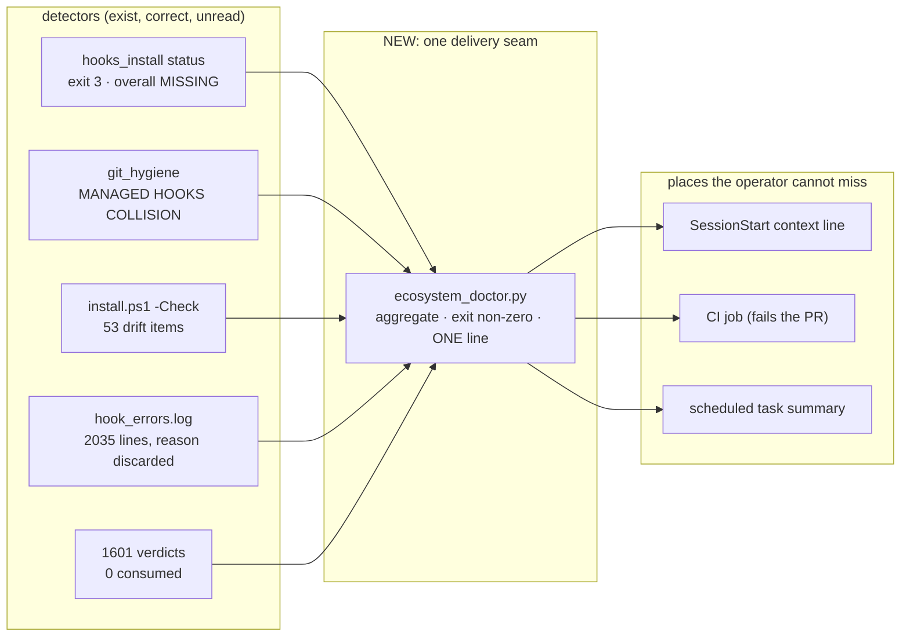

# Ecosystem delivery seam and hardening — R2

## Phase 0 — restatement

**Goal.** Close the gap between what this ecosystem *detects* and what the
operator *receives*, and repair the invariants the audit found unenforced.

**Assumptions.**
1. The operator's box also runs the live trading stack; any hook that hangs,
   double-fires, or pushes is an availability and correctness risk there too.
2. Agents normally work in worktrees, not in the primary checkout.
3. `~/.claude/settings.json` is partly operator-owned; the installer may only
   own its managed block and must preserve foreign handlers verbatim.
4. Report-only remains the default for destructive janitors; this plan does not
   change that.

**Edge cases that shape the design.**
- A second checkout installing hooks is the *normal* case, not an error — it is
  how the box reached 20 handlers. Classification must survive it.
- A hook can be SIGKILLed at its harness timeout, so `finally` is not a
  cleanup guarantee; temp files need a sweeper, not just a `finally`.
- `~/.claude/CLAUDE.md` has a hard 162-line / 16,000-byte guard with 57 bytes
  of headroom. Any prose fix must *remove* bytes, not add them.

**Constraints (red lines).**
- No change to the paper/live execution parity contract or to any just-in-time
  trigger gate.
- No auto-reaping of worktrees or branches; `--apply` stays manual.
- The `cdp:*` pools must never gain a dependency on `host:heavy`.
- No new always-loaded prose. Net bytes of `agent-rules/core.md` must go down.

**PONYTAIL: NOT USED** — the architecture is R2 and security-adjacent; the
checkpoint is excluded for R2/R3 and security work.

## Phase 0a — vision / plan collision verdict

There is no `design/visions/` in this repo, and `plan_context_loader.py` cannot
detect it (P1-4), so the check was a bounded manual pass over `design/plans/`
and `IDEA_BOX.md`.

**Verdict: CREATE NEW PLAN, AMENDING THREE.** The newly found scope (loader repo
detection, verdict consumption, CI coverage, the security cluster) has no owner.
Three existing plans own parts and are amended rather than duplicated:

- `2026-08-04_installer_managed_hook_block_r2.md` — marked `shipped`, but the
  managed block is absent from the live `settings.json`. **Reopen**: shipping the
  code was not shipping the installation. Slice A carries its DoD.
- `2026-07-25_sweep_abandoned_work_r1.md` — `deferred`; owns worktree/branch
  sprawl. **Promote** into Slice E.
- `2026-08-27_cdp_admission_pool_split_r2.md` — `active-continuation`; owns pool
  key validation. **Amend** with C1/C6 in Slice C.

`IDEA_BOX.md`'s "Installer-managed `settings.json` hook block" entry is resolved
by Slice A.

---

## Phase 1 — architecture

### The organising idea

Five of the largest findings are one defect: **a correct detector writing into a
file nobody reads.** So the architecture is not more checks. It is one delivery
seam plus exit codes wired into gates that already exist.

`ecosystem_doctor.py` owns no checks of its own. It shells the existing
detectors, folds their exit codes, and emits one bounded line. That keeps the
new surface small and makes every existing detector suddenly load-bearing.

### Slices

Ordered so each is independently shippable and each unblocks the next.

#### Slice A — disarm the live footguns (R1, hours) — **SHIPPED 2026-09-09**

Landed on `claude/ecosystem-architecture-audit-23f607`, PR #114. Applied to the
live `~/.claude/settings.json`: **21 handlers → 11** (the 10 the manifest
defines plus the one foreign gstack Stop hook, preserved);
`hooks_install status` reports `overall: OK`, exit 0, for the first time.
Backup at `~/.claude/backups/settings.json.20260909T155309Z`.

Review found 10 issues on the diff; 9 fixed in place, 1 deferred to Slice F
(the stdin seam fixes input only — `force_utf8_stdio()` for the output half
belongs with the other encoding work). Two items in the original list moved:
the stale `_worktrees/dotclaude-ecosystem-unified-fwf-20260831` worktree and
the 16.9 GB of legacy backups are destructive deletions and stay with the
operator — the installer now reports legacy backup trees instead of rotating
them away.

The only slice that is urgent rather than important. Everything here is already
armed on the operator's box.

| Fix | File |
|---|---|
| Commit only the design doc | `autocommit_design_docs.py:283` → `["commit","-m",msg,"--only","--",rel_path]` |
| Never commit/push on a protected branch | consult `PROTECTED_BRANCHES` in the commit path, not only `_can_amend`; on `main` take the mirror path only |
| Replace `shell=True` fire-and-forget push | two argv `run()` calls with timeouts; surface failure |
| Bound the mirror under the hook budget | wall-clock deadline well under the 30 s `PostToolUse` timeout |
| Classify handlers by basename + sidecar-recorded roots | `hooks_install.py:218-228`; refuse `install --apply` while collisions exist unless `--reconcile` |
| Fail the Windows installer on a native non-zero exit | `install.ps1:229-231` → `if ($LASTEXITCODE -ne 0) { throw }` |
| Decode hook stdin as UTF-8 | every hook entry point reads `sys.stdin.buffer`; or render commands as `py -X utf8` |
| Stop leaking credentials into backups | exclude dotfiles + `projects/`, rotate to N, narrow ACL (`install.ps1:151-154`) |

Then, once: `python scripts/hooks_install.py install --apply --reconcile`, and
delete the stale `D:/APPS/_worktrees/dotclaude-ecosystem-unified-fwf-20260831`
worktree that holds `main`.

**Validation.** A test that installs from *two different checkout roots* and
asserts 10 handlers, not 20 (the current test installs twice from the same root
and takes the noop path). A test that writes a design doc with an unrelated file
staged and asserts the commit contains one path. A test that writes a design doc
on `main` and asserts nothing was pushed to `main`. A cp1252-stdin test with a
Polish trigger.

**Rollback.** `hooks_install` already writes a timestamped `settings.json`
backup; restore it. All other changes are single-file reverts.

#### Slice B — the delivery seam (R1) — **SHIPPED 2026-09-09**

`scripts/ecosystem_doctor.py` folds `hooks_install status`, the verdict backlog,
orphaned atomic-write temp files and the cached `git_hygiene` report into one
bounded line plus an exit code. It owns no checks of its own — that is the
point. 50 ms against the live home; on it today:

    [  ok  ] hooks      OK
    [ FAIL ] verdicts   1601 unreaped (>400)
    [ FAIL ] temp       11 orphaned .tmp files
    [ FAIL ] janitor    14 alarms

Wired into `session_router`'s existing SessionStart context (one line, no new
hook, silent when clean) and into both CI workflows. The Codex and Cursor
doctors gained the `is_file()` check Claude's has always had.

One finding surfaced while landing Slice A and is recorded as audit P1-22: on
PR #114 every draft-time push produced `completed/skipped` checks, `gh pr ready`
created no run at all, and `mergeStateStatus` read `CLEAN` — a PR that looks
fully gated with zero tests executed. Slice C owns the fix.

1. `scripts/ecosystem_doctor.py` — runs `hooks_install status`,
   `install.ps1 -Check`, `git_hygiene` (dry-run, cached), a state-growth read,
   and a verdict-backlog read. Folds exit codes. Emits one line ≤ 200 chars.
2. Wire it into `session_router`'s existing SessionStart context (one line, no
   new hook, no new prose budget).
3. Wire it into a CI job so a PR that leaves the ecosystem undeliverable fails.
4. `install.ps1 -Check` calls `hooks_install status` and folds its exit code.
5. Codex/Cursor doctors gain the `Path(token).is_file()` check the Claude one
   already has.

**Validation.** Doctor returns non-zero on today's state and zero after Slice A;
assert both, from a fixture home.

#### Slice C — CI coverage and the red build (R2)

1. Fix the two failing contract tests — decide first whether the v2
   `master-agent/SKILL.md` or the tests are correct, then make one match the
   other. (The tests assert `matrix` and `Ponytail decision checkpoint`; v2 says
   `unified audit` and moved the checkpoint. The v2 text matches `core.md:76`,
   so the **tests** are stale.)
2. Add `.github/workflows/conductor-ci.yml` mirroring the existing three.
3. Add the 25 orphaned test files to a catch-all job, or replace the three
   hand-written argument lists with `pytest scripts/tests` + a `pyproject.toml`.
4. Add `pyproject.toml` with `[tool.ruff]` and `[tool.pytest.ini_options]` so
   scope stops living in YAML argument lists. Clear the 42 ruff violations.
5. Add `scripts/truthctl.py` to `truthdeck-ci`'s `paths:`.
6. Align CI Python with the box (3.12 vs local 3.14) or test both.

#### Slice D — conductor authority invariants (R2)

C1 `resolve_resource_key` validates against a closed set and `__init__` refuses
unknown pools · C2 attestation refused inside `process_envelope` regardless of
source, tty ceremony required, `envelope_source` enforced or deleted · C3
`BEGIN IMMEDIATE` + conditional `UPDATE ... AND leader_id = ?` · C4 `conductord`
emits `resource_reconcile` each pass and `evaluate_gate_verdict` flags
`ACTIVE && expires_at_utc < now` · C5 heartbeat refuses an expired lease · C6
purpose↔pool alignment derived from `PURPOSE_TO_RESOURCE_KEY` by loop, not by
hand · C7 GO gains a TTL and re-verified `scope_digest_sha256` · C8 WorkItem
heartbeat requires attempt ownership + strictly increasing sequence · C9 a
newer schema version raises · C10 GUI pins interpreter to `sys.executable` ·
C11 terminate the child on heartbeat failure · C12 ceilings for `logs/` and
`backups/`, skip no-op auto-reconcile receipts · C13 quarantine poison inbox
files.

Fix the three tests that currently assert the wrong invariant (T1/T2/T3) in the
same slice — they are why this was invisible.

#### Slice E — security hardening (R1/R2)

1. `scripts/secret_patterns.py` — one module, union of the five current sets
   plus `sk-[A-Za-z0-9_-]{12,}`, `AIza`, `github_pat_`, JWT, PEM, connection
   strings, and the path rules. All five call sites import it. Shared test vectors.
2. `implementation_review_packet` scans the **rendered packet**, not just the diff.
3. `sync_ecosystem_context` fails closed on a high-confidence hit instead of
   redacting silently; `DENY_FILES` applied at the walk, not to `*.md` globs.
4. `idea_digest` predicate allowlist — argv[0] must be `sys.executable`.
5. Trust boundary: every value interpolated by `steer_context` /
   `plan_context_loader` / `plan_context_updater` goes through the `_clean_fact`
   sanitiser `session_router.py:68-71` already has; the injected block is
   labelled untrusted data and loses its trailing `AI:` imperative.
6. `sync_agent_rules --source-root` validated against a known clean checkout.
7. `--` separators and `^-` rejection in the taste installers; pin `npx skills@<v>`
   and the `uvx` package in `overlays/claude-global.md`.
8. `sys.executable` instead of bare `python` in the five hook call sites.

#### Slice F — state, hygiene and prose (R1)

1. **Verdict delivery.** Either consume verdicts on the next SessionStart
   (delivery becomes automatic) or drop `VERDICT_OUTER_BOUND_DAYS` for
   never-consumed verdicts. Decide which; today's 90-day fallback is neither.
2. **Reaper cost.** Move the verdict JSON read behind the time budget, or index
   `consumed_at` in a single sidecar file so the scan is one read, not N.
3. **Error channel.** `append_hook_error` records the exception *message* and
   site, not just the class name; downgrade `LIFECYCLE_TRANSCRIPT_INCOMPLETE` to
   a counter; append via `O_APPEND` with periodic truncation instead of
   rewriting the whole file per line.
4. **Temp sweeper.** `plan_catalog` gets `try/finally`; the doctor sweeps stale
   `*.tmp` older than a day in `~/.claude` and `~/.claude/state`.
5. **`plan_context_loader._detect_repo`** — resolve via `git rev-parse
   --show-toplevel` and the worktree's main checkout, not a hardcoded
   `d:/APPS` parent test. Fail *loud* when it cannot resolve.
6. **Prose.** Fold `core.md:30` into `:28` (settles the Gemini pin and the Codex
   lane, and buys back the bytes that froze `--write`); rewrite
   `whatnext/SKILL.md:57` and `codex-global.md:30` as R3-care, not
   no-access; single routing table; archive the DONE block out of `IDEA_BOX.md`;
   then one `sync_agent_rules --write` and one `install.ps1` to re-converge.
7. **Sprawl.** Promote `2026-07-25_sweep_abandoned_work_r1.md`: a quiesced,
   operator-run `git_hygiene --apply` pass on Tsignal (504 worktrees) and here.

### Risks and blast radius

| Risk | Mitigation |
|---|---|
| A hooks change bricks every session | `hooks_install` backup + restore; validate against a fixture home before the live apply; hooks fail open by contract |
| Reconciling collisions deletes a foreign handler | classify by sidecar-recorded roots only; foreign handlers preserved verbatim; assert count and identity in a test |
| Conductor changes wedge `host:heavy` | Slice D adds reconciliation *before* tightening admission; keep `unwedge_host_heavy.py` — and put it under version control, it is currently only in `~/.claude/scripts` |
| Prose edits break `--write` again | the byte/line guard already fails closed; measure the render before landing |
| Sprawl reaping deletes live work | unchanged: `--apply` manual, only when other sessions are quiesced, locked worktrees protected |

### Safe deferrals

`~/.claude/PLANS.md` at 20.7 MB and `skills/gstack` at 1.7 GB are real but inert.
README/docs rewrites, the POSIX/Windows installer unification, and the
`answer_footer` O(session²) reparse are P2 quality-of-life, not correctness.
The Conductor operator GUI merge (`IDEA_BOX`) stays where it is.

---

## Approval

Slices A and B are R1 and can proceed. Slices C–F touch contracts, persistence
and the admission path.

>> APPROVAL NEEDED — reply GO to proceed
